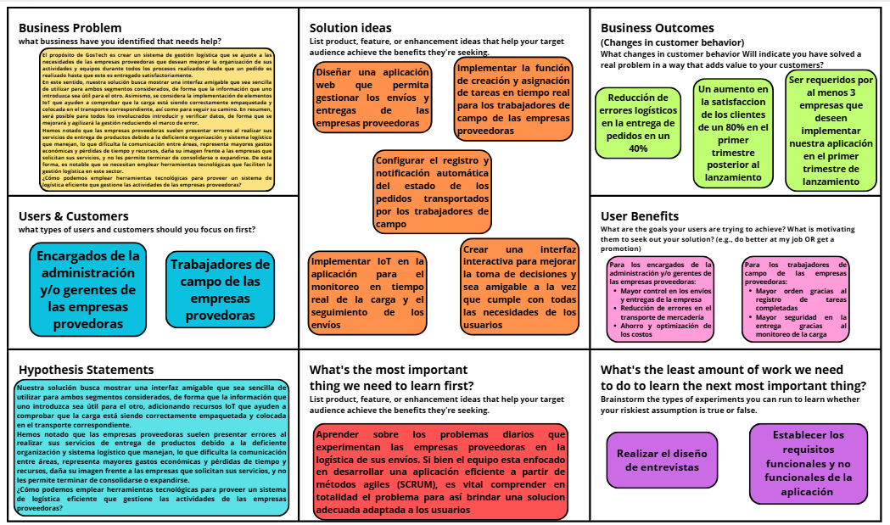

# Informe del Trabajo Final

  

  
<b>Informe de Trabajo Final</b>

  
Facultad de Ingeniería

  
Universidad Peruana de Ciencias Aplicadas

  
Ingeniería de Software

  
Desarrollo de Aplicaciones Open Source

  
4304

  
Efraín Ricardo Bautista Ubillús

  
Startup: GosTech

  
Producto: SwiftPort

---

## Team members:

| **Nombre**                       | **Código** |
| ---------------------------------|------------|
| Roman Cruz, Natalia Bertha       | U202310148 |
| Solano Armas, Angelo Hector      | U20231B775 |
| Iglesias Pérez, Sergio Sebastián | U202316118 |
| Baldeón Vivar, Santiago Armando  | U202319881 |
| Adrianzén Flores, Carlos Arturo  | U202215705 |

  
<b>Ciclo 2025 - 01</b>

---

## Versiones del Informe

| _Versión_ | _Fecha_    | _Autor_ | _Descripción de modificación_ |
| --------- | ---------- | ------- | ----------------------------- |
| 1.0       | 06/04/2025 | Iglesias Pérez, Sergio Sebastián | Creación del repositorio |
| 1.1       | 13/04/2025 | Roman Cruz, Natalia Bertha       | Capítulos I (sin entrevistas), Capítulo II (ubiquitous language) y Capítulo 3 (hasta 3.2) |

---

## Project Report Collaboration Insights

URL del repositorio para el reporte del proyecto: FALTA LANDING PAGE

**TB1**

Para el desarrollo del informe pertinente a la TB1, se dividió la implementación de sencciones de la siguiente forma entre los integrantes del grupo:

| **Integrantes**                  | **Tareas asignadas** |
| ---------------------------------|----------------------|
| Roman Cruz, Natalia Bertha       | Antescedentes y problemática, Problem Statements, Análisis de Entrevistas, Needfinding, Requirements Specification, Organization y Laling systems, Wireflow diagrams, Domain-Driven Software Architecture, Database diagram, Class diagram, Team Collaboration Insights, landing page, conclusiones, recomendaciones |
| Solano Armas, Angelo Hector      | Assumptions, Hypthesys statements, Análisis de Entrevistas, Needfinding, Requirements Specification, searching y navigation systems, wireframes, Domain-Driven Software Architecture, Database diagram, Class diagram, aspect leaders and collaborators, development evidence for sprint, landing page |
| Iglesias Pérez, Sergio Sebastián | Descripción del Startup, segmentos objetivos, registro de entrevistas, style guidelines, wireframes, mockup, prototype, context diagram, Software Development Environment Configuration, landing page |
| Baldeón Vivar, Santiago Armando  | Canvas, Diseño de entrevistas, style guidelines, wireframes, mockup, class dictionary, Source Code Style Guide & Conventions, Sprint Backlog 1, edición del video |
|  Adrianzén Flores, Carlos Arturo | Competidores, SEO Tags and Meta Tags, User Flow Diagrams, Software Configuration Management, Services Documentation Evidence for Sprint Review |

El proceso de colaboración durante el informe se realizó tanto con commits como compartiendo avances a través de documentos de google. 

---

## Github Collaboration Insights

Github también presenta un timeline de las ramas principales y los procesos de merge a los que se han sometido. Todas las ramas se crearon tomando en cuenta el diseño de GitFlow para una buena organización cuando se usa un software de control de versiones.

Se puede identificar a los integrantes como: 
- Roman Cruz, Natalia Bertha: natRC2005
- Solano Armas, Angelo Hector: Angelo5214
- Iglesias Pérez, Sergio Sebastián: ghostrider101218
- Baldeón Vivar, Santiago Armando: Santibal11
- Adrianzén Flores, Carlos Arturo: Choliwys

Asimismo, se explican las ramas que tenemos hasta el momento: FALTA COMPLETAR E IMAGEN
- main:
- readme-updates:

**ESPACIO PARA LA IMAGEN**

Los siguientes gráficos muestran analíticos en cuanto a los commits que cada integrante del grupo ha estado realizando en el repositorio.

__TB1__

**ESPACIO PARA LA IMAGEN**

---

## Students Outcomes

| _Criterios específicos_ | _Acciones realizadas_ | _Conclusiones_ |
| ----------------------- | ------------------------------------------------------------ | -------------- |
| Comunica oralmente con efectividad a diferentes rangos de audiencia. | Roman Cruz, Natalia Bertha  TB1 - Antecedentes y problemática  - Lean UX Problem Statements  - Análisis de entrevistas  - Needfinding  - Requirements Specification  - Organization Systems  - Labeling Systems  - Web Applications Wireflow Diagrams  - Domain-Driven Software Architecture  - Software Object-Oriented Design  - Database Design  - Team Collaboration Insights during Sprint  - Landing page  - Conclusiones  - Recomendaciones    Solano Armas, Angelo Hector  TB1   Iglesias Pérez, Sergio Sebastián  TB1   Baldeón Vivar, Santiago Armando  TB1   Adrianzén Flores, Carlos Arturo  TB1  | Al haber concluido con la primera entrega, hemos llegado a la conclusión de que logramos comunicarnos no solamente a través de las grabaciones incluídas, las cuales son las entrevistas y video de exposición, sino también antes los maestros que consultamos para la realización del trabajo y entre nosotros mismos como grupo y nuestros demás compañeros. Al comunicarnos, logramos expresar nuestras ideas de forma clara, comprensible, respetuosa y con un lenguaje adecuado acorde con el contexto. |
| Comunica por escrito con efectividad a diferentes rangos de audiencia | Roman Cruz, Natalia Bertha  TB1 - Antecedentes y problemática  - Lean UX Problem Statements  - Análisis de entrevistas  - Needfinding  - Requirements Specification  - Organization Systems  - Labeling Systems  - Web Applications Wireflow Diagrams  - Domain-Driven Software Architecture  - Software Object-Oriented Design  - Database Design  - Team Collaboration Insights during Sprint  - Landing page  - Conclusiones  - Recomendaciones    Solano Armas, Angelo Hector  TB1   Iglesias Pérez, Sergio Sebastián  TB1   Baldeón Vivar, Santiago Armando  TB1   Adrianzén Flores, Carlos Arturo  TB1  | Al termino de la TB1, podemos concluir que logramos expresar nuestras ideas y le mnesjae central de nuestro trabajo de forma escrita. Esto, dado que redactamos todo el análisis que realizamos para comenzar a implementar nuestro trabajo. Esto es apreciable al revisar las historias de usuario, análisis Lean UX y descripción de demás elementos incluídos. Asimismo, logramos identificar el lengujae correcto a utilizar al diseñar nuestro landing page de forma que los usuarios puedan comprenderlo sin problema.|

---

# Contenido

1. __[Capítulo I: Introducción](#Capítulo-i-introducción)__  
   1.1. [Startup Profile](#11-startup-profile)  
   &nbsp;&nbsp;&nbsp;&nbsp;1.1.1. [Descripción del startup](#111-descripción-de-la-startup)  
   &nbsp;&nbsp;&nbsp;&nbsp;1.1.2. [Perfiles de los integrantes del equipo](#112-perfiles-de-los-integrantes-del-equipo)  
   1.2. [Solution Profile](#12-solution-profile)  
   &nbsp;&nbsp;&nbsp;&nbsp;1.2.1. [Antecedentes y Problemática](#121-antecedentes-y-problemática)  
   &nbsp;&nbsp;&nbsp;&nbsp;1.2.2. [Lean UX Process](#122-lean-ux-process)  
   &nbsp;&nbsp;&nbsp;&nbsp;&nbsp;&nbsp;&nbsp;&nbsp;1.2.2.1. [Lean UX Problem Statement](#1221-lean-ux-problem-statement)  
   &nbsp;&nbsp;&nbsp;&nbsp;&nbsp;&nbsp;&nbsp;&nbsp;1.2.2.2. [Lean UX Assumptions](#1222-lean-ux-assumptions)  
   &nbsp;&nbsp;&nbsp;&nbsp;&nbsp;&nbsp;&nbsp;&nbsp;1.2.2.3. [Lean UX Hypothesis Statements](#1223-lean-ux-hypothesis-statements)  
   &nbsp;&nbsp;&nbsp;&nbsp;&nbsp;&nbsp;&nbsp;&nbsp;1.2.2.4. [Lean UX Canvas](#1224-lean-ux-canvas)  
   1.3. [Segmentos objetivo](#13-segmentos-objetivo)  
2. __[Capítulo II: Requirements Elicitation & Analysis](#capítulo-ii-requirements-elicitation--analysis)__  
   2.1. [Competidores](#21-competidores)  
   &nbsp;&nbsp;&nbsp;&nbsp;2.1.1. [Análisis competitivo](#211-análisis-competitivo)  
   &nbsp;&nbsp;&nbsp;&nbsp;2.1.2. [Estrategias y tácticas frente a competidores](#212-estrategias-y-tácticas-frente-a-competidores)  
   2.2. [Entrevistas](#22-entrevistas)  
   &nbsp;&nbsp;&nbsp;&nbsp;2.2.1. [Diseño de entrevistas](#221-diseño-de-entrevistas)  
   &nbsp;&nbsp;&nbsp;&nbsp;2.2.2. [Registro de entrevistas](#222-registro-de-entrevistas)  
   &nbsp;&nbsp;&nbsp;&nbsp;2.2.3. [Análisis de entrevistas](#223-análisis-de-entrevistas)  
   2.3. [Needfinding](#23-needfinding)  
   &nbsp;&nbsp;&nbsp;&nbsp;2.3.1. [User Personas](#231-user-personas)  
   &nbsp;&nbsp;&nbsp;&nbsp;2.3.2. [User Task Matrix](#232-user-task-matrix)  
   &nbsp;&nbsp;&nbsp;&nbsp;2.3.3. [User Journey Mapping](#233-user-journey-mapping)  
   &nbsp;&nbsp;&nbsp;&nbsp;2.3.4. [Empathy Mapping](#234-empathy-mapping)  
   &nbsp;&nbsp;&nbsp;&nbsp;2.3.5. [As-is Scenario Mapping](#235-as-is-scenario-mapping)  
3. __[Capítulo III: Requirements Specification](#capítulo-iii-requirements-specification)__  
   3.1. [To-Be Scenario Mapping](#31-to-be-scenario-mapping)  
   3.2. [User Stories](#32-user-stories)  
   3.3. [Impact Mapping](#33-impact-mapping)  
   3.4. [Product Backlog](#34-product-backlog)
4. __[Capítulo IV: Product Design](#capítulo-iv-product-design)__  
   4.1. [Style Guidelines](#41-style-guidelines)  
   &nbsp;&nbsp;&nbsp;&nbsp;4.1.1. [General Style Guidelines](#411-general-style-guidelines)  
   &nbsp;&nbsp;&nbsp;&nbsp;4.1.2. [Web Style Guidelines](#412-web-style-guidelines)  
   4.2. [Information Architecture](#42-information-architecture)  
   &nbsp;&nbsp;&nbsp;&nbsp;4.2.1. [Organization Systems](#421-organization-systems)  
   &nbsp;&nbsp;&nbsp;&nbsp;4.2.2. [Labeling Systems](#422-labeling-systems)  
   &nbsp;&nbsp;&nbsp;&nbsp;4.2.3. [SEO Tags and Meta Tags](#423-seo-tags-and-meta-tags)  
   &nbsp;&nbsp;&nbsp;&nbsp;4.2.4. [Searching Systems](#424-searching-systems)  
   &nbsp;&nbsp;&nbsp;&nbsp;4.2.5. [Navigation Systems](#425-navigation-systems)  
   4.3. [Landing Page UI Design](#43-landing-page-ui-design)  
   &nbsp;&nbsp;&nbsp;&nbsp;4.3.1. [Landing Page Wireframe](#431-landing-page-wireframe)  
   &nbsp;&nbsp;&nbsp;&nbsp;4.3.2. [Landing Page Mock-up](#432-landing-page-mock-up)  
   4.4. [Web Applications UX/UI Design](#44-web-applications-uxui-design)  
   &nbsp;&nbsp;&nbsp;&nbsp;4.4.1. [Web Applications Wireframes](#441-web-applications-wireframes)  
   &nbsp;&nbsp;&nbsp;&nbsp;4.4.2. [Web Applications Wireflow Diagrams](#442-web-applications-wireflow-diagrams)  
   &nbsp;&nbsp;&nbsp;&nbsp;4.4.3. [Web Applications Mock-ups](#443-web-applications-mock-ups)  
   &nbsp;&nbsp;&nbsp;&nbsp;4.4.4. [Web Applications User Flow Diagrams](#444-web-applications-user-flow-diagrams)  
   4.5. [Web Applications Prototyping](#45-web-applications-prototyping)  
   4.6. [Domain-Driven Software Architecture](#46-domain-driven-software-architecture)  
   &nbsp;&nbsp;&nbsp;&nbsp;4.6.1. [Software Architecture Context Diagram](#461-software-architecture-context-diagram)  
   &nbsp;&nbsp;&nbsp;&nbsp;4.6.2. [Software Architecture Container Diagrams](#462-software-architecture-container-diagrams)  
   &nbsp;&nbsp;&nbsp;&nbsp;4.6.3. [Software Architecture Components Diagrams](#463-software-architecture-components-diagrams)  
   4.7. [Software Object-Oriented Design](#47-software-object-oriented-design)  
   &nbsp;&nbsp;&nbsp;&nbsp;4.7.1. [Class Diagrams](#471-class-diagrams)  
   &nbsp;&nbsp;&nbsp;&nbsp;4.7.2. [Class Dictionary](#472-class-dictionary)  
   4.8. [Database Design](#48-database-design)  
   &nbsp;&nbsp;&nbsp;&nbsp;4.8.1. [Database Diagram](#481-database-diagram)  
5. __[Capítulo V: Product Implementation, Validation & Deployment](#capítulo-v-product-implementation-validation--deployment)__  
5.1. [Software Configuration Management](#51-software-configuration-management)  
   &nbsp;&nbsp;&nbsp;&nbsp;5.1.1. [Software Development Environment Configuration](#511-software-development-environment-configuration)  
   &nbsp;&nbsp;&nbsp;&nbsp;5.1.2. [Source Code Management](#512-source-code-management)  
   &nbsp;&nbsp;&nbsp;&nbsp;5.1.3. [Source Code Style Guide & Conventions](#513-source-code-style-guide--conventions)  
   &nbsp;&nbsp;&nbsp;&nbsp;5.1.4. [Software Deployment Configuration](#514-software-deployment-configuration)  
   5.2. [Landing Page, Services & Applications Implementation](#52-landing-page-services--applications-implementation)  
   &nbsp;&nbsp;&nbsp;&nbsp;5.2.1. [Sprint 1](#521-sprint-1)  
   &nbsp;&nbsp;&nbsp;&nbsp;&nbsp;&nbsp;&nbsp;&nbsp;5.2.1.1. [Sprint Planning 1](#5211-sprint-planning-1)  
   &nbsp;&nbsp;&nbsp;&nbsp;&nbsp;&nbsp;&nbsp;&nbsp;5.2.1.2. [Sprint Backlog 1](#5212-sprint-backlog-1)  
   &nbsp;&nbsp;&nbsp;&nbsp;&nbsp;&nbsp;&nbsp;&nbsp;5.2.1.3. [Development Evidence for Sprint Review](#5213-development-evidence-for-sprint-review)  
   &nbsp;&nbsp;&nbsp;&nbsp;&nbsp;&nbsp;&nbsp;&nbsp;5.2.1.4. [Testing Suite Evidence for Sprint Review](#5214-testing-suite-evidence-for-sprint-review)  
   &nbsp;&nbsp;&nbsp;&nbsp;&nbsp;&nbsp;&nbsp;&nbsp;5.2.1.5. [Execution Evidence for Sprint Review](#5215-execution-evidence-for-sprint-review)  
   &nbsp;&nbsp;&nbsp;&nbsp;&nbsp;&nbsp;&nbsp;&nbsp;5.2.1.6. [Services Documentation Evidence for Sprint Review](#5216-services-documentation-evidence-for-sprint-review)  
   &nbsp;&nbsp;&nbsp;&nbsp;&nbsp;&nbsp;&nbsp;&nbsp;5.2.1.7. [Software Deployment Evidence for Sprint Review](#5217-software-deployment-evidence-for-sprint-review)  
   &nbsp;&nbsp;&nbsp;&nbsp;&nbsp;&nbsp;&nbsp;&nbsp;5.2.1.8. [Team Collaboration Insights during Sprint](#5218-team-collaboration-insights-during-sprint)  
6. __[Conclusiones](#Conclusiones)__  
  6.1. [Conclusiones](#61-conclusiones)  
  6.2. [Recomendaciones](#62-recomendaciones)  
7. __[Bibliografía](#bibliografía)__  
8. __[Anexos](#anexos)__  

---
# Capítulo I: Introducción  

## 1.1. Startup Profile

### 1.1.1. Descripción de la Startup  

GosTech tiene como objetivo transformar digitalmente la planificación y supervisión de actividades logísticas de campo en zonas operativas de largo plazo, como aquellas vinculadas a la industria petrolera, minera o energética. A través de su plataforma principal, SwiftPort, GosTech permite a las empresas logísticas organizar de forma centralizada los requerimientos de transporte, asignar vehículos y cuadrillas de manera eficiente, y supervisar la ejecución operativa en tiempo real, incluso ante condiciones cambiantes del entorno.

La solución busca resolver la falta de trazabilidad, flexibilidad y control en entornos donde las operaciones logísticas deben adaptarse constantemente a factores como el clima, el estado del equipo o la disponibilidad del personal. Para ello, SwiftPort integra simulaciones de dispositivos IoT, como rastreo GPS y monitoreo del estado operativo de la maquinaria, lo cual permite generar alertas tempranas y tomar decisiones informadas durante la ejecución de las actividades.

Una de las principales fortalezas del sistema es su capacidad para adaptarse a la realidad del campo: contempla la reprogramación de actividades, el registro posterior de la ejecución por parte de los operarios y dashboards que reflejan el cumplimiento y desempeño operativo en todo momento. Esta solución aporta un valor diferencial tanto para los supervisores que planifican como para el personal que ejecuta tareas en terreno.

Misión: Optimizar la planificación, ejecución y trazabilidad de actividades logísticas de campo mediante una plataforma inteligente que integre tecnología IoT simulada adaptada a zonas operativas remotas.

Visión: GosTech aspira a convertirse en el aliado tecnológico preferido por empresas logísticas en Latinoamérica, facilitando operaciones más eficientes, seguras y adaptables a través de innovación digital aplicada al terreno.

### 1.1.2. Perfiles de los integrantes del equipo

#### 1.1.2.1. Natalia Bertha Roman Cruz

Mi nombre es Natalia Bertha Roman Cruz, tengo 19 años y soy estudiante de la carrera de Ingeniería de Software en la UPC. Me considero una persona perseverante y organizada, así como con capacidad de liderazgo, de forma que busco guiar a mi equipo y motivar la colaboración entre los integrantes. Me gusta investigar acerca de nuevas propuestas para utilizar las herramientas tecnológicas a nuestro favor. Antes de iniciar el curso, he tenido cierta experiencia en el manejo de Angular al estar realizando mis prácticas preprofesionales, así como he utilizado C + +, python y javaScript anteriormente.

  

#### 1.1.2.2. Angelo Hector Solano Armas

Mi nombre es Angelos Solano Armas, tengo 19 años y actualmente estudio Ingeniería de Software. Me encuentro cursando el quinto ciclo de la carrera, y me considero una persona alegre, responsable y con muchas ganas de aprender. Tengo grandes expectativas respecto a este curso, ya que espero que me brinde los conocimientos necesarios para desarrollar una estructura sólida de software, así como reforzar mis habilidades técnicas y mi lógica de programación. Aspiro a convertirme en un profesional capaz de diseñar soluciones eficientes y escalables, y sé que este curso será clave en ese camino.

  

#### 1.1.2.3. Sergio Sebastián Iglesias Pérez

Hola, soy estudiante de la carrera de Ingeniería de Software en la UPC. Tengo un alto interés en aprender sobre Arquitectura de Software y buenas prácticas de programación. Por motivos laborales, tengo experiencia en desarrollo web en un stack diferente al del curso, por lo cual espero poder adaptar mis conocimientos y poder apoyar a mis compañeros siempre que tenga disponibilidad. Finalmente, espero que la idea que proponemos sea de alto valor y la podamos implementar de forma adecuada.

  

#### 1.1.2.4. Santiago Armando Baldeón Vivar

Mi nombre es Santiago Armando Baldeon y tengo 18 años. Actualmente estoy cursando la carrera de Ingeniería de Software en la Universidad Peruana de Ciencias Aplicadas. En mi caso elegí esta carrera porque desde chico sentí gran pasión por la tecnología y siempre quise ser alguien importante en este mundo, brindando mis aportes a la humanidad. Creo que voy por buen camino y espero en un futuro cumplir estos sueños y objetivos que tengo

  

#### 1.1.2.5. Carlos Arturo Adrianzén Flores

Mi nombre es Carlos Arturo Adrianzén Flores y soy estudiante de la carrera de ingeniería de software. Me entusiasman las nuevas tecnologías, sobre todo las que son útiles para solventar problemas reales. Tengo experiencia en lenguajes de programación como C + + y Python. Me gusta tocar la guitarra y jugar fútbol.

  

## 1.2. Solution Profile

### 1.2.1. Antecedentes y problemática

#### 1.2.1.1. What

__¿Cuál es el problema__

El problema puede ser mencionado como la falta de un recurso tecnológico capaz de organizar equipos de trabajo y registrar datos sobre las actividades que estos deben cumplir en empresas dedicadas a la repartición de material o mercancía de forma industrial. Esto ocasiona consecuencias dentro de la empresa dado que, al no existir un registro de la secuencia de los procesos llevados a cabo para la entrega de lo solicitado, surgen errores que causan pérdidas de tiempo y económicas, así como la imagen de la empresa se ve afectada frente a sus empresas clientes.

#### 1.2.1.2. Who

__¿Quiénes están involucrados en el problema?__

Al ser este un problema que afecta principalmente a las empresas proveedoras de materiales o productos, serán los usuarios de estas nuestros usuarios. Así, podemos colocar a los encargados de la administración y/o gerentes como usuarios con la capacidad de colocar las tareas a cumplir para la entrega de cada envío que se está preparando y de visualizar los datos registrados para verificar que todo se está cumpliendo correctamente. Al mismo tiempo, los trabajadores de campo que ejecutan las tareas listadas por los superiores también tendrían acceso a nuestros servicios para registrar los datos solicitados y visualizar los requisitos o pasos a cumplir.

#### 1.2.1.3. Where

__¿Dónde surge el problema?__

El problema surge principalmente en los puntos de recojo y entrega de los productos o materiales encargados, siendo estos almacenes, dado que el recoger o dejar la carga dispone de procesos que frecuentemente no son completados ni verificados como deberían, lo que sube el riesgo de que ocurran errores que afecten el tiempo previsto de entrega o dañen la mercancía, lo que dispone problemas para ambas empresas involucradas.  

Asimismo, puede mencionarse que los problemas ocurren en las oficinas de la empresa proveedora, puesto que esta, al no contar con los datos sobre sus propios envíos en tiempo real, sufre de dificultades para ofrecer soluciones de forma rápida frente a las adversidades que puedan ocurrir, así como percibe una desorganización general que dificulta el crecimiento y mejora de la calidad de sus servicios.

#### 1.2.1.4. When

__¿Cuándo se presenta el problema?__

El problema inicia desde que una empresa externa realiza una solicitud a la empresa proveedora, dado que esta última debe registrar el pedido de manera correcta y considerando las especificaciones como medidas de seguridad a tomar durante el trayecto para proteger la carga. Cuando estas indicaciones no son correctamente especificadas, repartidas entre los equipos y verificadas, la carga puede no llegar en un estado óptimo, así como puede llegar a perderse por la gran cantidad de envíos simultáneos realizados. Asimismo, al no haberse seguido los pasos supuestos, la carga puede llegar con desperfectos, afectando el trabajo de la empresa receptora y generándole desconfianza hacia la proveedora.

#### 1.2.1.5. Why

__¿Por qué surge el problema?__

El problema surge debido a la descoordinación y desorganización de la empresa en cuanto a la ejecución de sus actividades. Al no contar con un sistema adecuado mediante el cuál verificar el cumplimiento de todos los pasos y medidas que supone cada proceso, es imposible saber si el envío está siendo realizado adecuadamente, lo que provoca errores evitables.

#### 1.2.1.6. How

__¿Cómo se utilizará el producto?__

El producto será utilizado como una herramienta de gestión logística que contendrá los pasos a realizar para cumplir exitosamente con cada etapa de envío de un pedido, así como con los requisitos adicionales de cada uno y sus datos cruciales (lugar de carga, lugar de entrega, encargados, entre otros). Así, quienes se encuentran en cargos administrativos podrán registrar la información mencionada y verificar el cumplimiento de lo solicitado de forma eficiente e inmediata, mientras que los trabajadores de campo tendrán las indicaciones que necesitan de forma clara y siempre disponible, junto a la opción de notificar el correcto cumplimiento de las operaciones detalladas o de una diversidad para lograr tomar acción inmediata de manera informada.

#### 1.2.1.7. How much

__¿¿Cuál es la magnitud del problema?__

Según indica Carlos Pintado (2023), licenciado en contaduría pública, se ha observado que el 44% de las empresas de transporte son deficientes debido a que no logran concretar un sistema a seguir con procesos lógicos en el cual puedan detectarse errores con facilidad. Esto ocasiona pérdidas monetarias y retrasa tanto el término del envío en cuestión como los posteriores. Asimismo, dentro de los factores que retrasan el crecimiento de la empresa dadas las constantes adversidades en sus operaciones, se señala la falta de coordinación y unidad al trabajar en equipo, lo cual surge dada la falta de comunicación entre áreas y las indicaciones imprecisas.

Por otro lado, el 63% de las empresas proveedoras encuestadas manifestaron que el cumplimiento del flujo de trabajo impacta directamente en su correcto desempeño, así como influye en sus gastos mensuales. De esta forma, se puede notar que el no contar con un sistema de logística útil y sencillo de utilizar que pueda mejorar la comunicación entre áreas y verificar el cumplimiento de tareas frena el crecimiento de la empresa y dificulta el cierre exitoso de los pedidos realizados.

### 1.2.2. Lean UX Process

#### 1.2.2.1. Lean UX Problem Statement

El propósito de GosTech es crear un sistema de gestión logística que se ajuste a las necesidades de las empresas proveedoras que desean mejorar la organización de sus actividades y equipos durante todos los procesos realizados desde que un pedido es realizado hasta que este es entregado satisfactoriamente. 

En este sentido, nuestra solución busca mostrar una interfaz amigable que sea sencilla de utilizar para ambos segmentos considerados, de forma que la información que uno introduzca sea útil para el otro. Asimismo, se considera la implementación de elementos IoT que ayuden a comprobar que la carga está siendo correctamente empaquetada y colocada en el transporte correspondiente, así como para seguir su camino. En resumen, será posible para todos los involucrados introducir y verificar datos, de forma que se mejorará y agilizará la gestión reduciendo el marco de error.

Hemos notado que las empresas proveedoras suelen presentar errores al realizar sus servicios de entrega de productos debido a la deficiente organización y sistema logístico que manejan, lo que dificulta la comunicación entre áreas, representa mayores gastos económicas y pérdidas de tiempo y recursos, daña su imagen frente a las empresas que solicitan sus servicios, y no les permite terminar de consolidarse o expandirse. De esta forma, es notable que se necesitan emplear herramientas tecnológicas que faciliten la gestión logística en este sector.

¿Cómo podemos emplear herramientas tecnológicas para proveer un sistema de logística eficiente que gestione las actividades de las empresas proveedoras?

#### 1.2.2.2. Lean UX Assumptions

__Business Assumptions:__

- __Creemos que nuestros usuarios necesitan__ una solución que automatice el control logístico, eliminando tareas manuales y mejorando la trazabilidad.
- __Estas necesidades se pueden satisfacer__  mediante una plataforma digital conectada a sensores IoT, que registre y notifique automáticamente cada acción del proceso.
- __Nuestros clientes iniciales serán__ empresas proveedoras, operadores logísticos y compañías industriales que trasladan productos o insumos entre sedes o hacia clientes.
- __El valor más importante que un cliente quiere de nuestros servicios es__ la verificación automática del cumplimiento logístico, visibilidad en tiempo real y reducción del margen de error.
- __Vamos a obtener la mayoría de los clientes mediante__ alianzas logísticas, pilotos con industrias clave, eventos sectoriales y marketing digital especializado en B2B (business to business).
- __Vamos a obtener ingresos mediante__ suscripciones mensuales, con planes escalables según el número de envíos, dispositivos conectados o integración con otros sistemas.
- __Nuestra competencia en el mercado será__ soluciones de rastreo parcial, herramientas no integradas o sistemas costosos sin soporte para tecnologías emergentes.
- __Vamos a tener ventaja frente a nuestra competencia debido a__ la combinación de tecnología IoT, QR y una interfaz colaborativa, adaptable a todo tipo de envío.
- __El mayor riesgo del servicio es__ que el personal de campo no registre correctamente o ignore el uso de los dispositivos.
- __Lo resolveremos realizando__ una interfaz fácil, entrenamientos orientados a procesos reales y pilotos con iteración constante.

__User Assumptions:__

__¿Quién es el usuario?__

Los usuarios principales son el personal técnico, supervisor y administrativo de empresas que gestionan envíos industriales en Perú. Esto incluye tanto al personal de planta como a operadores logísticos, transportistas, responsables de almacén y encargados de recibir mercancía en destino. Si la plataforma tiene éxito en este sector, se plantea su extensión a todo el ecosistema logístico nacional e internacional, incluyendo sectores como manufactura, minería, agroindustria, energía y distribución masiva.

__¿Qué problemas busca resolver el producto?__

La falta de control sobre tareas logísticas, los errores manuales en el embarque, y la imposibilidad de verificar el estado del envío de forma automática.

__¿Qué funcionalidades son importantes?__

Nuestra solución permite un seguimiento digital por etapas (embarque, transporte y entrega), con verificación automatizada, sensores IoT y códigos QR para asegurar el control de cada paquete. Ofrece mapas en tiempo real con el estado del envío, junto con alertas automáticas ante fallas o desviaciones. Permite además el registro fotográfico e informes de incidencias, integrándose con sistemas ERP(Planificación de Recursos Empresariales), WMS (Sistema de gestión de almacenes) y CRM (Gestión de Relaciones con el Cliente) para centralizar la información. Todo esto se complementa con reportes analíticos en tiempo real que apoyan la toma de decisiones logísticas.

__¿Dónde encaja nuestro producto en su trabajo o vida?__

En el flujo operativo diario: desde la preparación de pedidos, control de calidad y embarque, hasta la entrega, recepción y evaluación post-servicio.

__¿Cuándo y cómo es nuestro producto usado?__

Durante cada punto crítico del envío, por múltiples usuarios simultáneamente, a través de móviles, tablets, lectores o dashboards en oficina.

__¿Cómo debe verse nuestro producto y cómo debe comportarse?__

Debe tener una interfaz intuitiva, responsiva y modular, con indicadores visuales, carga automática de datos desde sensores y herramientas de validación visual, rápida y confiable.

#### 1.2.2.3. Lean UX Hypothesis Statements

Hypothesis Statement 01

**Creemos** que los supervisores y operadores adoptarán el sistema si pueden registrar el cumplimiento de tareas con tecnología RFID en lugar de formularios manuales.  
**Sabremos** que hemos tenido éxito  
**cuando** el 80% de los registros se realicen mediante escaneo RFID o sensores IoT durante la fase piloto.  

Hypothesis Statement 02

**Creemos** que permitir acceso en tiempo real al estado de cada envío, capturado por dispositivos IoT, mejorará la coordinación entre áreas.  
**Sabremos** que hemos tenido éxito  
**cuando** se reduzcan en un 40% los reportes sobre paquetes extraviados o enviados al destino incorrecto.  

Hypothesis Statement 03

**Creemos** que la combinación de códigos QR  reducirá errores en la asignación de destinos.  
**Sabremos** que hemos tenido éxito  
**cuando** se observe una disminución del 60% en entregas erróneas dentro de los primeros tres meses de uso.  

Hypothesis Statement 04

**Creemos** que las alertas automáticas generadas por sensores IoT permitirán al equipo logístico actuar rápidamente ante incidencias.  
**Sabremos** que hemos tenido éxito  
**cuando** el tiempo promedio de respuesta ante problemas logísticos se reduzca en un 40%.  

Hypothesis Statement 05

**Creemos** que un historial digital generado automáticamente por sensores, escaneos y registros IoT facilitará auditorías internas y prevención de errores.    
**Sabremos** que hemos tenido éxito  
**cuando** al menos el 70% de las auditorías logísticas utilicen los datos del sistema como fuente principal.  

Hypothesis Statement 06

**Creemos** que al integrarse con sistemas ERP, WMS o CRM, se incrementará la eficiencia y se reducirá la duplicidad de tareas administrativas.  
**Sabremos** que hemos tenido éxito  
**cuando** el tiempo promedio de registro y consulta de información de envíos se reduzca en un 50%.

Hypothesis Statement 07

**Creemos** que registrar automáticamente las incidencias detectadas por sensores IoT ayudará a prevenir errores mayores antes de la entrega.  
**Sabremos** que hemos tenido éxito  
**cuando** al menos el 60% de los eventos detectados se resuelvan antes de que el paquete llegue a destino.  

Hypothesis Statement 8

**Creemos** que añadir fotografías y validaciones por RFID o sensores IoT como evidencia aumentará la transparencia del proceso y reducirá disputas.  
**Sabremos** que hemos tenido éxito  
**cuando** los reclamos por daños sin evidencia disminuyan en un 50%.

Hypothesis Statement 09

**Creemos** que brindar dashboards analíticos en tiempo real, alimentados por dispositivos inteligentes, facilitará la toma de decisiones estratégicas.  
**Sabremos** que hemos tenido éxito  
**cuando** al menos el 75% de los responsables logísticos usen los reportes al menos una vez por semana.  

#### 1.2.2.4. Lean UX Canvas

Lean UX Canvas es una de las herramientas que hemos utilizado para conmprender a nuestros posibles usuarios y sus necesidades. Esta es usada en el campo del diseño centrado en el usuario y la metodología Lean con la intención de desarrollar productos de forma eficientes y práctica para los usuarios. A su vez, esta puede ser utilizada por equipos multidisciplinarios para que colaboración de forma ordenada dentro un marco estructurado.

  

Enlace para acceder al [Canvas](https://www.canva.com/design/DAGjpb8uvJA/kFkhcvG5a6BCtdU2xvq5gw/edit?utm_content=DAGjpb8uvJA&utm_campaign=designshare&utm_medium=link2&utm_source=sharebutton)

## 1.3 Segmentos Objetivos

#FALTAN SEGMENTOS OBJETIVOS

#### Segmento objetivo #1: Supervisores y Planificadores de Campo (Empresas Logísticas)

__Descripción General__

Personal a cargo de planificar y supervisar operaciones logísticas en terreno, incluyendo la asignación de vehículos, maquinaria y cuadrillas para el cumplimiento de requerimientos operativos. Este segmento representa a mandos intermedios o jefaturas operativas dentro de empresas logísticas que atienden sectores como petróleo, minería o infraestructura.

__Perfil Demográfico__

- Edad: 30 a 55 años
- Experiencia: técnica y logística, con alta carga operativa  
- Ubicación: regiones con presencia de operaciones industriales (como Piura, Ica, Loreto, Cusco)  
- Nivel digital: medio, familiarizados con hojas de cálculo, radios, GPS y plataformas básicas

__Datos del Sector__

De acuerdo con Logística360, la región latinoamericana enfrenta retos operativos debido a la infraestructura deficiente y la necesidad de digitalizar los procesos logísticos. Se proyecta un crecimiento del sector logístico en Sudamérica del 7.5% anual entre 2024 y 2032, lo que acentúa la necesidad de herramientas que optimicen la planificación y el seguimiento en campo.

__Necesidad__

Automatizar la planificación y trazabilidad de actividades, permitiendo la reprogramación dinámica ante imprevistos (clima, fallas, cambios de personal), y generar reportes confiables para la toma de decisiones.

#### Segmento objetivo #2: Operarios de Campo / Técnicos Logísticos

__Descripción General__

Trabajadores responsables de ejecutar las actividades logísticas en terreno, como el traslado de carga, operación de maquinaria, asistencia a zonas de trabajo y reporte de condiciones reales. Interactúan directamente con la ejecución física de las actividades y son fundamentales para el registro de datos reales.  

__Perfil Demográfico__

- Edad: 20 a 50 años
- Formación: técnica operativa o empírica 
- Herramientas: teléfonos móviles, radios, tablets (ocasionalmente)  
- Nivel digital: bajo a medio; priorizan sistemas simples, rápidos e intuitivos

__Datos del Sector__

La industria logística reconoce la necesidad de integrar herramientas de campo que funcionen en entornos desconectados o adversos. Según el mismo informe, la adopción de IoT y tecnologías móviles es clave para mejorar la visibilidad operativa, especialmente en regiones donde la logística es más compleja y los equipos humanos deben adaptarse constantemente.  

__Necesidad__

Contar con una herramienta que les facilite la consulta de tareas, registro de datos reales (como hora de ejecución, modificaciones de equipo) y alertas rápidas sin complicaciones, idealmente desde un celular o tablet.

# 2. Capítulo II: Requirements Elicitation & Analysis

## 2.1 Competidores

### 2.1.1. Análisis competitivo

A continuación, realizamos un análisis competitivo para identificar oportunidades, amenazas, ventajas y posibles desventajas que podemos tener dentro del mercado en comparación a otras empresas que realicen actividades similares a las nuestras. De esta forma, podremos prepararnos para resaltar frente a los consumidores.

<table>
  <thead>
    <tr>
      <th colspan="7"><b>Competitive Analysis Landscape</b></th>
    </tr>
  </thead>
  <tbody>
    <tr>
      <td colspan="2" align="center">¿Por qué llevar a cabo este análisis?</td>
      <td colspan="5" align="center">Identificar las fortalezas, debilidades, oportunidades y amenazas de nuestra solución, SwiftPort, frente a competidores consolidados del sector logístico, con el fin de validar nuestra propuesta de valor, afinar nuestra estrategia de posicionamiento y asegurar una ventaja competitiva que se pueda sostener a largo plazo en el mercado.</td>
    </tr>
    <tr>
      <td colspan="2">PERFIL</td>
      <td><picture>

 </picture></td>
      <td><picture>

</picture></td>
      <td><picture>

</picture></td>
      <td><picture>

</picture></td>
      <td><picture>

</picture></td>
    </tr>
    <tr>
      <td rowspan="2">Perfil</td>
      <td>Overview</td>
      <td>Plataforma de gestión de cadena de suministro enfocada en envíos internacionales.</td>
      <td>Plataforma colaborativa para la gestión logística unificada.</td>
      <td>Software robusto para ejecución logística internacional.</td>
      <td>Soluciones RFID + IoT para trazabilidad.</td>
      <td>Plataforma de gestión logística con IoT, QRs y dashboard colaborativo.</td>
    </tr>
    <tr>
      <td>Ventaja Competitiva ¿Qué valor ofrece a los clientes?</td>
      <td>Visibilidad global en tiempo real y optimización de cadena de suministro.</td>
      <td>Comunicación entre actores logísticos en una sola plataforma.</td>
      <td>Gran escalabilidad y automatización en sistemas complejos.</td>
      <td>Precisión en el escaneo y visibilidad en almacén.</td>
      <td>Integración IoT/RFID/QR + interfaz colaborativa adaptada a múltiples roles.</td>
    </tr>
    <tr>
      <td rowspan="2">Perfil de Marketing</td>
      <td>Mercado objetivo</td>
      <td>Empresas exportadoras e importadoras.</td>
      <td>PYMEs logísticas y grandes operadores.</td>
      <td>Operadores logísticos globales y agentes de aduanas.</td>
      <td>Logística, retail y salud.</td>
      <td>Empresas proveedoras, operadores logísticos, industria nacional e internacional.</td>
    </tr>
    <tr>
      <td>Estrategias de Marketing</td>
      <td>Marketing digital, contenido técnico y casos de éxito.</td>
      <td>Inbound marketing y demos personalizadas.</td>
      <td>Ferias internacionales, canales de distribución.</td>
      <td>Webinars, distribuidores autorizados.</td>
      <td>Alianzas, pilotos, eventos sectoriales, marketing B2B.</td>
    </tr>
    <tr>
      <td rowspan="3">Perfil del Producto</td>
      <td>Productos & Servicios</td>
      <td>Gestión de envíos internacionales, visibilidad y análisis.</td>
      <td>Plataforma de colaboración logística en tiempo real.</td>
      <td>Software de ejecución logística, aduanas, documentación.</td>
      <td>Lectores RFID, plataformas IoT.</td>
      <td>Gestión logística integrada con IoT, RFID, QR y dashboards.</td>
    </tr>
    <tr>
      <td>Precios & Costos</td>
      <td>No público, con licencias y comisiones.</td>
      <td>Desde $500/mes.</td>
      <td>$1,000+ por licencia</td>
      <td>Hardware $1,000–$8,000 + software.</td>
      <td>Suscripción mensual por niveles.</td>
    </tr>
    <tr>
      <td>Canales de Distribución (web / móvil)</td>
      <td>Web, API.</td>
      <td>Web, Móvil, API.</td>
      <td>Software a medida, integración global.</td>
      <td>Hardware + software, API.</td>
      <td>Web, Móvil, Dashboards integrados con ERP/CRM/WMS.</td>
    </tr>
    <tr>
      <td rowspan="4">Análisis SWOT</td>
      <td>Fortalezas</td>
      <td>Red global, interfaz elegante, gran reputación.</td>
      <td>Enfoque colaborativo único, buena integración con otros sistemas.</td>
      <td>Escalabilidad, cumplimiento legal, alcance global.</td>
      <td>Precisión RFID, experiencia técnica.</td>
      <td>Interfaz intuitiva, integración con ERP/WMS/CRM, tecnología IoT, alertas en tiempo real.</td>
    </tr>
    <tr>
      <td>Debilidades</td>
      <td>Costos elevados, foco en grandes empresas.</td>
      <td>Curva de aprendizaje, costos para pequeñas empresas.</td>
      <td>Costoso, complejo de implementar.</td>
      <td>Alta inversión inicial.</td>
      <td>Riesgo de adopción en campo, requiere capacitación inicial.</td>
    </tr>
    <tr>
      <td>Oportunidades</td>
      <td>Alianzas con nuevos mercados.</td>
      <td>Expansión en Latinoamérica.</td>
      <td>Nuevos acuerdos con gobiernos.</td>
      <td>Integración con software de gestión.</td>
      <td>Ampliar a otros sectores (minería, agro, distribución), expansión regional.</td>
    </tr>
    <tr>
      <td>Amenazas</td>
      <td>Competencia de plataformas más baratas.</td>
      <td>Competidores locales con soluciones más simples.</td>
      <td>Aparición de plataformas más flexibles.</td>
      <td>Disminución de inversión en hardware.</td>
      <td>Baja adopción tecnológica en PYMEs, resistencia al cambio.</td>
    </tr>
  </tbody>
</table>

### 2.1.2. Estrategias y tácticas frente a competidores

Para diferenciar nuestra solución en el mercado de gestión logística, consideramos las siguientes estrategias:

- Integración de Tecnologías Emergentes: Incorporar tecnologías como IoT, RFID y códigos QR para ofrecer una trazabilidad completa y en tiempo real de los envíos, superando las capacidades de algunos competidores que aún dependen de sistemas menos integrados.​

- Interfaz Intuitiva y Colaborativa: Desarrollar una plataforma con una interfaz amigable que facilite la colaboración entre diferentes niveles de usuarios, desde operarios hasta gerentes, asegurando una rápida adopción y minimizando la resistencia al cambio.​

- Modelo de Precios Escalable y Transparente: Ofrecer planes de suscripción flexibles basados en el volumen de envíos o dispositivos conectados, permitiendo a empresas de diferentes tamaños acceder a la solución sin inversiones iniciales prohibitivas.​

- Soporte y Capacitación Personalizados: Proporcionar programas de capacitación adaptados a las necesidades específicas de cada cliente y un soporte técnico proactivo para garantizar el máximo aprovechamiento de la plataforma.​

- Enfoque en Mercados Locales y Regionales: Centrarse inicialmente en empresas proveedoras y operadores logísticos en Perú y América Latina, atendiendo a las particularidades y desafíos específicos de estos mercados.​

## 2.2. Entrevistas

### 2.2.1. Diseño de entrevistas

#### Segmento objetivo #1: Planificadores de actividades de campo

Actividades actuales  

- ¿Cómo organizas las actividades que tu equipo realiza en campo?  
- ¿Qué herramientas usas para planificar y asignar tareas?
- ¿Tienes algún proceso estándar para reagendar o modificar tareas?
- ¿Cuánto tiempo te toma asignar tareas para un día o semana?

Monitoreo y control

- ¿Cómo haces seguimiento a la ejecución de las tareas?
- ¿Cómo sabes si una actividad se completó correctamente?
- ¿Con qué frecuencia ocurren imprevistos o desviaciones?
- ¿Qué tan importante es para ti contar con reportes o estadísticas?

Tecnología y digitalización

- ¿Has usado alguna solución digital (app, sistema web) para estas tareas?
- ¿Qué te gustó o no te gustó de esas herramientas?
- ¿Qué funcionalidades consideras más importantes en un sistema de planificación y monitoreo?

Dolores y frustraciones

- ¿Qué es lo que más te complica en la planificación de campo?
- ¿Te resulta difícil coordinar con los operarios durante el día?
- ¿Qué consecuencias tiene una mala planificación en tu equipo?

Expectativas

- Si pudieras tener una herramienta ideal, ¿qué haría por ti?

#### Segmento objetivo #2:  Operarios de campo

Flujo de trabajo

- ¿Cómo sabes qué tareas debes hacer cada día?
- ¿Recibes instrucciones claras sobre lo que se espera de ti?
- ¿Qué tipo de tareas haces normalmente?

Herramientas y comunicación

- ¿Qué dispositivos usas durante el trabajo? (celular, radio, tablet, etc.)
- ¿Cómo reportas que una tarea ya fue completada?
- ¿Te ha pasado que no sabes cómo proceder en una tarea? ¿Qué haces?

Seguimiento y ubicación

- ¿Alguna vez han rastreado tu ubicación mientras trabajas?
- ¿Estás de acuerdo con que se monitoree tu ubicación por razones de seguridad u operación?

Problemas frecuentes

- ¿Qué es lo más difícil de tu trabajo diario?
- ¿Qué pasa cuando hay un cambio de último minuto o problema en el campo?
- ¿Cómo te sientes con la forma actual en que se te asignan tareas?

Experiencia digital

- ¿Has usado alguna aplicación para recibir o reportar tareas?
- ¿Te parece fácil usar tecnología para trabajar o prefieres métodos tradicionales?

Mejoras posibles

- ¿Qué haría más fácil tu día a día en el campo?
- Si una aplicación pudiera ayudarte, ¿qué te gustaría que hiciera?

### 2.2.2. Registro de entrevistas

# FALTA REGISTRO DE ENTREVISTAS

### 2.2.3. Análisis de entrevistas

# FALTA ANALISIS DE ENTREVISTAS

## 2.3. Needfinding

### 2.3.1. User Personas

#### 2.3.1.1. User persona del supervisor logistico

  

    
  

#### 2.3.1.2. User persona del operador logistico  

  

    
  

### 2.3.2 User Task Matrix

A continuamos, se presenta el User Task Matrix que hemos elaborado, a través del cual se pueden ver las actividades que realizarán nuestros segmentos objetivos, tanto en común como por separado según sus deseos y necesidades.

<table border="1" cellpadding="6" cellspacing="0">
  <tbody>
    <tr>
      <td rowspan="2">TASK</td>
      <td colspan="2">Operario logístico</td>
      <td colspan="2">Supervisor logístico</td>
    </tr>
    <tr>
      <td>Frequency</td>
      <td>Importance</td>
      <td>Frequency</td>
      <td>Importance</td>
    </tr>
    <tr>
      <td>Iniciar sesión en la app web</td>
      <td>Always</td>
      <td>High</td>
      <td>Always</td>
      <td>High</td>
    </tr>
    <tr>
      <td>Ver tareas asignadas</td>
      <td>Always</td>
      <td>High</td>
      <td>Always</td>
      <td>High</td>
    </tr>
    <tr>
      <td>Confirmar disponibilidad (aceptar tarea)</td>
      <td>Always</td>
      <td>High</td>
      <td>Often</td>
      <td>Medium</td>
    </tr>
    <tr>
      <td>Asignar tareas al operario</td>
      <td>Never</td>
      <td>Never</td>
      <td>Always</td>
      <td>High</td>
    </tr>
    <tr>
      <td>Coordinar con almacén</td>
      <td>Often</td>
      <td>High</td>
      <td>Always</td>
      <td>High</td>
    </tr>
    <tr>
      <td>Validar estado físico de la carga</td>
      <td>Always</td>
      <td>High</td>
      <td>Sometimes</td>
      <td>Medium</td>
    </tr>
    <tr>
      <td>Cargar mercancía y confirmar en sistema</td>
      <td>Always</td>
      <td>High</td>
      <td>Rarely</td>
      <td>Medium</td>
    </tr>
    <tr>
      <td>Registrar guía y salida</td>
      <td>Often</td>
      <td>High</td>
      <td>Sometimes</td>
      <td>Medium</td>
    </tr>
    <tr>
      <td>Registrar observaciones antes de salida</td>
      <td>Sometimes</td>
      <td>Medium</td>
      <td>Rarely</td>
      <td>Medium</td>
    </tr>
    <tr>
      <td>Salir del almacén hacia destino</td>
      <td>Always</td>
      <td>High</td>
      <td>Never</td>
      <td>Never</td>
    </tr>
    <tr>
      <td>Registrar demoras por factores externos</td>
      <td>Sometimes</td>
      <td>High</td>
      <td>Often</td>
      <td>High</td>
    </tr>
    <tr>
      <td>Visualizar mapa y seguimiento</td>
      <td>Never</td>
      <td>Never</td>
      <td>Always</td>
      <td>High</td>
    </tr>
    <tr>
      <td>Recibir alertas por desvíos o demoras</td>
      <td>Never</td>
      <td>Never</td>
      <td>Always</td>
      <td>High</td>
    </tr>
    <tr>
      <td>Llegar al punto de entrega</td>
      <td>Always</td>
      <td>High</td>
      <td>Sometimes</td>
      <td>Medium</td>
    </tr>
    <tr>
      <td>Registrar entrega</td>
      <td>Always</td>
      <td>High</td>
      <td>Sometimes</td>
      <td>Medium</td>
    </tr>
    <tr>
      <td>Tomar y subir fotos de la entrega</td>
      <td>Often</td>
      <td>Medium</td>
      <td>Rarely</td>
      <td>Low</td>
    </tr>
    <tr>
      <td>Registrar observaciones o rechazos</td>
      <td>Sometimes</td>
      <td>High</td>
      <td>Often</td>
      <td>High</td>
    </tr>
    <tr>
      <td>Cerrar tarea desde app web</td>
      <td>Always</td>
      <td>High</td>
      <td>Sometimes</td>
      <td>Medium</td>
    </tr>
    <tr>
      <td>Ver cumplimiento diario de tareas</td>
      <td>Never</td>
      <td>Never</td>
      <td>Always</td>
      <td>High</td>
    </tr>
    <tr>
      <td>Descargar o revisar reportes automáticos</td>
      <td>Never</td>
      <td>Never</td>
      <td>Always</td>
      <td>High</td>
    </tr>
    <tr>
      <td>Validar incidentes reportados</td>
      <td>Never</td>
      <td>Never</td>
      <td>Often</td>
      <td>High</td>
    </tr>
  </tbody>
</table>

Se puede observar que las tareas que se realizan con mayor frecuencia y que poseen mayor importancia están principalmente asociadas al operario logístico, ya que es quien se encarga de ejecutar físicamente las actividades del proceso de envío. Desde validar el estado de la carga, cargar la mercancía, registrar observaciones, hasta concretar la entrega, su rol es clave en la operación diaria. Por otro lado, el supervisor logístico cumple funciones estratégicas que también resultan altamente relevantes, como la asignación de tareas, el seguimiento del estado de las operaciones y la validación de incidentes. Asimismo, se evidencia que las tareas de monitoreo y control tienen un peso significativo en el flujo de trabajo, ya que el sistema propuesto busca garantizar la trazabilidad, la correcta ejecución de cada etapa y la minimización de errores en la cadena logística. Esta diferenciación entre roles permite optimizar la planificación y ejecución de las tareas en campo, asegurando una operación eficiente y coordinada.

### 2.3.3. User Journey Mapping 

En la siguiente sección, se mostrarán los end-to-end journey maps para ilustrar como es que el usuario empieza a usar la aplicación desde que la conoce y crea su cuenta hasta que llega a completar las actividades que deseaba, pasando por su proceso de experimentar con las funcionalidades que se le ofrecen.

#### 2.3.3.1 Supervisor Logístico

  

    
  

#### 2.3.3.1 Operador Logístico

  

    
  

### 2.3.4. Empathy Mapping 

#### 2.3.4.1 Supervisor Logístico

  

    
  

#### 2.3.4.2 Operador Logístico

  

    
  

### 2.3.5. As-is Scenario Mapping 

Conociendo todos los datos mostrados anteriormente, realizamos un As-Is Scenario Mapping para plantear los procesos que seguían nuestros segmentos objetivos en este momento, resaltando las dificultades que están enfrentando en el día a día y su sentir hacia las mismas.

#### 2.3.5.1 Supervisor Logístico

  

#### 2.3.5.2 Operador Logístico

  

## 2.4. Ubiquitous Language - FALTA

# 3. Capítulo III: Requirements Specification

## 3.1. To-Be Scenario Mapping

#### 3.1.1. Administrador de empresa proveedora

#### 3.1.2. Administrador de empresa cliente

## 3.2. User Stories

## 3.3 Impact Mapping

## 3.4 Product Backlog

# 4. Capítulo IV: Product Design  

## 4.1. Style Guidelines - FALTA TODO 4.1.

### 4.1.1. General Style Guidelines

### 4.1.2. Web Style Guidelines

## 4.2. Information Architecture

### 4.2.1. Organization Systems

La organización que presentamos en pantalla se encuentra distribuida de distintas formas acorde con la sección y cantidad de información presentada en la misma. En términos generales, puede mencionarse una organización jerárquica que busca dar a resaltar los elementos principales como opciones que ayuden al usuario a navegar entre pantallas y funcionalidad, o títulos que le aclaren la sección en la que se encuentra.

Comenzando con la landing page, esta está dividida en secciones que se diferencian por título y color de fondo, de forma que sean distinguibles y que cada una explique un aspecto particular de nuestro proyecto. Dentro de estas, se incluyen elementos más pequeños con un espacio razonable entre ellos para permitir su visualización clara, así como para evitar recargar la vista del usuario. En algunas de las secciones se ha optado por dividir los dos lados de la misma, colocando la información a un lado y una imagen o ícono referencial al otro, de forma que puedan apreciarse ambas partes en simultáneo mientras se hace un buen uso del espacio total.

Continuando con la aplicación web en vista desktop, en la mayoría de los casos se está optando por una organización horizontal, comenzando por el título y continuando con opciones particulares. Asimismo, las opciones se presentan apiladas en el menú lateral. Al presentar información en pantallas como “Home” y “Clima”, se opta por presentar datos puntuales a un lado y una lista deslizable de opciones al otro, de forma que el usuario pueda tener un acercamiento a la información sin sobrecargar la pantalla. Además, cuenta con botones que permiten ingresar a una nueva pantalla con mayor información sobre el elemento que desea revisar.

Por último, se ha decidido optar por diseños más reducidos en la versión de vista mobile de la aplicación considerando el espacio reducido. Esto implica que se han incluído más pantallas para reducir la información presentada por cada una, y que en el caso de las pantallas en que se están presentando dos secciones de información en simultáneo, ahora van una sobre la otra, considerando siempre un título que indique lo que se presenta y un botón que permita revisar una sección en particular.

### 4.2.2. Labeling Systems

Para el nombramiento en general, estamos optando por palabras del uso diario en el ámbito que se está trabajando, es decir, el sector de transporte de forma industrial. En este sentido, podemos estar seguros de que nuestros usuarios comprenderán las opciones que se les presentan. Cabe resaltar que siempre se incluyen títulos o subtítulos que mencionan el propósito de la sección en que el usuario se encuentra. Ejemplo de esto pueden ser los subtítulos “Alertas” o “Nueva tarea”. De la misma forma, los botones mencionan con verbos en la mayoría de los casos, y sustantivos en unos pocos, la funcionalidad que implican. Esto puede verse en botones como “Iniciar”, “Crear” o “Ver”. Así, el usuario puede estar seguro de lo que hará al seleccionar el botón. En cuanto al nombramiento de opciones de navegación, se usan palabras claves y puntuales para indicar al usuario la sección a la que se dirigirá.

### 4.2.3. SEO Tags and Meta Tags

### 4.2.4. Searching Systems

### 4.2.5. Navigation Systems

## 4.3. Landing Page UI Design

### 4.3.1. Landing Page Wireframe

### 4.3.2. Landing Page Mock-up

## 4.4. Web Applications UX/UI Design - FALTA

### 4.4.1. Web Applications Wireframes

### 4.4.2. Web Applications Wireflow Diagrams

### 4.4.3. Web Applications Mock-ups

### 4.4.4. Web Applications User Flow Diagrams

## 4.5. Web Applications Prototyping

## 4.6. Domain-Driven Software Architecture

### 4.6.1. Software Architecture Context Diagram

### 4.6.2. Software Architecture Container  Diagram

### 4.6.3. Software Architecture Components  Diagram

## 4.7. Software Object-Oriented Design

### 4.7.1. Class Diagrams

### 4.7.1. Class Dictionary

## 4.8. Database Design

### 4.8.1. Database Diagram

# 5. Capítulo V: Product Implementation, Validation & Deployment

## 5.1. Software Configuration Management

### 5.1.1. Software Development Environment Configuration

### 5.1.2. Source Code Management

### 5.1.3. Source Code Style Guide & Conventions

### 5.1.4. Software Deployment Configuration

## 5.2. Landing Page, Services & Applications Implementation

### 5.2.1. Sprint 1

### 5.2.1.1. Sprint Planning 1

| Sprint # | Sprint 1 |
|----------|---------|
| Date | 2025 - 04 - 12 |
| Time | 11:45 PM |
| Location | Reunión virtual a través de discord | 
| Prepared by | Roman Cruz, Natalia Bertha | 
| Attendees (to planning meeting) | Solano Armas, Angelo Hector; Roman Cruz, Natalia Bertha; Iglesias Pérez, Sergio Sebastián; Baldeón Vivar, Santiago Armando y Adrianzén Flores, Carlos Arturo | 
| Sprint n – 1 Review Summary | No existe sprint previo | 
| Sprint 1 Goal | Our focues is on deploying our landing page. We believe it delivers satisfaction and confidence to our team and future users. This will be confirmed when all the members of the team and a user are able to access and explore our landing page | 
| Sprint 1 Velocity | 20 story points | 
| Sum of story points | 20 story points |

### 5.2.1.2. Aspect Leaders and Collaborators.

### 5.2.1.3. Sprint Backlog 1

### 5.2.1.4. Development Evidence for Sprint Review

### 5.2.1.5. Execution Evidence for Sprint Review

### 5.2.1.6. Services Documentation Evidence for Sprint Review

### 5.2.1.7. Software Deployment Evidence for Sprint Review

### 5.2.1.8. Team Collaboration Insights during Sprint

| **Nombre**                       | **Actividad** |
| ---------------------------------|------------|
| Roman Cruz, Natalia Bertha       | Implementación de las secciones "¿Qué es SwiftPort?", "¿Por qué nace SwiftPort?", "Funcionalidades de SwiftPort", "Funcionalidades de SwiftPort" y "¿Cómo funciona SwiftPort?" en la landing page |
| Solano Armas, Angelo Hector      | Implementación de la sección "Elegí tu plan" en la landing page |
| Iglesias Pérez, Sergio Sebastián | Implenmentación de la cabecera y de las secciones "Preguntas frecuentes y de presentación, y revisión general |
| Baldeón Vivar, Santiago Armando  | Implementación de la sección "Contacto" y footer |
| Adrianzén Flores, Carlos Arturo  | Implementación de la sección "Contacto" y footer |

# FALTA PEGAR ANALISIS DE GITHUB

# 6. Conclusiones

## 6.1. Conclusiones

## 6.2. Recomendaciones

# 7. Bibliografía 

# 8. Anexos 
