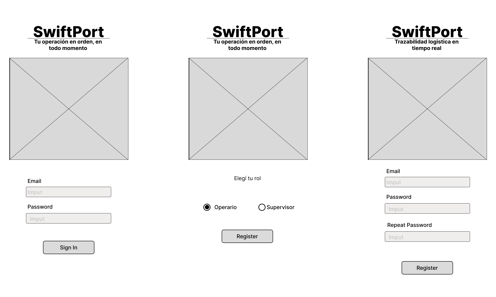
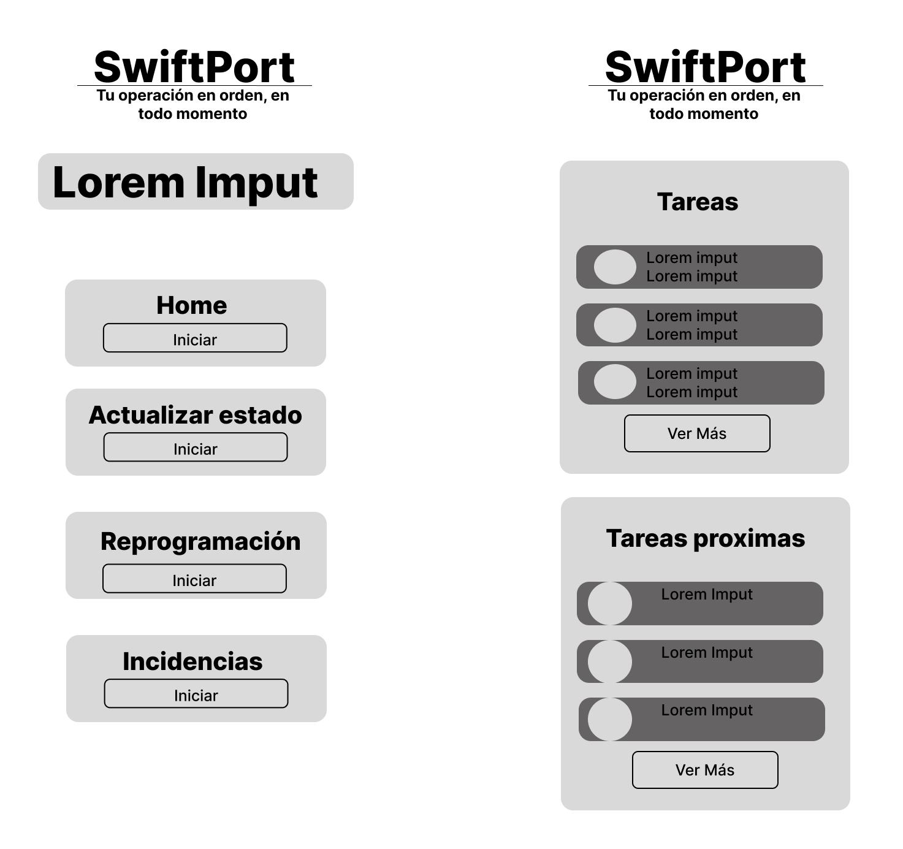
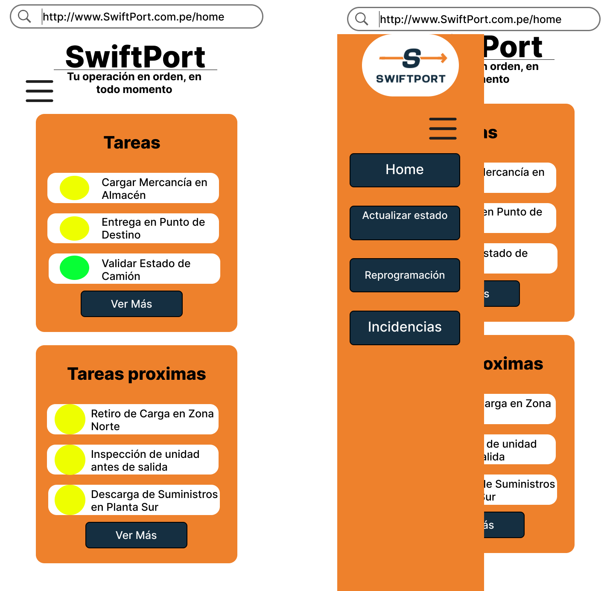
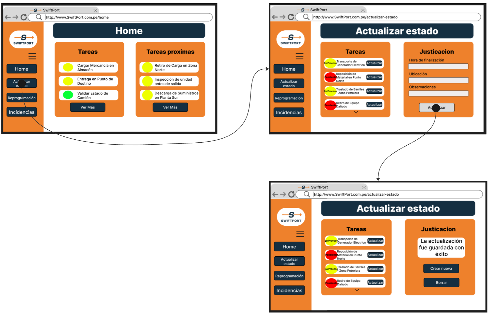

# Informe del Trabajo Final

  

  
<b>Informe de Trabajo Final</b>

  
Facultad de Ingeniería

  
Universidad Peruana de Ciencias Aplicadas

  
Ingeniería de Software

  
Desarrollo de Aplicaciones Open Source

  
4304

  
Efraín Ricardo Bautista Ubillús

  
Startup: GosTech

  
Producto: SwiftPort

---

## Team members:

| **Nombre**                       | **Código** |
| ---------------------------------|------------|
| Roman Cruz, Natalia Bertha       | U202310148 |
| Solano Armas, Angelo Hector      | U20231B775 |
| Iglesias Pérez, Sergio Sebastián | U202316118 |
| Baldeón Vivar, Santiago Armando  | U202319881 |
| Adrianzén Flores, Carlos Arturo  | U202215705 |

  
<b>Ciclo 2025 - 01</b>

---

## Versiones del Informe

| _Versión_ | _Fecha_    | _Autor_ | _Descripción de modificación_ |
| --------- | ---------- | ------- | ----------------------------- |
| 1.0       | 06/04/2025 | Iglesias Pérez, Sergio Sebastián | Creación del repositorio |
| 1.1       | 13/04/2025 | Roman Cruz, Natalia Bertha       | Capítulos I (sin entrevistas), Capítulo II (ubiquitous language) y Capítulo 3 (hasta 3.2) |

---

## Project Report Collaboration Insights

URL del repositorio para el reporte del proyecto: FALTA LANDING PAGE

**TB1**

Para el desarrollo del informe pertinente a la TB1, se dividió la implementación de sencciones de la siguiente forma entre los integrantes del grupo:

| **Integrantes**                  | **Tareas asignadas** |
| ---------------------------------|----------------------|
| Roman Cruz, Natalia Bertha       | Antescedentes y problemática, Problem Statements, Análisis de Entrevistas, Needfinding, Requirements Specification, Organization y Laling systems, Wireflow diagrams, Domain-Driven Software Architecture, Database diagram, Class diagram, Team Collaboration Insights, landing page, conclusiones, recomendaciones |
| Solano Armas, Angelo Hector      | Assumptions, Hypthesys statements, Análisis de Entrevistas, Needfinding, Requirements Specification, searching y navigation systems, wireframes, Domain-Driven Software Architecture, Database diagram, Class diagram, aspect leaders and collaborators, development evidence for sprint, landing page |
| Iglesias Pérez, Sergio Sebastián | Descripción del Startup, segmentos objetivos, registro de entrevistas, style guidelines, wireframes, mockup, prototype, context diagram, Software Development Environment Configuration, landing page |
| Baldeón Vivar, Santiago Armando  | Canvas, Diseño de entrevistas, style guidelines, wireframes, mockup, class dictionary, Source Code Style Guide & Conventions, Sprint Backlog 1, edición del video |
|  Adrianzén Flores, Carlos Arturo | Competidores, SEO Tags and Meta Tags, User Flow Diagrams, Software Configuration Management, Services Documentation Evidence for Sprint Review |

El proceso de colaboración durante el informe se realizó tanto con commits como compartiendo avances a través de documentos de google. 

---

## Github Collaboration Insights

Github también presenta un timeline de las ramas principales y los procesos de merge a los que se han sometido. Todas las ramas se crearon tomando en cuenta el diseño de GitFlow para una buena organización cuando se usa un software de control de versiones.

Se puede identificar a los integrantes como: 
- Roman Cruz, Natalia Bertha: natRC2005
- Solano Armas, Angelo Hector: Angelo5214
- Iglesias Pérez, Sergio Sebastián: ghostrider101218
- Baldeón Vivar, Santiago Armando: Santibal11
- Adrianzén Flores, Carlos Arturo: Choliwys

Asimismo, se explican las ramas que tenemos hasta el momento: FALTA COMPLETAR E IMAGEN
- main:
- readme-updates:

**ESPACIO PARA LA IMAGEN**

Los siguientes gráficos muestran analíticos en cuanto a los commits que cada integrante del grupo ha estado realizando en el repositorio.

__TB1__

**ESPACIO PARA LA IMAGEN**

---

## Students Outcomes

| _Criterios específicos_ | _Acciones realizadas_ | _Conclusiones_ |
| ----------------------- | ------------------------------------------------------------ | -------------- |
| Comunica oralmente con efectividad a diferentes rangos de audiencia. | Roman Cruz, Natalia Bertha  TB1 - Antecedentes y problemática  - Lean UX Problem Statements  - Análisis de entrevistas  - Needfinding  - Requirements Specification  - Organization Systems  - Labeling Systems  - Web Applications Wireflow Diagrams  - Domain-Driven Software Architecture  - Software Object-Oriented Design  - Database Design  - Team Collaboration Insights during Sprint  - Landing page  - Conclusiones  - Recomendaciones    Solano Armas, Angelo Hector  TB1   Iglesias Pérez, Sergio Sebastián  TB1   Baldeón Vivar, Santiago Armando  TB1   Adrianzén Flores, Carlos Arturo  TB1 - Analisis de competidores  - Analisis de entrevistas - Aspect Leaders and collaborators - Sprint Backlog 1 - Development Evidence for Sprint Review - Execution Evidence for Sprint Review - Team collaboration insigths | Al haber concluido con la primera entrega, hemos llegado a la conclusión de que logramos comunicarnos no solamente a través de las grabaciones incluídas, las cuales son las entrevistas y video de exposición, sino también antes los maestros que consultamos para la realización del trabajo y entre nosotros mismos como grupo y nuestros demás compañeros. Al comunicarnos, logramos expresar nuestras ideas de forma clara, comprensible, respetuosa y con un lenguaje adecuado acorde con el contexto. |
| Comunica por escrito con efectividad a diferentes rangos de audiencia | Roman Cruz, Natalia Bertha  TB1 - Antecedentes y problemática  - Lean UX Problem Statements  - Análisis de entrevistas  - Needfinding  - Requirements Specification  - Organization Systems  - Labeling Systems  - Web Applications Wireflow Diagrams  - Domain-Driven Software Architecture  - Software Object-Oriented Design  - Database Design  - Team Collaboration Insights during Sprint  - Landing page  - Conclusiones  - Recomendaciones    Solano Armas, Angelo Hector  TB1   Iglesias Pérez, Sergio Sebastián  TB1   Baldeón Vivar, Santiago Armando  TB1   Adrianzén Flores, Carlos Arturo  TB1 - Analisis de competidores  - Analisis de entrevistas - Aspect Leaders and collaborators - Sprint Backlog 1 - Development Evidence for Sprint Review - Execution Evidence for Sprint Review - Team collaboration insigths | Al termino de la TB1, podemos concluir que logramos expresar nuestras ideas y le mnesjae central de nuestro trabajo de forma escrita. Esto, dado que redactamos todo el análisis que realizamos para comenzar a implementar nuestro trabajo. Esto es apreciable al revisar las historias de usuario, análisis Lean UX y descripción de demás elementos incluídos. Asimismo, logramos identificar el lengujae correcto a utilizar al diseñar nuestro landing page de forma que los usuarios puedan comprenderlo sin problema.|

---

# Contenido

1. __[Capítulo I: Introducción](#Capítulo-i-introducción)__  
   1.1. [Startup Profile](#11-startup-profile)  
   &nbsp;&nbsp;&nbsp;&nbsp;1.1.1. [Descripción del startup](#111-descripción-de-la-startup)  
   &nbsp;&nbsp;&nbsp;&nbsp;1.1.2. [Perfiles de los integrantes del equipo](#112-perfiles-de-los-integrantes-del-equipo)  
   1.2. [Solution Profile](#12-solution-profile)  
   &nbsp;&nbsp;&nbsp;&nbsp;1.2.1. [Antecedentes y Problemática](#121-antecedentes-y-problemática)  
   &nbsp;&nbsp;&nbsp;&nbsp;1.2.2. [Lean UX Process](#122-lean-ux-process)  
   &nbsp;&nbsp;&nbsp;&nbsp;&nbsp;&nbsp;&nbsp;&nbsp;1.2.2.1. [Lean UX Problem Statement](#1221-lean-ux-problem-statement)  
   &nbsp;&nbsp;&nbsp;&nbsp;&nbsp;&nbsp;&nbsp;&nbsp;1.2.2.2. [Lean UX Assumptions](#1222-lean-ux-assumptions)  
   &nbsp;&nbsp;&nbsp;&nbsp;&nbsp;&nbsp;&nbsp;&nbsp;1.2.2.3. [Lean UX Hypothesis Statements](#1223-lean-ux-hypothesis-statements)  
   &nbsp;&nbsp;&nbsp;&nbsp;&nbsp;&nbsp;&nbsp;&nbsp;1.2.2.4. [Lean UX Canvas](#1224-lean-ux-canvas)  
   1.3. [Segmentos objetivo](#13-segmentos-objetivo)  
2. __[Capítulo II: Requirements Elicitation & Analysis](#capítulo-ii-requirements-elicitation--analysis)__  
   2.1. [Competidores](#21-competidores)  
   &nbsp;&nbsp;&nbsp;&nbsp;2.1.1. [Análisis competitivo](#211-análisis-competitivo)  
   &nbsp;&nbsp;&nbsp;&nbsp;2.1.2. [Estrategias y tácticas frente a competidores](#212-estrategias-y-tácticas-frente-a-competidores)  
   2.2. [Entrevistas](#22-entrevistas)  
   &nbsp;&nbsp;&nbsp;&nbsp;2.2.1. [Diseño de entrevistas](#221-diseño-de-entrevistas)  
   &nbsp;&nbsp;&nbsp;&nbsp;2.2.2. [Registro de entrevistas](#222-registro-de-entrevistas)  
   &nbsp;&nbsp;&nbsp;&nbsp;2.2.3. [Análisis de entrevistas](#223-análisis-de-entrevistas)  
   2.3. [Needfinding](#23-needfinding)  
   &nbsp;&nbsp;&nbsp;&nbsp;2.3.1. [User Personas](#231-user-personas)  
   &nbsp;&nbsp;&nbsp;&nbsp;2.3.2. [User Task Matrix](#232-user-task-matrix)  
   &nbsp;&nbsp;&nbsp;&nbsp;2.3.3. [User Journey Mapping](#233-user-journey-mapping)  
   &nbsp;&nbsp;&nbsp;&nbsp;2.3.4. [Empathy Mapping](#234-empathy-mapping)  
   &nbsp;&nbsp;&nbsp;&nbsp;2.3.5. [As-is Scenario Mapping](#235-as-is-scenario-mapping)  
3. __[Capítulo III: Requirements Specification](#capítulo-iii-requirements-specification)__  
   3.1. [To-Be Scenario Mapping](#31-to-be-scenario-mapping)  
   3.2. [User Stories](#32-user-stories)  
   3.3. [Impact Mapping](#33-impact-mapping)  
   3.4. [Product Backlog](#34-product-backlog)
4. __[Capítulo IV: Product Design](#capítulo-iv-product-design)__  
   4.1. [Style Guidelines](#41-style-guidelines)  
   &nbsp;&nbsp;&nbsp;&nbsp;4.1.1. [General Style Guidelines](#411-general-style-guidelines)  
   &nbsp;&nbsp;&nbsp;&nbsp;4.1.2. [Web Style Guidelines](#412-web-style-guidelines)  
   4.2. [Information Architecture](#42-information-architecture)  
   &nbsp;&nbsp;&nbsp;&nbsp;4.2.1. [Organization Systems](#421-organization-systems)  
   &nbsp;&nbsp;&nbsp;&nbsp;4.2.2. [Labeling Systems](#422-labeling-systems)  
   &nbsp;&nbsp;&nbsp;&nbsp;4.2.3. [SEO Tags and Meta Tags](#423-seo-tags-and-meta-tags)  
   &nbsp;&nbsp;&nbsp;&nbsp;4.2.4. [Searching Systems](#424-searching-systems)  
   &nbsp;&nbsp;&nbsp;&nbsp;4.2.5. [Navigation Systems](#425-navigation-systems)  
   4.3. [Landing Page UI Design](#43-landing-page-ui-design)  
   &nbsp;&nbsp;&nbsp;&nbsp;4.3.1. [Landing Page Wireframe](#431-landing-page-wireframe)  
   &nbsp;&nbsp;&nbsp;&nbsp;4.3.2. [Landing Page Mock-up](#432-landing-page-mock-up)  
   4.4. [Web Applications UX/UI Design](#44-web-applications-uxui-design)  
   &nbsp;&nbsp;&nbsp;&nbsp;4.4.1. [Web Applications Wireframes](#441-web-applications-wireframes)  
   &nbsp;&nbsp;&nbsp;&nbsp;4.4.2. [Web Applications Wireflow Diagrams](#442-web-applications-wireflow-diagrams)  
   &nbsp;&nbsp;&nbsp;&nbsp;4.4.3. [Web Applications Mock-ups](#443-web-applications-mock-ups)  
   &nbsp;&nbsp;&nbsp;&nbsp;4.4.4. [Web Applications User Flow Diagrams](#444-web-applications-user-flow-diagrams)  
   4.5. [Web Applications Prototyping](#45-web-applications-prototyping)  
   4.6. [Domain-Driven Software Architecture](#46-domain-driven-software-architecture)  
   &nbsp;&nbsp;&nbsp;&nbsp;4.6.1. [Software Architecture Context Diagram](#461-software-architecture-context-diagram)  
   &nbsp;&nbsp;&nbsp;&nbsp;4.6.2. [Software Architecture Container Diagrams](#462-software-architecture-container-diagrams)  
   &nbsp;&nbsp;&nbsp;&nbsp;4.6.3. [Software Architecture Components Diagrams](#463-software-architecture-components-diagrams)  
   4.7. [Software Object-Oriented Design](#47-software-object-oriented-design)  
   &nbsp;&nbsp;&nbsp;&nbsp;4.7.1. [Class Diagrams](#471-class-diagrams)  
   &nbsp;&nbsp;&nbsp;&nbsp;4.7.2. [Class Dictionary](#472-class-dictionary)  
   4.8. [Database Design](#48-database-design)  
   &nbsp;&nbsp;&nbsp;&nbsp;4.8.1. [Database Diagram](#481-database-diagram)  
5. __[Capítulo V: Product Implementation, Validation & Deployment](#capítulo-v-product-implementation-validation--deployment)__  
5.1. [Software Configuration Management](#51-software-configuration-management)  
   &nbsp;&nbsp;&nbsp;&nbsp;5.1.1. [Software Development Environment Configuration](#511-software-development-environment-configuration)  
   &nbsp;&nbsp;&nbsp;&nbsp;5.1.2. [Source Code Management](#512-source-code-management)  
   &nbsp;&nbsp;&nbsp;&nbsp;5.1.3. [Source Code Style Guide & Conventions](#513-source-code-style-guide--conventions)  
   &nbsp;&nbsp;&nbsp;&nbsp;5.1.4. [Software Deployment Configuration](#514-software-deployment-configuration)  
   5.2. [Landing Page, Services & Applications Implementation](#52-landing-page-services--applications-implementation)  
   &nbsp;&nbsp;&nbsp;&nbsp;5.2.1. [Sprint 1](#521-sprint-1)  
   &nbsp;&nbsp;&nbsp;&nbsp;&nbsp;&nbsp;&nbsp;&nbsp;5.2.1.1. [Sprint Planning 1](#5211-sprint-planning-1)  
   &nbsp;&nbsp;&nbsp;&nbsp;&nbsp;&nbsp;&nbsp;&nbsp;5.2.1.2. Aspect Leaders and Collaborators](#5212-aspect-leaders-and-collaborators)
   &nbsp;&nbsp;&nbsp;&nbsp;&nbsp;&nbsp;&nbsp;&nbsp;5.2.1.3. [Sprint Backlog 1](#5212-sprint-backlog-1)  
   &nbsp;&nbsp;&nbsp;&nbsp;&nbsp;&nbsp;&nbsp;&nbsp;5.2.1.4. [Development Evidence for Sprint Review](#5213-development-evidence-for-sprint-review)  
   &nbsp;&nbsp;&nbsp;&nbsp;&nbsp;&nbsp;&nbsp;&nbsp;5.2.1.5. [Execution Evidence for Sprint Review](#5215-execution-evidence-for-sprint-review)  
   &nbsp;&nbsp;&nbsp;&nbsp;&nbsp;&nbsp;&nbsp;&nbsp;5.2.1.6. [Services Documentation Evidence for Sprint Review](#5216-services-documentation-evidence-for-sprint-review)  
   &nbsp;&nbsp;&nbsp;&nbsp;&nbsp;&nbsp;&nbsp;&nbsp;5.2.1.7. [Software Deployment Evidence for Sprint Review](#5217-software-deployment-evidence-for-sprint-review)  
   &nbsp;&nbsp;&nbsp;&nbsp;&nbsp;&nbsp;&nbsp;&nbsp;5.2.1.8. [Team Collaboration Insights during Sprint](#5218-team-collaboration-insights-during-sprint)  
   &nbsp;&nbsp;&nbsp;&nbsp;5.2.2. [Sprint 2](#522-sprint-2)  
    &nbsp;&nbsp;&nbsp;&nbsp;&nbsp;&nbsp;&nbsp;&nbsp;5.2.2.1. [Sprint Planning 2](#5221-sprint-planning-2)  
    &nbsp;&nbsp;&nbsp;&nbsp;&nbsp;&nbsp;&nbsp;&nbsp;5.2.2.2. [Aspect Leaders and Collaborators] (#5222-aspect-leaders-and-collaborators)  
    &nbsp;&nbsp;&nbsp;&nbsp;&nbsp;&nbsp;&nbsp;&nbsp;5.2.2.3. [Sprint Backlog 2](#5223-sprint-backlog-2)  
    &nbsp;&nbsp;&nbsp;&nbsp;&nbsp;&nbsp;&nbsp;&nbsp;5.2.2.4. [Development Evidence for Sprint Review](#5224-development-evidence-for-sprint-review)  
    &nbsp;&nbsp;&nbsp;&nbsp;&nbsp;&nbsp;&nbsp;&nbsp;5.2.2.5. [Execution Evidence for Sprint Review](#5225-execution-evidence-for-sprint-review)  
    &nbsp;&nbsp;&nbsp;&nbsp;&nbsp;&nbsp;&nbsp;&nbsp;5.2.2.6. [Services Documentation Evidence for Sprint Review](#5226-services-documentation-evidence-for-sprint-review)  
    &nbsp;&nbsp;&nbsp;&nbsp;&nbsp;&nbsp;&nbsp;&nbsp;5.2.2.7. [Software Deployment Evidence for Sprint Review](#5227-software-deployment-evidence-for-sprint-review)  
    &nbsp;&nbsp;&nbsp;&nbsp;&nbsp;&nbsp;&nbsp;&nbsp;5.2.2.8. [Team Collaboration Insights during Sprint](#5228-team-collaboration-insights-during-sprint)  

7. __[Conclusiones](#Conclusiones)__  
  6.1. [Conclusiones](#61-conclusiones)  
  6.2. [Recomendaciones](#62-recomendaciones)  
8. __[Bibliografía](#bibliografía)__  
9. __[Anexos](#anexos)__  

---
# Capítulo I: Introducción  

## 1.1. Startup Profile

### 1.1.1. Descripción de la Startup  

GosTech tiene como objetivo transformar digitalmente la planificación y supervisión de actividades logísticas de campo en zonas operativas de largo plazo, como aquellas vinculadas a la industria petrolera, minera o energética. A través de su plataforma principal, SwiftPort, GosTech permite a las empresas logísticas organizar de forma centralizada los requerimientos de transporte, asignar vehículos y cuadrillas de manera eficiente, y supervisar la ejecución operativa en tiempo real, incluso ante condiciones cambiantes del entorno.

La solución busca resolver la falta de trazabilidad, flexibilidad y control en entornos donde las operaciones logísticas deben adaptarse constantemente a factores como el clima, el estado del equipo o la disponibilidad del personal. Para ello, SwiftPort integra simulaciones de dispositivos IoT, como rastreo GPS y monitoreo del estado operativo de la maquinaria, lo cual permite generar alertas tempranas y tomar decisiones informadas durante la ejecución de las actividades.

Una de las principales fortalezas del sistema es su capacidad para adaptarse a la realidad del campo: contempla la reprogramación de actividades, el registro posterior de la ejecución por parte de los operarios y dashboards que reflejan el cumplimiento y desempeño operativo en todo momento. Esta solución aporta un valor diferencial tanto para los supervisores que planifican como para el personal que ejecuta tareas en terreno.

Misión: Optimizar la planificación, ejecución y trazabilidad de actividades logísticas de campo mediante una plataforma inteligente que integre tecnología IoT simulada adaptada a zonas operativas remotas.

Visión: GosTech aspira a convertirse en el aliado tecnológico preferido por empresas logísticas en Latinoamérica, facilitando operaciones más eficientes, seguras y adaptables a través de innovación digital aplicada al terreno.

### 1.1.2. Perfiles de los integrantes del equipo

#### 1.1.2.1. Natalia Bertha Roman Cruz

Mi nombre es Natalia Bertha Roman Cruz, tengo 19 años y soy estudiante de la carrera de Ingeniería de Software en la UPC. Me considero una persona perseverante y organizada, así como con capacidad de liderazgo, de forma que busco guiar a mi equipo y motivar la colaboración entre los integrantes. Me gusta investigar acerca de nuevas propuestas para utilizar las herramientas tecnológicas a nuestro favor. Antes de iniciar el curso, he tenido cierta experiencia en el manejo de Angular al estar realizando mis prácticas preprofesionales, así como he utilizado C + +, python y javaScript anteriormente.

  

#### 1.1.2.2. Angelo Hector Solano Armas

Mi nombre es Angelos Solano Armas, tengo 19 años y actualmente estudio Ingeniería de Software. Me encuentro cursando el quinto ciclo de la carrera, y me considero una persona alegre, responsable y con muchas ganas de aprender. Tengo grandes expectativas respecto a este curso, ya que espero que me brinde los conocimientos necesarios para desarrollar una estructura sólida de software, así como reforzar mis habilidades técnicas y mi lógica de programación. Aspiro a convertirme en un profesional capaz de diseñar soluciones eficientes y escalables, y sé que este curso será clave en ese camino.

  

#### 1.1.2.3. Sergio Sebastián Iglesias Pérez

Hola, soy estudiante de la carrera de Ingeniería de Software en la UPC. Tengo un alto interés en aprender sobre Arquitectura de Software y buenas prácticas de programación. Por motivos laborales, tengo experiencia en desarrollo web en un stack diferente al del curso, por lo cual espero poder adaptar mis conocimientos y poder apoyar a mis compañeros siempre que tenga disponibilidad. Finalmente, espero que la idea que proponemos sea de alto valor y la podamos implementar de forma adecuada.

  

#### 1.1.2.4. Santiago Armando Baldeón Vivar

Mi nombre es Santiago Armando Baldeon y tengo 18 años. Actualmente estoy cursando la carrera de Ingeniería de Software en la Universidad Peruana de Ciencias Aplicadas. En mi caso elegí esta carrera porque desde chico sentí gran pasión por la tecnología y siempre quise ser alguien importante en este mundo, brindando mis aportes a la humanidad. Creo que voy por buen camino y espero en un futuro cumplir estos sueños y objetivos que tengo

  

#### 1.1.2.5. Carlos Arturo Adrianzén Flores

Mi nombre es Carlos Arturo Adrianzén Flores y soy estudiante de la carrera de ingeniería de software. Me entusiasman las nuevas tecnologías, sobre todo las que son útiles para solventar problemas reales. Tengo experiencia en lenguajes de programación como C + + y Python. Me gusta tocar la guitarra y jugar fútbol.

  

## 1.2. Solution Profile

### 1.2.1. Antecedentes y problemática

#### 1.2.1.1. What

__¿Cuál es el problema__

El problema puede ser mencionado como la falta de un recurso tecnológico capaz de organizar equipos de trabajo y registrar datos sobre las actividades que estos deben cumplir en empresas dedicadas a la repartición de material o mercancía de forma industrial. Esto ocasiona consecuencias dentro de la empresa dado que, al no existir un registro de la secuencia de los procesos llevados a cabo para la entrega de lo solicitado, surgen errores que causan pérdidas de tiempo y económicas, así como la imagen de la empresa se ve afectada frente a sus empresas clientes.

#### 1.2.1.2. Who

__¿Quiénes están involucrados en el problema?__

Al ser este un problema que afecta principalmente a las empresas proveedoras de materiales o productos, serán los usuarios de estas nuestros usuarios. Así, podemos colocar a los encargados de la administración y/o gerentes como usuarios con la capacidad de colocar las tareas a cumplir para la entrega de cada envío que se está preparando y de visualizar los datos registrados para verificar que todo se está cumpliendo correctamente. Al mismo tiempo, los trabajadores de campo que ejecutan las tareas listadas por los superiores también tendrían acceso a nuestros servicios para registrar los datos solicitados y visualizar los requisitos o pasos a cumplir.

#### 1.2.1.3. Where

__¿Dónde surge el problema?__

El problema surge principalmente en los puntos de recojo y entrega de los productos o materiales encargados, siendo estos almacenes, dado que el recoger o dejar la carga dispone de procesos que frecuentemente no son completados ni verificados como deberían, lo que sube el riesgo de que ocurran errores que afecten el tiempo previsto de entrega o dañen la mercancía, lo que dispone problemas para ambas empresas involucradas.  

Asimismo, puede mencionarse que los problemas ocurren en las oficinas de la empresa proveedora, puesto que esta, al no contar con los datos sobre sus propios envíos en tiempo real, sufre de dificultades para ofrecer soluciones de forma rápida frente a las adversidades que puedan ocurrir, así como percibe una desorganización general que dificulta el crecimiento y mejora de la calidad de sus servicios.

#### 1.2.1.4. When

__¿Cuándo se presenta el problema?__

El problema inicia desde que una empresa externa realiza una solicitud a la empresa proveedora, dado que esta última debe registrar el pedido de manera correcta y considerando las especificaciones como medidas de seguridad a tomar durante el trayecto para proteger la carga. Cuando estas indicaciones no son correctamente especificadas, repartidas entre los equipos y verificadas, la carga puede no llegar en un estado óptimo, así como puede llegar a perderse por la gran cantidad de envíos simultáneos realizados. Asimismo, al no haberse seguido los pasos supuestos, la carga puede llegar con desperfectos, afectando el trabajo de la empresa receptora y generándole desconfianza hacia la proveedora.

#### 1.2.1.5. Why

__¿Por qué surge el problema?__

El problema surge debido a la descoordinación y desorganización de la empresa en cuanto a la ejecución de sus actividades. Al no contar con un sistema adecuado mediante el cuál verificar el cumplimiento de todos los pasos y medidas que supone cada proceso, es imposible saber si el envío está siendo realizado adecuadamente, lo que provoca errores evitables.

#### 1.2.1.6. How

__¿Cómo se utilizará el producto?__

El producto será utilizado como una herramienta de gestión logística que contendrá los pasos a realizar para cumplir exitosamente con cada etapa de envío de un pedido, así como con los requisitos adicionales de cada uno y sus datos cruciales (lugar de carga, lugar de entrega, encargados, entre otros). Así, quienes se encuentran en cargos administrativos podrán registrar la información mencionada y verificar el cumplimiento de lo solicitado de forma eficiente e inmediata, mientras que los trabajadores de campo tendrán las indicaciones que necesitan de forma clara y siempre disponible, junto a la opción de notificar el correcto cumplimiento de las operaciones detalladas o de una diversidad para lograr tomar acción inmediata de manera informada.

#### 1.2.1.7. How much

__¿¿Cuál es la magnitud del problema?__

Según indica Carlos Pintado (2023), licenciado en contaduría pública, se ha observado que el 44% de las empresas de transporte son deficientes debido a que no logran concretar un sistema a seguir con procesos lógicos en el cual puedan detectarse errores con facilidad. Esto ocasiona pérdidas monetarias y retrasa tanto el término del envío en cuestión como los posteriores. Asimismo, dentro de los factores que retrasan el crecimiento de la empresa dadas las constantes adversidades en sus operaciones, se señala la falta de coordinación y unidad al trabajar en equipo, lo cual surge dada la falta de comunicación entre áreas y las indicaciones imprecisas.

Por otro lado, el 63% de las empresas proveedoras encuestadas manifestaron que el cumplimiento del flujo de trabajo impacta directamente en su correcto desempeño, así como influye en sus gastos mensuales. De esta forma, se puede notar que el no contar con un sistema de logística útil y sencillo de utilizar que pueda mejorar la comunicación entre áreas y verificar el cumplimiento de tareas frena el crecimiento de la empresa y dificulta el cierre exitoso de los pedidos realizados.

### 1.2.2. Lean UX Process

#### 1.2.2.1. Lean UX Problem Statement

El propósito de GosTech es crear un sistema de gestión logística que se ajuste a las necesidades de las empresas proveedoras que desean mejorar la organización de sus actividades y equipos durante todos los procesos realizados desde que un pedido es realizado hasta que este es entregado satisfactoriamente. 

En este sentido, nuestra solución busca mostrar una interfaz amigable que sea sencilla de utilizar para ambos segmentos considerados, de forma que la información que uno introduzca sea útil para el otro. Asimismo, se considera la implementación de elementos IoT que ayuden a comprobar que la carga está siendo correctamente empaquetada y colocada en el transporte correspondiente, así como para seguir su camino. En resumen, será posible para todos los involucrados introducir y verificar datos, de forma que se mejorará y agilizará la gestión reduciendo el marco de error.

Hemos notado que las empresas proveedoras suelen presentar errores al realizar sus servicios de entrega de productos debido a la deficiente organización y sistema logístico que manejan, lo que dificulta la comunicación entre áreas, representa mayores gastos económicas y pérdidas de tiempo y recursos, daña su imagen frente a las empresas que solicitan sus servicios, y no les permite terminar de consolidarse o expandirse. De esta forma, es notable que se necesitan emplear herramientas tecnológicas que faciliten la gestión logística en este sector.

¿Cómo podemos emplear herramientas tecnológicas para proveer un sistema de logística eficiente que gestione las actividades de las empresas proveedoras?

#### 1.2.2.2. Lean UX Assumptions

__Business Assumptions:__

- __Creemos que nuestros usuarios necesitan__ una solución que automatice el control logístico, eliminando tareas manuales y mejorando la trazabilidad.
- __Estas necesidades se pueden satisfacer__  mediante una plataforma digital conectada a sensores IoT, que registre y notifique automáticamente cada acción del proceso.
- __Nuestros clientes iniciales serán__ empresas proveedoras, operadores logísticos y compañías industriales que trasladan productos o insumos entre sedes o hacia clientes.
- __El valor más importante que un cliente quiere de nuestros servicios es__ la verificación automática del cumplimiento logístico, visibilidad en tiempo real y reducción del margen de error.
- __Vamos a obtener la mayoría de los clientes mediante__ alianzas logísticas, pilotos con industrias clave, eventos sectoriales y marketing digital especializado en B2B (business to business).
- __Vamos a obtener ingresos mediante__ suscripciones mensuales, con planes escalables según el número de envíos, dispositivos conectados o integración con otros sistemas.
- __Nuestra competencia en el mercado será__ soluciones de rastreo parcial, herramientas no integradas o sistemas costosos sin soporte para tecnologías emergentes.
- __Vamos a tener ventaja frente a nuestra competencia debido a__ la combinación de tecnología IoT, QR y una interfaz colaborativa, adaptable a todo tipo de envío.
- __El mayor riesgo del servicio es__ que el personal de campo no registre correctamente o ignore el uso de los dispositivos.
- __Lo resolveremos realizando__ una interfaz fácil, entrenamientos orientados a procesos reales y pilotos con iteración constante.

__User Assumptions:__

__¿Quién es el usuario?__

Los usuarios principales son el personal técnico, supervisor y administrativo de empresas que gestionan envíos industriales en Perú. Esto incluye tanto al personal de planta como a operadores logísticos, transportistas, responsables de almacén y encargados de recibir mercancía en destino. Si la plataforma tiene éxito en este sector, se plantea su extensión a todo el ecosistema logístico nacional e internacional, incluyendo sectores como manufactura, minería, agroindustria, energía y distribución masiva.

__¿Qué problemas busca resolver el producto?__

La falta de control sobre tareas logísticas, los errores manuales en el embarque, y la imposibilidad de verificar el estado del envío de forma automática.

__¿Qué funcionalidades son importantes?__

Nuestra solución permite un seguimiento digital por etapas (embarque, transporte y entrega), con verificación automatizada, sensores IoT y códigos QR para asegurar el control de cada paquete. Ofrece mapas en tiempo real con el estado del envío, junto con alertas automáticas ante fallas o desviaciones. Permite además el registro fotográfico e informes de incidencias, integrándose con sistemas ERP(Planificación de Recursos Empresariales), WMS (Sistema de gestión de almacenes) y CRM (Gestión de Relaciones con el Cliente) para centralizar la información. Todo esto se complementa con reportes analíticos en tiempo real que apoyan la toma de decisiones logísticas.

__¿Dónde encaja nuestro producto en su trabajo o vida?__

En el flujo operativo diario: desde la preparación de pedidos, control de calidad y embarque, hasta la entrega, recepción y evaluación post-servicio.

__¿Cuándo y cómo es nuestro producto usado?__

Durante cada punto crítico del envío, por múltiples usuarios simultáneamente, a través de móviles, tablets, lectores o dashboards en oficina.

__¿Cómo debe verse nuestro producto y cómo debe comportarse?__

Debe tener una interfaz intuitiva, responsiva y modular, con indicadores visuales, carga automática de datos desde sensores y herramientas de validación visual, rápida y confiable.

#### 1.2.2.3. Lean UX Hypothesis Statements

Hypothesis Statement 01

**Creemos** que los supervisores y operadores adoptarán el sistema si pueden registrar el cumplimiento de tareas con tecnología RFID en lugar de formularios manuales.  
**Sabremos** que hemos tenido éxito  
**cuando** el 80% de los registros se realicen mediante escaneo RFID o sensores IoT durante la fase piloto.  

Hypothesis Statement 02

**Creemos** que permitir acceso en tiempo real al estado de cada envío, capturado por dispositivos IoT, mejorará la coordinación entre áreas.  
**Sabremos** que hemos tenido éxito  
**cuando** se reduzcan en un 40% los reportes sobre paquetes extraviados o enviados al destino incorrecto.  

Hypothesis Statement 03

**Creemos** que la combinación de códigos QR  reducirá errores en la asignación de destinos.  
**Sabremos** que hemos tenido éxito  
**cuando** se observe una disminución del 60% en entregas erróneas dentro de los primeros tres meses de uso.  

Hypothesis Statement 04

**Creemos** que las alertas automáticas generadas por sensores IoT permitirán al equipo logístico actuar rápidamente ante incidencias.  
**Sabremos** que hemos tenido éxito  
**cuando** el tiempo promedio de respuesta ante problemas logísticos se reduzca en un 40%.  

Hypothesis Statement 05

**Creemos** que un historial digital generado automáticamente por sensores, escaneos y registros IoT facilitará auditorías internas y prevención de errores.    
**Sabremos** que hemos tenido éxito  
**cuando** al menos el 70% de las auditorías logísticas utilicen los datos del sistema como fuente principal.  

Hypothesis Statement 06

**Creemos** que al integrarse con sistemas ERP, WMS o CRM, se incrementará la eficiencia y se reducirá la duplicidad de tareas administrativas.  
**Sabremos** que hemos tenido éxito  
**cuando** el tiempo promedio de registro y consulta de información de envíos se reduzca en un 50%.

Hypothesis Statement 07

**Creemos** que registrar automáticamente las incidencias detectadas por sensores IoT ayudará a prevenir errores mayores antes de la entrega.  
**Sabremos** que hemos tenido éxito  
**cuando** al menos el 60% de los eventos detectados se resuelvan antes de que el paquete llegue a destino.  

Hypothesis Statement 8

**Creemos** que añadir fotografías y validaciones por RFID o sensores IoT como evidencia aumentará la transparencia del proceso y reducirá disputas.  
**Sabremos** que hemos tenido éxito  
**cuando** los reclamos por daños sin evidencia disminuyan en un 50%.

Hypothesis Statement 09

**Creemos** que brindar dashboards analíticos en tiempo real, alimentados por dispositivos inteligentes, facilitará la toma de decisiones estratégicas.  
**Sabremos** que hemos tenido éxito  
**cuando** al menos el 75% de los responsables logísticos usen los reportes al menos una vez por semana.  

#### 1.2.2.4. Lean UX Canvas

Lean UX Canvas es una de las herramientas que hemos utilizado para conmprender a nuestros posibles usuarios y sus necesidades. Esta es usada en el campo del diseño centrado en el usuario y la metodología Lean con la intención de desarrollar productos de forma eficientes y práctica para los usuarios. A su vez, esta puede ser utilizada por equipos multidisciplinarios para que colaboración de forma ordenada dentro un marco estructurado.

  

Enlace para acceder al [Canvas](https://www.canva.com/design/DAGjpb8uvJA/kFkhcvG5a6BCtdU2xvq5gw/edit?utm_content=DAGjpb8uvJA&utm_campaign=designshare&utm_medium=link2&utm_source=sharebutton)

## 1.3. Segmentos Objetivos

#### Segmento objetivo #1: Supervisores y Planificadores de Campo (Empresas Logísticas)

__Descripción General__

Personal a cargo de planificar y supervisar operaciones logísticas en terreno, incluyendo la asignación de vehículos, maquinaria y cuadrillas para el cumplimiento de requerimientos operativos. Este segmento representa a mandos intermedios o jefaturas operativas dentro de empresas logísticas que atienden sectores como petróleo, minería o infraestructura.

__Perfil Demográfico__

- Edad: 30 a 55 años
- Experiencia: técnica y logística, con alta carga operativa  
- Ubicación: regiones con presencia de operaciones industriales (como Piura, Ica, Loreto, Cusco)  
- Nivel digital: medio, familiarizados con hojas de cálculo, radios, GPS y plataformas básicas

__Datos del Sector__

De acuerdo con Logística360, la región latinoamericana enfrenta retos operativos debido a la infraestructura deficiente y la necesidad de digitalizar los procesos logísticos. Se proyecta un crecimiento del sector logístico en Sudamérica del 7.5% anual entre 2024 y 2032, lo que acentúa la necesidad de herramientas que optimicen la planificación y el seguimiento en campo.

__Necesidad__

Automatizar la planificación y trazabilidad de actividades, permitiendo la reprogramación dinámica ante imprevistos (clima, fallas, cambios de personal), y generar reportes confiables para la toma de decisiones.

#### Segmento objetivo #2: Operarios de Campo / Técnicos Logísticos

__Descripción General__

Trabajadores responsables de ejecutar las actividades logísticas en terreno, como el traslado de carga, operación de maquinaria, asistencia a zonas de trabajo y reporte de condiciones reales. Interactúan directamente con la ejecución física de las actividades y son fundamentales para el registro de datos reales.  

__Perfil Demográfico__

- Edad: 20 a 50 años
- Formación: técnica operativa o empírica 
- Herramientas: teléfonos móviles, radios, tablets (ocasionalmente)  
- Nivel digital: bajo a medio; priorizan sistemas simples, rápidos e intuitivos

__Datos del Sector__

La industria logística reconoce la necesidad de integrar herramientas de campo que funcionen en entornos desconectados o adversos. Según el mismo informe, la adopción de IoT y tecnologías móviles es clave para mejorar la visibilidad operativa, especialmente en regiones donde la logística es más compleja y los equipos humanos deben adaptarse constantemente.  

__Necesidad__

Contar con una herramienta que les facilite la consulta de tareas, registro de datos reales (como hora de ejecución, modificaciones de equipo) y alertas rápidas sin complicaciones, idealmente desde un celular o tablet.

# 2. Capítulo II: Requirements Elicitation & Analysis

## 2.1 Competidores

### 2.1.1. Análisis competitivo

A continuación, realizamos un análisis competitivo para identificar oportunidades, amenazas, ventajas y posibles desventajas que podemos tener dentro del mercado en comparación a otras empresas que realicen actividades similares a las nuestras. De esta forma, podremos prepararnos para resaltar frente a los consumidores.

<table>
  <thead>
    <tr>
      <th colspan="7"><b>Competitive Analysis Landscape</b></th>
    </tr>
  </thead>
  <tbody>
    <tr>
      <td colspan="2" align="center">¿Por qué llevar a cabo este análisis?</td>
      <td colspan="5" align="center">Identificar las fortalezas, debilidades, oportunidades y amenazas de nuestra solución, SwiftPort, frente a competidores consolidados del sector logístico, con el fin de validar nuestra propuesta de valor, afinar nuestra estrategia de posicionamiento y asegurar una ventaja competitiva que se pueda sostener a largo plazo en el mercado.</td>
    </tr>
    <tr>
      <td colspan="2">PERFIL</td>
      <td><picture>

 </picture></td>
      <td><picture>

</picture></td>
      <td><picture>

</picture></td>
      <td><picture>

</picture></td>
      <td><picture>

</picture></td>
    </tr>
    <tr>
      <td rowspan="2">Perfil</td>
      <td>Overview</td>
      <td>Plataforma de gestión de cadena de suministro enfocada en envíos internacionales.</td>
      <td>Plataforma colaborativa para la gestión logística unificada.</td>
      <td>Software robusto para ejecución logística internacional.</td>
      <td>Soluciones RFID + IoT para trazabilidad.</td>
      <td>Plataforma de gestión logística con IoT, QRs y dashboard colaborativo.</td>
    </tr>
    <tr>
      <td>Ventaja Competitiva ¿Qué valor ofrece a los clientes?</td>
      <td>Visibilidad global en tiempo real y optimización de cadena de suministro.</td>
      <td>Comunicación entre actores logísticos en una sola plataforma.</td>
      <td>Gran escalabilidad y automatización en sistemas complejos.</td>
      <td>Precisión en el escaneo y visibilidad en almacén.</td>
      <td>Integración IoT/RFID/QR + interfaz colaborativa adaptada a múltiples roles.</td>
    </tr>
    <tr>
      <td rowspan="2">Perfil de Marketing</td>
      <td>Mercado objetivo</td>
      <td>Empresas exportadoras e importadoras.</td>
      <td>PYMEs logísticas y grandes operadores.</td>
      <td>Operadores logísticos globales y agentes de aduanas.</td>
      <td>Logística, retail y salud.</td>
      <td>Empresas proveedoras, operadores logísticos, industria nacional e internacional.</td>
    </tr>
    <tr>
      <td>Estrategias de Marketing</td>
      <td>Marketing digital, contenido técnico y casos de éxito.</td>
      <td>Inbound marketing y demos personalizadas.</td>
      <td>Ferias internacionales, canales de distribución.</td>
      <td>Webinars, distribuidores autorizados.</td>
      <td>Alianzas, pilotos, eventos sectoriales, marketing B2B.</td>
    </tr>
    <tr>
      <td rowspan="3">Perfil del Producto</td>
      <td>Productos & Servicios</td>
      <td>Gestión de envíos internacionales, visibilidad y análisis.</td>
      <td>Plataforma de colaboración logística en tiempo real.</td>
      <td>Software de ejecución logística, aduanas, documentación.</td>
      <td>Lectores RFID, plataformas IoT.</td>
      <td>Gestión logística integrada con IoT, RFID, QR y dashboards.</td>
    </tr>
    <tr>
      <td>Precios & Costos</td>
      <td>No público, con licencias y comisiones.</td>
      <td>Desde $500/mes.</td>
      <td>$1,000+ por licencia</td>
      <td>Hardware $1,000–$8,000 + software.</td>
      <td>Suscripción mensual por niveles.</td>
    </tr>
    <tr>
      <td>Canales de Distribución (web / móvil)</td>
      <td>Web, API.</td>
      <td>Web, Móvil, API.</td>
      <td>Software a medida, integración global.</td>
      <td>Hardware + software, API.</td>
      <td>Web, Móvil, Dashboards integrados con ERP/CRM/WMS.</td>
    </tr>
    <tr>
      <td rowspan="4">Análisis SWOT</td>
      <td>Fortalezas</td>
      <td>Red global, interfaz elegante, gran reputación.</td>
      <td>Enfoque colaborativo único, buena integración con otros sistemas.</td>
      <td>Escalabilidad, cumplimiento legal, alcance global.</td>
      <td>Precisión RFID, experiencia técnica.</td>
      <td>Interfaz intuitiva, integración con ERP/WMS/CRM, tecnología IoT, alertas en tiempo real.</td>
    </tr>
    <tr>
      <td>Debilidades</td>
      <td>Costos elevados, foco en grandes empresas.</td>
      <td>Curva de aprendizaje, costos para pequeñas empresas.</td>
      <td>Costoso, complejo de implementar.</td>
      <td>Alta inversión inicial.</td>
      <td>Riesgo de adopción en campo, requiere capacitación inicial.</td>
    </tr>
    <tr>
      <td>Oportunidades</td>
      <td>Alianzas con nuevos mercados.</td>
      <td>Expansión en Latinoamérica.</td>
      <td>Nuevos acuerdos con gobiernos.</td>
      <td>Integración con software de gestión.</td>
      <td>Ampliar a otros sectores (minería, agro, distribución), expansión regional.</td>
    </tr>
    <tr>
      <td>Amenazas</td>
      <td>Competencia de plataformas más baratas.</td>
      <td>Competidores locales con soluciones más simples.</td>
      <td>Aparición de plataformas más flexibles.</td>
      <td>Disminución de inversión en hardware.</td>
      <td>Baja adopción tecnológica en PYMEs, resistencia al cambio.</td>
    </tr>
  </tbody>
</table>

### 2.1.2. Estrategias y tácticas frente a competidores

Para diferenciar nuestra solución en el mercado de gestión logística, consideramos las siguientes estrategias:

- Integración de Tecnologías Emergentes: Incorporar tecnologías como IoT, RFID y códigos QR para ofrecer una trazabilidad completa y en tiempo real de los envíos, superando las capacidades de algunos competidores que aún dependen de sistemas menos integrados.​

- Interfaz Intuitiva y Colaborativa: Desarrollar una plataforma con una interfaz amigable que facilite la colaboración entre diferentes niveles de usuarios, desde operarios hasta gerentes, asegurando una rápida adopción y minimizando la resistencia al cambio.​

- Modelo de Precios Escalable y Transparente: Ofrecer planes de suscripción flexibles basados en el volumen de envíos o dispositivos conectados, permitiendo a empresas de diferentes tamaños acceder a la solución sin inversiones iniciales prohibitivas.​

- Soporte y Capacitación Personalizados: Proporcionar programas de capacitación adaptados a las necesidades específicas de cada cliente y un soporte técnico proactivo para garantizar el máximo aprovechamiento de la plataforma.​

- Enfoque en Mercados Locales y Regionales: Centrarse inicialmente en empresas proveedoras y operadores logísticos en Perú y América Latina, atendiendo a las particularidades y desafíos específicos de estos mercados.​

## 2.2. Entrevistas

### 2.2.1. Diseño de entrevistas

#### Segmento objetivo #1: Planificadores de actividades de campo

Actividades actuales  

- ¿Cómo organizas las actividades que tu equipo realiza en campo?  
- ¿Qué herramientas usas para planificar y asignar tareas?
- ¿Tienes algún proceso estándar para reagendar o modificar tareas?
- ¿Cuánto tiempo te toma asignar tareas para un día o semana?

Monitoreo y control

- ¿Cómo haces seguimiento a la ejecución de las tareas?
- ¿Cómo sabes si una actividad se completó correctamente?
- ¿Con qué frecuencia ocurren imprevistos o desviaciones?
- ¿Qué tan importante es para ti contar con reportes o estadísticas?

Tecnología y digitalización

- ¿Has usado alguna solución digital (app, sistema web) para estas tareas?
- ¿Qué te gustó o no te gustó de esas herramientas?
- ¿Qué funcionalidades consideras más importantes en un sistema de planificación y monitoreo?

Dolores y frustraciones

- ¿Qué es lo que más te complica en la planificación de campo?
- ¿Te resulta difícil coordinar con los operarios durante el día?
- ¿Qué consecuencias tiene una mala planificación en tu equipo?

Expectativas

- Si pudieras tener una herramienta ideal, ¿qué haría por ti?

#### Segmento objetivo #2:  Operarios de campo

Flujo de trabajo

- ¿Cómo sabes qué tareas debes hacer cada día?
- ¿Recibes instrucciones claras sobre lo que se espera de ti?
- ¿Qué tipo de tareas haces normalmente?

Herramientas y comunicación

- ¿Qué dispositivos usas durante el trabajo? (celular, radio, tablet, etc.)
- ¿Cómo reportas que una tarea ya fue completada?
- ¿Te ha pasado que no sabes cómo proceder en una tarea? ¿Qué haces?

Seguimiento y ubicación

- ¿Alguna vez han rastreado tu ubicación mientras trabajas?
- ¿Estás de acuerdo con que se monitoree tu ubicación por razones de seguridad u operación?

Problemas frecuentes

- ¿Qué es lo más difícil de tu trabajo diario?
- ¿Qué pasa cuando hay un cambio de último minuto o problema en el campo?
- ¿Cómo te sientes con la forma actual en que se te asignan tareas?

Experiencia digital

- ¿Has usado alguna aplicación para recibir o reportar tareas?
- ¿Te parece fácil usar tecnología para trabajar o prefieres métodos tradicionales?

Mejoras posibles

- ¿Qué haría más fácil tu día a día en el campo?
- Si una aplicación pudiera ayudarte, ¿qué te gustaría que hiciera?

### 2.2.2. Registro de entrevistas

[**URL del video en Microsoft Stream:** ](https://upcedupe-my.sharepoint.com/:v:/g/personal/u202215705_upc_edu_pe/EdofB-Lkw9xAm5R9rqSvjwkBEdDoYDrSsJH919ObYPsTxA?e=d12awe&nav=eyJyZWZlcnJhbEluZm8iOnsicmVmZXJyYWxBcHAiOiJTdHJlYW1XZWJBcHAiLCJyZWZlcnJhbFZpZXciOiJTaGFyZURpYWxvZy1MaW5rIiwicmVmZXJyYWxBcHBQbGF0Zm9ybSI6IldlYiIsInJlZmVycmFsTW9kZSI6InZpZXcifX0%3D)

#### Segmento objetivo #1: Supervisores y Planificadores de Campo (Empresas Logísticas)

##### Entrevista 1: Jordan Espinel
- **Edad:** 35
- **Distrito:** Lince
- **Marcas de tiempo de entrevista:** 00:00 - 11:32
- **Duracion:** 11:32
- **Screenshot del video:**  

##### Resumen descriptivo de la entrevista:
Jordan se desempeña como líder de cuadrilla o *lotmaster* en un entorno industrial, específicamente en el proyecto Malvinas (GA de Camisea). Su función principal consiste en coordinar maniobras de izaje con equipos de maniobristas, garantizando la correcta ejecución de tareas con seguridad y eficacia. Él guía al operador de grúa mediante señales visuales a lo largo del campo de trabajo.

Las instrucciones diarias las recibe en reuniones presenciales a las 5 a.m. después del desayuno, en coordinación con el superintendente y el supervisor. No se utilizan sistemas digitales para asignación de tareas; todo se transmite verbalmente y se registra en plantillas físicas.

La comunicación en campo se realiza por radio y, para registrar la ejecución de tareas, se emplean plantillas físicas. También mencionó el uso de protocolos de emergencia en caso de incidentes y planes de contingencia ante cambios inesperados en el flujo de trabajo.

En cuanto a tecnología, Gianmarco indica que nunca ha usado aplicaciones para gestionar tareas, pero ve con buenos ojos una posible implementación. Destaca que una app útil debería incluir:

- Flujo de actividades bien organizado  
- Ubicación del personal vía GPS  
- Simulación gráfica del izaje para evitar errores humanos  
- Registro fotográfico como evidencia de cumplimiento  

Actualmente se monitorea la ubicación del personal mediante celulares o tablets con GPS. También aprueba la integración de evidencia fotográfica en sistemas digitales como sustento operativo ante posibles reclamos.

Respecto a IoT, aunque no está familiarizado con el término, considera útil su implementación, especialmente sensores que alerten sobre cambios de temperatura en cargas sensibles como combustible, alimentos o explosivos.

##### Características objetivas:
- **Rol:** Líder de cuadrilla / Lotmaster  
- **Herramientas de trabajo:** Radio, plantillas físicas, GPS en celulares  
- **Canal de comunicación:** Reuniones presenciales, radio  
- **Tecnología usada:** No apps; uso de GPS con dispositivos móviles  
- **Conocimiento de IoT:** No, pero está abierto a aprender

##### Características subjetivas:
- **Personalidad:** Responsable, consciente de la seguridad, colaborador  
- **Influencias:** Protocolos de seguridad y experiencia previa  
- **Necesidades:** Mejora en el flujo de tareas, simulación de izajes, trazabilidad  
- **Disposición a adoptar tecnología:** Alta, si es útil y visual

##### Entrevista 2: George Coronel Ribbeck
- **Edad:** 42
- **Distrito:** Callao 
- **Marcas de tiempo de entrevista:** 11:33 - 24:56
- **Duracion:** 13:23
- **Screenshot del video:**  

##### Resumen descriptivo de la entrevista:
George Coronel trabaja como **supervisor de almacén** en la empresa **Petrotal**, dedicada a la logística y extracción de petróleo y gas. Se encarga de la **recepción, validación y despacho de materiales**, que van desde artículos de oficina hasta EPP y maquinaria, enviados por vía marítima desde Perú hacia Brasil (Lote 95).

Actualmente, la gestión de órdenes y envíos se realiza con **Excel y radios**, sin un sistema especializado. Esto genera serios problemas como:

- Falta de trazabilidad de productos por envío.
- Pérdida o sustracción de materiales sin forma de validación.
- Multas contractuales por entregas incompletas o fuera de plazo.
- Falta de control en los tiempos de entrega y logística ineficiente.

George considera que un sistema digital podría **mitigar estos problemas significativamente**, y propone una solución con las siguientes características:

- Integración con órdenes de compra.
- Validación de productos al recibirlos.
- Identificación por código de barras o QR.
- Trazabilidad desde origen hasta destino.
- Seguimiento en tiempo real de los envíos.
- Reportes de eficiencia, tiempos muertos y cantidad de carga.

Mencionó que ha solicitado una plataforma interna al área de sistemas, pero **no se le ha dado prioridad**, a pesar de que estima que podría reducir los errores logísticos hasta en un **90%** y mejorar la toma de decisiones estratégicas.

##### Características objetivas:
- **Rol:** Supervisor de almacén  
- **Herramientas de trabajo:** Excel, radio  
- **Canal de comunicación:** Escritorio, radio  
- **Tecnología usada:** Sin sistema especializado; gestiones manuales  
- **Flujo de trabajo:** Registro manual, validación física de carga  

##### Características subjetivas:
- **Personalidad:** Proactivo, orientado a eficiencia y trazabilidad  
- **Influencias:** Exigencias logísticas del sector energético, multas contractuales  
- **Necesidades:** Trazabilidad, validación digital, dashboards de tiempo y carga  
- **Disposición a adoptar tecnología:** Muy alta; propone activamente mejoras  

##### Entrevista 3: Fernando Isuiza
- **Edad:** 52 años  
- **Distrito:** Chulica  
- **Marcas de tiempo de entrevista:** 24:57 - 37:06
- **Duracion:** 12:09
- **Screenshot del video:**  

##### Resumen descriptivo de la entrevista:
Fernando se desempeña como **líder de cuadrilla** en una empresa logística, supervisando equipos de trabajo en campo. La **planificación se realiza el día anterior** junto a supervisores, definiendo tareas por cuadrilla. Las **principales herramientas de comunicación** son **radio y WhatsApp**, mientras que el celular se usa para recibir correos o instrucciones generales.

Cuando hay **condiciones no seguras o fallas logísticas**, detienen las actividades y notifican a los supervisores. Aunque **no utilizan rastreo GPS**, sí existe una asignación clara de ubicación para cada cuadrilla, y Fernando considera que una solución de seguimiento sería clave para mejorar la eficiencia.

Las principales **dificultades** que enfrentan son la **llegada tardía de materiales o equipos**, lo cual genera retrasos. Los cambios de último minuto se comunican rápidamente entre líderes. Si bien **prefiere los métodos actuales**, está **abierto al uso de aplicaciones**, siempre que cuente con **una capacitación previa**. Considera útil una app que digitalice el control de tareas, reporte evidencias mediante fotos y sustituya el uso de papel en procesos como el ATS.

##### Características objetivas:
- **Rol:** Líder de cuadrilla  
- **Herramientas de trabajo:** Radio, celular, WhatsApp  
- **Canal de comunicación:** Radio y mensajes grupales  
- **Tecnología usada:** Sin GPS; comunicación digital básica  
- **Flujo de trabajo:** Planificación diaria anticipada, comunicación directa, asignación por cuadrilla  

##### Características subjetivas:
- **Personalidad:** Colaborativo, receptivo al cambio, pragmático  
- **Influencias:** Condiciones del entorno, eficiencia operativa  
- **Necesidades:** Mejora en la trazabilidad, digitalización de reportes, evidencias en campo  
- **Disposición a adoptar tecnología:** Alta, si se proporciona capacitación previa  

---

#### Segmento objetivo #2: Operarios de Campo / Técnicos Logísticos

##### Entrevista 4: Julio Cordova Fernández
- **Edad:** 31
- **Distrito:** Santiago de Surco 
- **Marcas de tiempo de entrevista:** 37:07 - 51:33
- **Duracion:** 13:26
- **Screenshot del video:**  

 

##### Resumen descriptivo de la entrevista:
Julio se desempeña como **ingeniero industrial** y **planificador y supervisor** de actividades relacionadas con el transporte de equipos y maniobras en la planta de gas Malvinas-Camisera. En cuanto a la **planificación**, se organiza en función de las solicitudes que reciben del cliente, las cuales gestionan utilizando **Excel**, **Project**, **Rhino** o **AutoCAD** para planificar y supervisar los trabajos de isaje o transporte. Para el transporte, utilizan cargadores frontales y montacargas dependiendo del peso de la carga.

El tiempo que le toma organizar la programación **semanal es de aproximadamente 3-4 horas** y la **diaria de 1.5 horas**. En cuanto al **seguimiento de las actividades**, el trabajo se monitorea a través de **líderes de campo** que comunican el progreso de las actividades. Las principales **dificultades** se encuentran en las **desviaciones del plan** y en la **coordinación con los equipos**, especialmente cuando hay imprevistos, lo que genera **urgencias** y complicaciones logísticas.

Julio menciona que la empresa utiliza **Bluship** para mantener registros, pero la mayor parte de la planificación y monitoreo se realiza mediante Excel. En cuanto a la posibilidad de incorporar **tecnologías IoT** (como GPS o sensores de temperatura), considera que serían útiles para **mejorar la trazabilidad y la eficiencia** en el transporte de cargas, reduciendo la necesidad de intervención manual y mejorando la comunicación entre los equipos.

##### Características objetivas:
- **Rol:** Planificador y supervisor de transporte y maniobras  
- **Herramientas de trabajo:** Excel, Project, Rhino, AutoCAD, Bluship  
- **Canal de comunicación:** Radio, celular, WhatsApp  
- **Tecnología usada:** Sin GPS para monitoreo, uso de Excel y software específico para planificación  
- **Flujo de trabajo:** Planificación semanal y diaria, coordinación con líderes de campo, monitoreo de actividades ejecutadas

##### Características subjetivas:
- **Personalidad:** Organizado, pragmático, dispuesto a adaptar nuevas soluciones tecnológicas  
- **Influencias:** Imprevistos y urgencias, dinámicas de equipo y comunicación  
- **Necesidades:** Mejora en la trazabilidad, uso de GPS, optimización de tiempos  
- **Disposición a adoptar tecnología:** Alta, si mejora la trazabilidad y la eficiencia  

##### Entrevista 5: Pedro Ramirez
- **Edad:** 40
- **Distrito:** Ate  
- **Marcas de tiempo de entrevista:** 51:34 - 1:03:31
- **Duracion:** 11:57
- **Screenshot del video:**  

##### Resumen descriptivo de la entrevista:  

Pedro se desempeña como **gerente de proyecto** en **Confederate Cosmos** y tiene **41 años** de experiencia en el sector logístico. La empresa gestiona operaciones logísticas a nivel nacional, moviendo entre **5,000 y 6,000 ítems** mensualmente. Actualmente, utilizan un sistema llamado **Máximo** de IBM para gestionar los almacenes, incluyendo un almacén central, subalmacenes y almacenes en tránsito, necesarios debido al transporte marítimo y fluvial. Los productos se gestionan a través de órdenes de salida debidamente aprobadas y registradas en el sistema.

Pedro comenta que la empresa está en proceso de **actualización tecnológica** y planean implementar un sistema más ágil para gestionar el **registro de entregas de EPPs** (equipos de protección personal), lo cual es un proceso legal y necesario para mantener el control sobre los artículos entregados a los trabajadores. Aunque la empresa está usando un sistema como **Máximo**, todavía se enfrenta a problemas operativos, especialmente en la gestión de salidas de productos debido a la gran cantidad de trabajadores y la dificultad de generar documentos de salida por cada uno. Esto lleva a que se utilicen soluciones manuales para controlar las entregas y que se genere una única salida para grupos de ítems, lo que complica el registro.

En cuanto a la **gestión de carga**, Pedro señala que cuando el producto está en tránsito, es necesario tener un **almacén en tránsito** para poder validar lo recibido en el destino, dado que hay un periodo de **35-45 días** de traslado. En relación con el tema de la **tecnología**, Pedro considera que el uso de **códigos QR o barras** sería una mejora significativa en la gestión de almacenes, ya que permitiría un proceso más dinámico y ágil. También menciona que la implementación de **dashboards interactivos** para el seguimiento de carga y la trazabilidad del proceso sería beneficioso para tomar decisiones informadas, especialmente cuando se trabaja en **operaciones remotas**.

##### Características objetivas:  
- **Rol:** Gerente de proyecto  
- **Herramientas de trabajo:** Sistema Máximo (IBM), software para gestión de almacenes  
- **Canal de comunicación:** No especificado  
- **Tecnología usada:** Sistema Máximo, procesos manuales para control de salidas  
- **Flujo de trabajo:** Gestión de almacenes y transportes mediante subalmacenes y almacenes en tránsito, generación de órdenes de salida y validación de entregas

##### Características subjetivas:  
- **Personalidad:** Experimentado, abierto a la innovación, pragmático  
- **Influencias:** Problemas operativos por grandes volúmenes de trabajadores y la logística en el transporte marítimo y fluvial  
- **Necesidades:** Un sistema ágil y más amigable para el registro de entregas, así como mejorar la trazabilidad y eficiencia en el proceso logístico  
- **Disposición a adoptar tecnología:** Alta, especialmente para soluciones que optimicen el proceso de entrega y control de inventarios

##### Entrevista 6: Percy Rojas 
- **Edad:** 44 
- **Distrito:** Lince
- **Marcas de tiempo de entrevista:** 1:03:32 - 1:32:54
- **Duracion:** 29:22
- **Screenshot del video:**  

##### Resumen descriptivo de la entrevista:  

Percy Rojas Romero, Supervisor de Planeamiento en el proyecto Gase Camisea, explicó cómo se organiza la planificación y ejecución de actividades en campo. La raíz de la planificación son las solicitudes de los usuarios, que son recibidas por un programador o planificador y, en base a estas, se organiza el personal y los recursos. Las actividades se dividen entre "campamento" y "planta de gas", donde se gestionan permisos y documentación específica debido a la alta seguridad del yacimiento.

Se mencionaron varias etapas de la planificación, como la evaluación de trabajos, la asignación de recursos y la distribución de cuadrías y operadores, priorizando la planta de gas y luego el campamento. Se tiene en cuenta la capacitación y la rotación del personal, así como la compatibilidad de sus habilidades con las tareas asignadas.

El seguimiento de la ejecución se realiza mediante reportes diarios, comunicación por radio y WhatsApp, y supervisión en campo. Los imprevistos, como emergencias, condiciones climatológicas y mantenimiento de equipos, afectan la programación de manera significativa.

##### Características objetivas:  
- **Rol:** Supervisor de Planeamiento  
- **Herramientas de trabajo:** Microsoft Excel, Power View  
- **Canal de comunicación:** Correo electrónico, radio, WhatsApp 
- **Tecnología usada:** Excel, Power View (para presentaciones), no se implementaron otros sistemas debido a restricciones contractuales 
- **Flujo de trabajo:** Recepción de solicitudes de usuarios, planificación de actividades, distribución de recursos, supervisión de ejecución, y ajustes de última hora según imprevistos

##### Características subjetivas:  
- **Personalidad:** Enfocado en la organización y resolución de problemas, prioriza la seguridad y la calidad en la ejecución de actividades  
- **Influencias:** Los imprevistos de emergencias y condiciones climáticas afectan la programación
- **Necesidades:** Mejorar la eficiencia de la planificación, especialmente en la recepción de solicitudes y en la gestión de imprevistos
- **Disposición a adoptar tecnología:** Abierto a la implementación de tecnologías que optimicen los procesos, como componentes IoT para el monitoreo climático

### 2.2.3. Análisis de entrevistas

**Segmento objetivo #1: Supervisores y Planificadores de Campo (Empresas Logísticas)**
#### Características Objetivas:
1. **Herramientas utilizadas**:
   - Todos los entrevistados mencionaron el uso de **Excel**, **Microsoft Project**, **Rhino**, **AutoCAD** y **Word** para la planificación y ejecución de las actividades (100%).
   - La herramienta de software principal es **Excel** (utilizado por todos los entrevistados), lo que refleja que la gestión de la planificación y monitoreo de actividades es manual y no digitalizada completamente.

2. **Tiempo dedicado**:
   - El tiempo dedicado a la planificación semanal es en promedio de **4 horas** (para la primera entrevista), y **1.5 horas diarias**. Este tiempo puede variar dependiendo de los imprevistos y cambios en las actividades (desviaciones de los planes).
   - Un **30% a 40%** de desviaciones en la planificación semanal es común debido a imprevistos, lo que puede aumentar considerablemente la carga de trabajo. Esto indica que la gestión de imprevistos es un aspecto crítico.

3. **Reportes y métricas**:
   - Se destacan métricas como **horas operativas de equipos**, **toneladas movidas**, **utilización de equipos**, y **cantidad de actividades canceladas**.
   - Los entrevistados indicaron que los datos son utilizados para generar reportes sobre la eficiencia de los equipos y cuadrillas, y la comparación entre la planificación y ejecución.

#### Características Subjetivas:
1. **Desafíos en la planificación**:
   - Los entrevistados expresaron que las principales complicaciones provienen de los **imprevistos**, especialmente cuando se trata de **desviaciones** en la planificación. La gestión de estos imprevistos puede requerir salidas al campo para revisar las condiciones y asegurarse de que los trabajos se pueden ejecutar según lo esperado.
   - Se destaca la dificultad de **coordinar con las cuadrillas**, especialmente durante actividades dinámicas donde la comunicación puede verse interrumpida por la carga de trabajo.

2. **Satisfacción con el sistema actual**:
   - La mayoría de los entrevistados expresaron una **falta de satisfacción** con la manera en que se gestionan las solicitudes adicionales, ya que el proceso involucra un **método manual** (por correo o teléfono) para gestionar solicitudes urgentes y la asignación de tareas.
   - **Mejoras** como un sistema de software que centralice las solicitudes y las comunicaciones fueron propuestas por todos los entrevistados. La integración directa de las solicitudes en un sistema sería más eficiente y reduciría el tiempo dedicado a la conciliación de información.

3. **Expectativa de tecnologías emergentes**:
   - Los entrevistados se mostraron receptivos a la implementación de tecnologías como **IoT** (sensores de temperatura, GPS) en el transporte de cargas y materiales. Sin embargo, destacan la importancia de que el software sea **intuitivo** y **fácil de usar** para evitar rechazos por parte de los operadores.

**Segmento objetivo #2: Operarios de Campo / Técnicos Logísticos**
#### Características Objetivas:
1. **Herramientas utilizadas**:
   - Similar al primer sector, el uso de **Excel** y **Microsoft Project** sigue siendo predominante. Sin embargo, también se mencionaron herramientas adicionales como **Bluship** para el registro de datos de las actividades.
   - Las herramientas están principalmente orientadas a la **gestión de datos y reportes**, pero no integran todas las fases de la planificación, ejecución y monitoreo de las actividades.

2. **Tiempo dedicado**:
   - El tiempo dedicado a la planificación y monitoreo es similar al segmento anterior: **4 horas semanales** y **1.5 horas diarias**.
   - Sin embargo, se menciona que el tiempo dedicado puede aumentar significativamente en situaciones de **desviaciones o cambios imprevistos**.

3. **Reportes y métricas**:
   - Se utilizan reportes de **utilización de equipos**, **toneladas movidas**, y **eficiencia de cuadrillas**, similar al primer segmento, pero con un enfoque adicional en la **seguridad de las maniobras**. La frecuencia de reportes sobre imprevistos y cambios también es alta.

#### Características Subjetivas:
1. **Desafíos operativos**:
   - Los entrevistados señalaron que **la coordinación con las cuadrillas** y la **comunicación efectiva** en las operaciones de campo son los principales desafíos. Las actividades son dinámicas y, a menudo, se dificulta obtener respuestas rápidas por parte de los trabajadores en el campo debido a la **carga operativa**.
   - **Desviaciones** en los planes operativos son frecuentes (aproximadamente un **30% a 40%**), lo que genera incertidumbre y aumenta el tiempo dedicado a **ajustar las operaciones**.

2. **Desviaciones e imprevistos**:
   - Al igual que en el primer segmento, los **imprevistos** generan complicaciones, especialmente cuando se trata de actividades adicionales urgentes. La incapacidad de planificar estos imprevistos con antelación es un desafío constante para los entrevistados.

3. **Uso de tecnologías**:
   - Los entrevistados del segundo segmento también fueron receptivos a la idea de integrar tecnologías como **IoT y GPS** en el flujo de trabajo. Destacan que la **transparencia** y el **seguimiento en tiempo real** serían muy beneficiosos para mejorar la eficiencia operativa y la seguridad.
   - Se mencionó la posibilidad de usar **sensores de temperatura** para monitorizar la carga de materiales sensibles como gases y combustibles.

---

### Conclusión del Análisis

El análisis de las entrevistas revela una serie de características comunes que afectan la planificación, monitoreo y ejecución de las actividades operativas en ambos segmentos. Las principales dificultades incluyen:

1. **La falta de digitalización**: El uso extensivo de herramientas manuales como **Excel** y **Microsoft Project** genera una gran carga operativa, especialmente cuando se gestionan imprevistos.
2. **Las desviaciones y los imprevistos**: Un porcentaje significativo de actividades, alrededor del **30% a 40%**, se ve afectado por cambios no planificados, lo que aumenta la complejidad de la gestión.
3. **La comunicación con las cuadrillas**: La falta de comunicación rápida y eficiente con los equipos de trabajo es una barrera crítica, especialmente en operaciones dinámicas y urgentes.
4. **Receptividad hacia nuevas tecnologías**: Existe una fuerte disposición para adoptar tecnologías emergentes como **IoT**, **GPS** y sistemas de software especializados que puedan mejorar la eficiencia operativa, el seguimiento de actividades y la **seguridad de las cargas**.

El análisis ha sido realizado considerando tanto las **características objetivas** (tiempos, herramientas y métricas) como las **subjetivas** (desafíos, satisfacción y expectativas), proporcionando una base sólida para construir los **arquetipos** de usuario que representen las necesidades de cada segmento.

## 2.3. Needfinding

### 2.3.1. User Personas

#### 2.3.1.1. User persona del supervisor logistico

  

    
  

#### 2.3.1.2. User persona del operador logistico  

  

    
  

### 2.3.2 User Task Matrix

A continuamos, se presenta el User Task Matrix que hemos elaborado, a través del cual se pueden ver las actividades que realizarán nuestros segmentos objetivos, tanto en común como por separado según sus deseos y necesidades.

<table border="1" cellpadding="6" cellspacing="0">
  <tbody>
    <tr>
      <td rowspan="2">TASK</td>
      <td colspan="2">Operario logístico</td>
      <td colspan="2">Supervisor logístico</td>
    </tr>
    <tr>
      <td>Frequency</td>
      <td>Importance</td>
      <td>Frequency</td>
      <td>Importance</td>
    </tr>
    <tr>
      <td>Iniciar sesión en la app web</td>
      <td>Always</td>
      <td>High</td>
      <td>Always</td>
      <td>High</td>
    </tr>
    <tr>
      <td>Ver tareas asignadas</td>
      <td>Always</td>
      <td>High</td>
      <td>Always</td>
      <td>High</td>
    </tr>
    <tr>
      <td>Confirmar disponibilidad (aceptar tarea)</td>
      <td>Always</td>
      <td>High</td>
      <td>Often</td>
      <td>Medium</td>
    </tr>
    <tr>
      <td>Asignar tareas al operario</td>
      <td>Never</td>
      <td>Never</td>
      <td>Always</td>
      <td>High</td>
    </tr>
    <tr>
      <td>Coordinar con almacén</td>
      <td>Often</td>
      <td>High</td>
      <td>Always</td>
      <td>High</td>
    </tr>
    <tr>
      <td>Validar estado físico de la carga</td>
      <td>Always</td>
      <td>High</td>
      <td>Sometimes</td>
      <td>Medium</td>
    </tr>
    <tr>
      <td>Cargar mercancía y confirmar en sistema</td>
      <td>Always</td>
      <td>High</td>
      <td>Rarely</td>
      <td>Medium</td>
    </tr>
    <tr>
      <td>Registrar guía y salida</td>
      <td>Often</td>
      <td>High</td>
      <td>Sometimes</td>
      <td>Medium</td>
    </tr>
    <tr>
      <td>Registrar observaciones antes de salida</td>
      <td>Sometimes</td>
      <td>Medium</td>
      <td>Rarely</td>
      <td>Medium</td>
    </tr>
    <tr>
      <td>Salir del almacén hacia destino</td>
      <td>Always</td>
      <td>High</td>
      <td>Never</td>
      <td>Never</td>
    </tr>
    <tr>
      <td>Registrar demoras por factores externos</td>
      <td>Sometimes</td>
      <td>High</td>
      <td>Often</td>
      <td>High</td>
    </tr>
    <tr>
      <td>Visualizar mapa y seguimiento</td>
      <td>Never</td>
      <td>Never</td>
      <td>Always</td>
      <td>High</td>
    </tr>
    <tr>
      <td>Recibir alertas por desvíos o demoras</td>
      <td>Never</td>
      <td>Never</td>
      <td>Always</td>
      <td>High</td>
    </tr>
    <tr>
      <td>Llegar al punto de entrega</td>
      <td>Always</td>
      <td>High</td>
      <td>Sometimes</td>
      <td>Medium</td>
    </tr>
    <tr>
      <td>Registrar entrega</td>
      <td>Always</td>
      <td>High</td>
      <td>Sometimes</td>
      <td>Medium</td>
    </tr>
    <tr>
      <td>Tomar y subir fotos de la entrega</td>
      <td>Often</td>
      <td>Medium</td>
      <td>Rarely</td>
      <td>Low</td>
    </tr>
    <tr>
      <td>Registrar observaciones o rechazos</td>
      <td>Sometimes</td>
      <td>High</td>
      <td>Often</td>
      <td>High</td>
    </tr>
    <tr>
      <td>Cerrar tarea desde app web</td>
      <td>Always</td>
      <td>High</td>
      <td>Sometimes</td>
      <td>Medium</td>
    </tr>
    <tr>
      <td>Ver cumplimiento diario de tareas</td>
      <td>Never</td>
      <td>Never</td>
      <td>Always</td>
      <td>High</td>
    </tr>
    <tr>
      <td>Descargar o revisar reportes automáticos</td>
      <td>Never</td>
      <td>Never</td>
      <td>Always</td>
      <td>High</td>
    </tr>
    <tr>
      <td>Validar incidentes reportados</td>
      <td>Never</td>
      <td>Never</td>
      <td>Often</td>
      <td>High</td>
    </tr>
  </tbody>
</table>

Se puede observar que las tareas que se realizan con mayor frecuencia y que poseen mayor importancia están principalmente asociadas al operario logístico, ya que es quien se encarga de ejecutar físicamente las actividades del proceso de envío. Desde validar el estado de la carga, cargar la mercancía, registrar observaciones, hasta concretar la entrega, su rol es clave en la operación diaria. Por otro lado, el supervisor logístico cumple funciones estratégicas que también resultan altamente relevantes, como la asignación de tareas, el seguimiento del estado de las operaciones y la validación de incidentes. Asimismo, se evidencia que las tareas de monitoreo y control tienen un peso significativo en el flujo de trabajo, ya que el sistema propuesto busca garantizar la trazabilidad, la correcta ejecución de cada etapa y la minimización de errores en la cadena logística. Esta diferenciación entre roles permite optimizar la planificación y ejecución de las tareas en campo, asegurando una operación eficiente y coordinada.

### 2.3.3. User Journey Mapping 

En la siguiente sección, se mostrarán los end-to-end journey maps para ilustrar como es que el usuario empieza a usar la aplicación desde que la conoce y crea su cuenta hasta que llega a completar las actividades que deseaba, pasando por su proceso de experimentar con las funcionalidades que se le ofrecen.

#### 2.3.3.1. Supervisor Logístico

  

    
  

#### 2.3.3.2. Operador Logístico

  

    
  

### 2.3.4. Empathy Mapping 

#### 2.3.4.1. Supervisor Logístico

  

    
  

#### 2.3.4.2. Operador Logístico

  

    
  

### 2.3.5. As-is Scenario Mapping 

Conociendo todos los datos mostrados anteriormente, realizamos un As-Is Scenario Mapping para plantear los procesos que seguían nuestros segmentos objetivos en este momento, resaltando las dificultades que están enfrentando en el día a día y su sentir hacia las mismas.

#### 2.3.5.1. Supervisor Logístico

  

#### 2.3.5.2. Operador Logístico

  

## 2.4. Ubiquitous Language - FALTA

# 3. Capítulo III: Requirements Specification

## 3.1. To-Be Scenario Mapping

A continuación, mostraremos los To-Be Scenario Mapping que creamos para mostrar el cambio en las actividades que realizarían nuestros segmentos objetivos en comparación a aquellas que realizan ahora, resaltando no solo el aumento en la eficiencia de las tareas sino también como mejora el sentir de los involucrados en los nuevos procesos.

#### 3.1.1. Supervisor Logístico

  

#### 3.1.2. Operario Logístico

  

## 3.2. User Stories

Las historias de usuario constituyen una herramienta fundamental para traducir las necesidades detectadas en entrevistas con usuarios potenciales en especificaciones funcionales del sistema. Su adecuada formulación permite estructurar requisitos claros, priorizados y orientados al usuario final, facilitando así su interpretación por parte del equipo de desarrollo. Esta práctica no solo garantiza una mejor alineación entre las expectativas del cliente y las funcionalidades desarrolladas, sino que también mejora la planificación y asignación de tareas en el ciclo de vida del software. En el caso del proyecto TrackLab, se ha definido un conjunto estructurado de épicas e historias de usuario que sirven como base para el diseño de la landing page, el desarrollo de la aplicación web y la definición de los requerimientos técnicos asociados.

<table>
  <thead>
    <tr>
      <td>Epic/User Story ID</td>
      <td>Título</td>
      <td>Descripción</td>
      <td>Criterios de aceptación</td>
      <td>Relacionado con (Epic ID)</td>
    </tr>
  </thead>
  <tbody>
    <tr>
      <td>EP01</td>
      <td>Contacto</td>
      <td>Como visitante de la landing page, quiero comunicarme con el equipo de desarrollo de la aplicación TrackLab para enviar mis comentarios y realizar consultas sobre su producto.</td>
      <td>No corresponde</td>
      <td>No corresponde</td>
    </tr>
    <tr>
      <td>EP02</td>
      <td>Desarrollo de la landing page</td>
      <td>Como visitante del sitio, quiero navegar una landing page clara, informativa y visualmente atractiva que me brinde acceso a las funcionalidades clave, preguntas frecuentes y formas de contacto, para entender mejor el valor de SwiftPort.</td>
      <td>No corresponde</td>
      <td>No corresponde</td>
    </tr>
    <tr>
      <td>EP03</td>
      <td>Conectar la landing page con la aplicación</td>
      <td>Como visitante de la landing page, quiero navegar hacia diferentes secciones de la aplicación a través de componentes interactivos, para acceder a las funciones y beneficios que ofrece TrackLab.</td>
      <td>No corresponde</td>
      <td>No corresponde</td>
    </tr>
    <tr>
      <td>EP04</td>
      <td>Registro y Creación de Tareas</td>
      <td>Como supervisor logístico, quiero crear y registrar tareas asignadas a los responsables del proceso para organizar la ejecución diaria de las operaciones.</td>
      <td>No corresponde</td>
      <td>No corresponde</td>
    </tr>
    <tr>
      <td>EP05</td>
      <td>Seguimiento de Actividades</td>
      <td>Como supervisor logístico, quiero hacer seguimiento del avance de cada tarea para identificar bloqueos, demoras y condiciones externas que puedan afectar su cumplimiento.</td>
      <td>No corresponde</td>
      <td>No corresponde</td>
    </tr>
    <tr>
      <td>EP06</td>
      <td>Alertas y Notificaciones</td>
      <td>Como trabajador de la empresa, quiero recibir notificaciones sobre asignaciones, cambios o bloqueos de tareas para mantenerme informado y actuar a tiempo.</td>
      <td>No corresponde</td>
      <td>No corresponde</td>
    </tr>
    <tr>
      <td>EP07</td>
      <td>Validación y Control de Actividades</td>
      <td>Como supervisor logístico, quiero validar el cumplimiento de las tareas ejecutadas o suspendidas para asegurar su correcta ejecución y documentar causas de no cumplimiento.</td>
      <td>No corresponde</td>
      <td>No corresponde</td>
    </tr>
    <tr>
      <td>EP08</td>
      <td>Visualización y Tableros de Control</td>
      <td>Como Supervisor logístico, quiero visualizar el estado general de tareas y procesos en dashboards para tomar decisiones basadas en datos actualizados.</td>
      <td>No corresponde</td>
      <td>No corresponde</td>
    </tr>
    <tr>
      <td>EP09</td>
      <td>Integración con Sistemas Externos</td>
      <td>Como operario, quiero integrar datos relevantes del clima, tránsito u otros sistemas para anticipar retrasos o problemas logísticos.</td>
      <td>No corresponde</td>
      <td>No corresponde</td>
    </tr>
    <tr>
      <td>EP10</td>
      <td>Gestión de Usuarios y Roles</td>
      <td>Como Supervisor logístico, quiero gestionar los usuarios y sus permisos según sus roles para garantizar un acceso seguro y adecuado a las funcionalidades del sistema.</td>
      <td>No corresponde</td>
      <td>No corresponde</td>
    </tr>
    <tr>
      <td>EP11</td>
      <td>Planeamiento Diario de Operaciones</td>
      <td>Como Supervisor logístico, quiero generar el plan diario de actividades considerando restricciones y recursos disponibles para optimizar el cumplimiento de las tareas.</td>
      <td>No corresponde</td>
      <td>No corresponde</td>
    </tr>
    <tr>
      <td>US01</td>
      <td>Contactar al startup</td>
      <td>Como visitante de la landing page, quiero contar con un medio para escribirle al equipo de desarrolladores, para compartir mis comentarios y sugerencias sobre la aplicación.</td>
      <td>
        Escenario 1: Acceder al formulario para enviar sugerencias 
        DADO que el visitante ha accedido al landing page 
        CUANDO el visitante selecciona la opción “Enviar sugerencia” 
        ENTONCES el sistema debe desplegar un formulario breve para completar  
        Escenario 2: Enviar una sugerencia al equipo de desarrollo 
        DADO que el visitante está dentro del formulario de sugerencias 
        CUANDO el visitante redacta su mensaje 
        Y el visitante presiona el botón “Enviar” 
        ENTONCES el sistema debe remitir el contenido del mensaje al correo del equipo de desarrolladores
      </td>
      <td>EP01</td>
    </tr>
    <tr>
      <td>US02</td>
      <td>Obtener información sobre el uso de la aplicación</td>
      <td>Como visitante de la landing page, quiero contar con un espacio donde pueda conocer las funcionalidades y beneficios de la aplicación, para utilizarlos fácilmente cuando los necesite.</td>
      <td>
        Escenario 1: Acceder a la sección de información sobre la aplicación 
        DADO que el visitante ha accedido al landing page 
        CUANDO el visitante selecciona el ícono con el signo de interrogación 
        ENTONCES el sistema debe redirigirlo a una pantalla donde se detallan las funcionalidades y beneficios de la aplicación  
        Escenario 2: Acceder a la sección de preguntas frecuentes 
        DADO que el visitante ha ingresado al landing page 
        CUANDO el visitante selecciona la opción “Preguntas Frecuentes” 
        ENTONCES el sistema debe mostrar una lista de preguntas y respuestas
      </td>
      <td>EP02</td>
    </tr>
    <tr>
      <td>US03</td>
      <td>Acceder a la aplicación desde el landing page</td>
      <td>Como visitante de la landing page, quiero ingresar a la aplicación desde la landing page para acceder fácilmente a las funcionalidades de la aplicación.</td>
      <td>
        Escenario 1: Ingreso exitoso 
        DADO que el visitante ha ingresado al landing page 
        CUANDO el visitante selecciona la opción “Iniciar sesión” 
        Y el visitante ingrese correctamente su usuario y contraseña 
        ENTONCES el sistema redirigirá al usuario a su cuenta dentro de la aplicación  
        Escenario 2: Error en el ingreso 
        DADO que el usuario ha ingresado al landing page 
        CUANDO el visitante seleccione la opción “Iniciar sesión” 
        Y el visitante ingrese su usuario o su contraseña incorrectamente 
        ENTONCES el sistema mostrará el mensaje “Datos ingresados incorrectamente, favor de reintentar”
      </td>
      <td>EP03</td>
    </tr>
    <tr>
  <td>US04</td>
  <td>Crear una nueva tarea</td>
  <td>Como supervisor logístico, quiero crear tareas logísticas para planificar los procesos de envío.</td>
  <td>
    Escenario 1: Crear una tarea con datos completos 
    DADO que el supervisor logístico tiene acceso al módulo de planificación de tareas 
    Y que el supervisor cuenta con los campos necesarios para el registro 
    CUANDO ingresa la descripción, la fecha, la fase y asigna un responsable 
    Y presiona el botón “Guardar” 
    ENTONCES el sistema debe crear la nueva tarea 
    Y mostrarla en la lista de planificación diaria  
    Escenario 2: Intentar crear tarea sin completar campos obligatorios 
    DADO que el supervisor intenta registrar una tarea 
    CUANDO deja vacía la descripción o la fecha 
    Y trata de guardarla 
    ENTONCES el sistema debe mostrar un mensaje de error 
    Y resaltar los campos faltantes  
    Escenario 3: Crear varias tareas consecutivas 
    DADO que el supervisor se encuentra en el módulo de tareas 
    CUANDO crea una tarea 
    Y selecciona la opción “crear otra” 
    ENTONCES el sistema guarda la tarea actual 
    Y muestra un nuevo formulario en blanco  
    Escenario 4: Crear tarea programada a futuro 
    DADO que el supervisor desea planificar tareas futuras 
    CUANDO selecciona una fecha posterior a la actual 
    ENTONCES el sistema debe guardarla 
    Y marcarla como “programada”  
    Escenario 5: Cancelar la creación de una tarea 
    DADO que el supervisor ha iniciado el registro de una nueva tarea 
    CUANDO presiona el botón “Cancelar” 
    ENTONCES el sistema debe descartar los datos ingresados 
    Y regresar a la lista principal sin guardar información
    
  </td>
  <td>EP04</td>
</tr>

<tr>
  <td>US05</td>
  <td>Asignar tarea a un responsable</td>
  <td>Como supervisor logístico, quiero asignar responsables a tareas para distribuir el trabajo adecuadamente.</td>
  <td>
    Escenario 1: Asignar responsable disponible a una tarea 
    DADO que hay una tarea pendiente sin responsable 
    CUANDO el supervisor selecciona un operario disponible 
    ENTONCES el sistema debe asignarlo 
    Y actualizar su estado a “Asignada”  
    Escenario 2: Intentar asignar tarea a operario no disponible 
    DADO que el supervisor selecciona un operario que ya tiene una tarea en el mismo horario 
    CUANDO intenta asignarle otra 
    ENTONCES el sistema debe mostrar una advertencia de conflicto de horario 
    Y evitar la asignación  
    Escenario 3: Reasignar tarea a otro responsable 
    DADO que hay una tarea con un responsable asignado 
    CUANDO el supervisor selecciona otro operario para reemplazarlo 
    ENTONCES el sistema actualiza la asignación 
    Y notifica al nuevo responsable  
    Escenario 4: Ver lista filtrada de operarios por turno y zona 
    DADO que se asigna una tarea para el turno mañana y zona norte 
    CUANDO el supervisor aplica los filtros 
    ENTONCES el sistema muestra solo los operarios que cumplen los criterios  
    Escenario 5: Cancelar asignación antes de guardar 
    DADO que se ha iniciado la asignación 
    CUANDO el supervisor presiona “Cancelar” antes de confirmar 
    ENTONCES el sistema debe descartar la acción 
    Y dejar la tarea sin cambios
  </td>
  <td>EP04</td>
</tr>
<tr>
  <td>US06</td>
  <td>Establecer prioridad y riesgo externo</td>
  <td>Como supervisor logístico, quiero registrar si una tarea está sujeta a factores externos para monitorear de cerca.</td>
  <td>
    Escenario 1: Marcar tarea con riesgo por clima 
    DADO que el supervisor se encuentra creando una nueva tarea 
    CUANDO selecciona la opción de riesgo “Clima” 
    ENTONCES el sistema registra la tarea con marca de riesgo climático 
    Y la muestra destacada en la lista  
    Escenario 2: Asignar prioridad alta a una tarea crítica 
    DADO que el supervisor está editando una tarea urgente 
    CUANDO configura su prioridad como “Alta” 
    ENTONCES el sistema debe resaltarla visualmente 
    Y posicionarla primero en el panel  
    Escenario 3: Intentar guardar una tarea con riesgo sin causa especificada 
    DADO que el supervisor marca una tarea con riesgo externo 
    CUANDO no indica la causa específica 
    ENTONCES el sistema bloquea el guardado 
    Y muestra un mensaje solicitando completar ese campo  
    Escenario 4: Ver resumen de tareas con riesgos externos 
    DADO que el supervisor desea revisar tareas con riesgo 
    CUANDO aplica el filtro “Con riesgo” 
    ENTONCES el sistema muestra las tareas marcadas 
    Y permite agruparlas por tipo de riesgo  
    Escenario 5: Editar riesgo y prioridad de una tarea ya registrada 
    DADO que el supervisor desea modificar una tarea 
    CUANDO accede al detalle y actualiza la información 
    ENTONCES el sistema guarda los cambios 
    Y actualiza los datos en tiempo real
  </td>
  <td>EP04</td>
</tr>

<tr>
  <td>US07</td>
  <td>Cambiar estado de tarea</td>
  <td>Como operario, quiero actualizar el estado de una tarea para reflejar si está en proceso, finalizada o bloqueada.</td>
  <td>
    Escenario 1: Cambiar estado de tarea a “En Proceso” 
    DADO que el operario se encuentra ejecutando una tarea 
    CUANDO cambia el estado a “En Proceso” 
    ENTONCES el sistema registra el nuevo estado 
    Y lo muestra en el panel del supervisor  
    Escenario 2: Marcar tarea como “Finalizada” 
    DADO que el operario ha completado una tarea 
    CUANDO selecciona la opción “Finalizada” 
    ENTONCES el sistema actualiza el estado 
    Y registra la hora de finalización  
    Escenario 3: Bloquear tarea por causa externa 
    DADO que el operario no puede continuar por una protesta 
    CUANDO marca la tarea como “Bloqueada” y selecciona el motivo 
    ENTONCES el sistema registra el estado como bloqueado 
    Y genera una alerta al supervisor  
    Escenario 4: Evitar cambio de estado sin motivo 
    DADO que el operario intenta marcar como “Bloqueada” 
    CUANDO no selecciona una causa 
    ENTONCES el sistema impide el cambio 
    Y solicita seleccionar un motivo  
    Escenario 5: Corregir estado marcado por error 
    DADO que el operario ha marcado erróneamente el estado 
    CUANDO intenta corregirlo dentro de 5 minutos 
    ENTONCES el sistema permite la edición 
    Y guarda el historial del cambio
  </td>
  <td>EP05</td>
</tr>
<tr>
  <td>US08</td>
  <td>Ver tareas asignadas</td>
  <td>Como operario, quiero ver todas las tareas que tengo pendientes con sus fechas y riesgos para poder gestionarlas adecuadamente.</td>
  <td>
    Escenario 1: Ver listado de tareas pendientes 
    DADO que el operario accede al sistema 
    CUANDO ingresa al módulo “Mis Tareas” 
    ENTONCES el sistema muestra la lista de tareas asignadas 
    Y cada una incluye fecha, estado y nivel de riesgo  
    DADO que el operario tiene múltiples tareas asignadas 
    CUANDO utiliza el filtro “Fecha de entrega” 
    ENTONCES el sistema muestra solo las tareas próximas a vencer 
    Y oculta las que no cumplan con el criterio  
    Escenario 3: Identificar tareas con riesgo 
    DADO que el operario revisa la lista de tareas 
    CUANDO existen tareas sujetas a factores externos 
    ENTONCES el sistema las destaca visualmente 
    Y muestra el tipo de riesgo asociado (clima, acceso, etc.)  
    Escenario 4: Ordenar tareas por prioridad 
    DADO que el operario desea organizar su jornada 
    CUANDO selecciona “orden por prioridad” 
    ENTONCES el sistema reordena la lista 
    Y coloca primero las tareas urgentes  
    Escenario 5: Actualización en tiempo real de nuevas tareas 
    DADO que el operario mantiene abierta su lista de tareas 
    CUANDO el supervisor le asigna una nueva tarea 
    ENTONCES el sistema actualiza la lista automáticamente 
    Y muestra la nueva asignación sin recargar la página
  </td>
  <td>EP05</td>
</tr>

<tr>
  <td>US09</td>
  <td>Reportar demora por clima u otros</td>
  <td>Como operario, quiero indicar que no pude realizar una tarea debido al mal clima o situación externa para mantener la trazabilidad de los retrasos.</td>
  <td>
    Escenario 1: Reportar demora por clima 
    DADO que el operario tiene una tarea que no pudo ejecutar 
    Y el motivo fue una lluvia intensa 
    CUANDO selecciona “Demora por clima” 
    ENTONCES el sistema registra la demora 
    Y la clasifica como “Clima”  
    Escenario 2: Evitar reporte sin seleccionar causa 
    DADO que el operario intenta registrar una demora 
    CUANDO no selecciona la causa en el formulario 
    ENTONCES el sistema bloquea el envío 
    Y muestra un mensaje indicando que el motivo es obligatorio  
    Escenario 3: Registrar fecha y hora exacta del evento 
    DADO que el operario reporta una demora 
    CUANDO ingresa la información 
    ENTONCES el sistema guarda fecha, hora y tipo de evento 
    Y los asocia automáticamente a la tarea  
    Escenario 4: Reportar demora por acceso bloqueado 
    DADO que el operario encuentra una protesta que impide el acceso 
    CUANDO selecciona “Acceso bloqueado” 
    ENTONCES el sistema registra el incidente como externo 
    Y genera una alerta al supervisor  
    Escenario 5: Ver historial de demoras 
    DADO que el operario accede a su historial 
    CUANDO consulta sus tareas anteriores 
    ENTONCES el sistema muestra las demoras registradas 
    Y permite ver detalles como causa, fecha y hora
  </td>
  <td>EP05</td>
</tr>
<tr>
  <td>US10</td>
  <td>Definir fases del proceso logístico</td>
  <td>Como supervisor logístico, quiero definir las fases del proceso logístico para estructurar el flujo de trabajo.</td>
  <td>
    Escenario 1: Registrar nuevas fases del proceso 
    DADO que el supervisor accede a la configuración del sistema 
    CUANDO agrega fases como “Alistamiento”, “Enviado” y “Entrega” 
    ENTONCES el sistema guarda las fases en el orden definido 
    Y las muestra disponibles para asignación en tareas  
    Escenario 2: Evitar creación de fase duplicada 
    DADO que el supervisor intenta registrar una fase existente 
    CUANDO guarda una fase llamada “Entrega” que ya existe 
    ENTONCES el sistema rechaza el registro 
    Y muestra un mensaje de que ya existe  
    Escenario 3: Editar nombre de una fase creada 
    DADO que hay una fase mal nombrada como “Entregaa” 
    CUANDO el supervisor la edita y cambia a “Entrega” 
    ENTONCES el sistema actualiza el nombre 
    Y refleja el cambio en todas las tareas asociadas  
    Escenario 4: Eliminar fase sin tareas asociadas 
    DADO que hay una fase llamada “Inspección” sin tareas 
    CUANDO el supervisor presiona “Eliminar” 
    ENTONCES el sistema borra la fase 
    Y actualiza la lista de fases activas  
    Escenario 5: Impedir eliminación de fase con tareas en curso 
    DADO que una fase “Despacho” tiene tareas asignadas 
    CUANDO el supervisor intenta eliminarla 
    ENTONCES el sistema impide la acción 
    Y muestra un mensaje indicando que hay tareas vinculadas
  </td>
  <td>EP05</td>
</tr>

<tr>
  <td>US11</td>
  <td>Agrupar tareas por fase</td>
  <td>Como supervisor logístico, quiero ver las tareas agrupadas por fase para facilitar la ejecución.</td>
  <td>
    Escenario 1: Ver tareas agrupadas por fase en el panel principal 
    DADO que el supervisor accede al panel de tareas 
    Y hay tareas con fases asignadas 
    CUANDO selecciona la opción “Agrupado por fase” 
    ENTONCES el sistema organiza las tareas según su fase  
    Escenario 2: Expandir y contraer fases para visualizar tareas 
    DADO que el supervisor está en la vista agrupada por fase 
    CUANDO presiona expandir sobre “Tareas de Entrega” 
    ENTONCES el sistema muestra las tareas de esa fase 
    Y permite contraerlas de nuevo  
    Escenario 3: Visualizar tareas sin fase asignada 
    DADO que existen tareas sin fase 
    CUANDO el supervisor usa la vista “Agrupado por fase” 
    ENTONCES el sistema crea un grupo “Sin Fase” 
    Y las ubica ahí hasta que se les asigne una  
    Escenario 4: Cambiar la fase de una tarea desde la vista agrupada 
    DADO que el supervisor ve tareas en la fase “Alistamiento” 
    CUANDO arrastra una a la fase “Entrega” 
    ENTONCES el sistema actualiza la fase de la tarea 
    Y la reubica en el nuevo grupo automáticamente
  </td>
  <td>EP05</td>
</tr>
<tr>
  <td>US12</td>
  <td>Alerta por tarea bloqueada</td>
  <td>Como supervisor logístico, quiero recibir una alerta cuando una tarea se declare como bloqueada por factores externos.</td>
  <td>
    Escenario 1: Recibir alerta por bloqueo por clima 
    DADO que el supervisor gestiona tareas del sistema 
    Y un operario marca una tarea como bloqueada por causa climática 
    CUANDO se actualiza el estado 
    ENTONCES el sistema genera una alerta inmediata 
    Y la envía a la bandeja de notificaciones del supervisor  
    Escenario 2: No generar alerta si la tarea fue pausada voluntariamente 
    DADO que una tarea fue reprogramada internamente sin riesgo externo 
    CUANDO se cambia su estado 
    ENTONCES el sistema no genera ninguna alerta  
    Escenario 3: Recibir la alerta en la app web 
    DADO que el supervisor tiene sesión iniciada en la web 
    CUANDO se bloquea una tarea por causas externas 
    ENTONCES el sistema envía una notificación 
    Y permite acceder al detalle del bloqueo  
    Escenario 4: Visualizar historial de alertas por bloqueos 
    DADO que el supervisor accede al historial de alertas 
    CUANDO consulta las notificaciones de tareas bloqueadas 
    ENTONCES el sistema lista todas las alertas generadas 
    Y muestra la causa, fecha, hora y quién la reportó
  </td>
  <td>EP06</td>
</tr>

<tr>
  <td>US13</td>
  <td>Notificación de nueva tarea asignada</td>
  <td>Como operario, quiero recibir notificación inmediata cuando se me asigne una nueva tarea.</td>
  <td>
    Escenario 1: Recibir notificación al ser asignado a una tarea 
    DADO que el operario tiene sesión iniciada en el sistema 
    CUANDO un supervisor le asigna una nueva tarea 
    ENTONCES el sistema genera una notificación 
    Y la muestra de forma inmediata  
    Escenario 2: Ver notificación con detalle de urgencia y fecha límite 
    DADO que el operario recibe una nueva tarea prioritaria 
    CUANDO se genera la notificación 
    ENTONCES esta incluye la fecha límite y nivel de urgencia
  </td>
  <td>EP06</td>
</tr>
<tr>
  <td>US14</td>
  <td>Validar tareas completadas o suspendidas</td>
  <td>Como supervisor, quiero validar tareas y registrar si fueron suspendidas por clima o fallas.</td>
  <td>
    Escenario 1: Validar una tarea marcada como finalizada 
    DADO que el supervisor observa una tarea con estado “Finalizada” 
    CUANDO ingresa al detalle de la tarea 
    Y revisa que la ejecución fue correcta 
    ENTONCES el sistema permite validarla 
    Y cierra su ciclo en el sistema  
    Escenario 2: Validar tarea suspendida por condiciones climáticas 
    DADO que una tarea fue marcada como “Suspendida” por clima 
    CUANDO el supervisor revisa el detalle 
    ENTONCES el sistema permite registrar la validación 
    Y guarda la causa para trazabilidad  
    Escenario 3: Impedir validación si falta información 
    DADO que el reporte de suspensión no tiene detalles 
    CUANDO el supervisor intenta validarla 
    ENTONCES el sistema bloquea la validación 
    Y muestra un mensaje solicitando los datos faltantes  
    Escenario 4: Visualizar todas las tareas validadas 
    DADO que el supervisor accede al historial de validaciones 
    CUANDO aplica un filtro por “Finalizadas” o “Suspendidas” 
    ENTONCES el sistema agrupa las tareas por tipo de cierre 
    Y permite exportar el listado
  </td>
  <td>EP07</td>
</tr>

<tr>
  <td>US15</td>
  <td>Añadir observaciones a una tarea</td>
  <td>Como operario, quiero dejar comentarios sobre problemas o incidencias al realizar una tarea.</td>
  <td>
    Escenario 1: Agregar observación durante la ejecución 
    DADO que el operario está realizando una tarea 
    CUANDO detecta un inconveniente 
    Y accede al campo de observaciones 
    ENTONCES puede redactar y guardar un comentario asociado a la tarea  
    Escenario 2: Registrar múltiples observaciones 
    DADO que ya hay una observación previa 
    CUANDO el operario agrega una nueva entrada 
    ENTONCES el sistema guarda ambas en orden cronológico  
    Escenario 3: Impedir observación vacía 
    DADO que el operario intenta guardar sin contenido 
    CUANDO presiona “Guardar” 
    ENTONCES el sistema muestra un mensaje de error 
    Y bloquea el guardado hasta que se ingrese texto
  </td>
  <td>EP07</td>
</tr>

<tr>
  <td>US16</td>
  <td>Reportar incidencias</td>
  <td>Como operario, quiero reportar una incidencia durante la ejecución de una tarea para que sea atendida.</td>
  <td>
    Escenario 1: Reportar una incidencia con causa y descripción 
    DADO que el operario está ejecutando una tarea y ocurre un inconveniente 
    CUANDO accede a la opción “Reportar incidencia” 
    Y selecciona la causa junto con una descripción 
    ENTONCES el sistema registra la incidencia 
    Y notifica al supervisor correspondiente  
    Escenario 2: Evitar envío de incidencia sin causa seleccionada 
    DADO que el operario intenta reportar una incidencia 
    CUANDO no marca la causa 
    ENTONCES el sistema bloquea el envío 
    Y muestra un mensaje indicando que el campo es obligatorio  
    Escenario 3: Registrar la hora exacta de la incidencia 
    DADO que el operario confirma el envío del reporte 
    CUANDO se guarda la incidencia 
    ENTONCES el sistema registra la fecha y hora automáticamente  
    Escenario 4: Adjuntar evidencia al reporte 
    DADO que el operario adjunta una foto relevante 
    CUANDO la sube desde su dispositivo 
    ENTONCES el sistema guarda la imagen con el reporte 
    Y la hace visible para el supervisor
  </td>
  <td>EP08</td>
</tr>

<tr>
  <td>US17</td>
  <td>Asignar responsable de resolver incidencia</td>
  <td>Como supervisor logístico, quiero asignar un responsable a cada incidencia para su seguimiento.</td>
  <td>
    Escenario 1: Asignar responsable desde el panel de incidencias 
    DADO que el supervisor identifica una nueva incidencia 
    CUANDO selecciona un operario desde la lista de usuarios disponibles 
    ENTONCES el sistema asigna al responsable 
    Y registra la hora de asignación  
    Escenario 2: Reasignar una incidencia a otro usuario 
    DADO que el responsable inicial no puede atenderla 
    CUANDO el supervisor accede al detalle y selecciona un nuevo responsable 
    ENTONCES el sistema actualiza la asignación 
    Y guarda el historial del cambio  
    Escenario 3: Impedir asignación sin responsable 
    DADO que el supervisor intenta asignar una incidencia 
    CUANDO no selecciona a ningún usuario 
    ENTONCES el sistema bloquea el guardado 
    Y muestra un mensaje de advertencia  
    Escenario 4: Notificar automáticamente al responsable asignado 
    DADO que el supervisor confirma la asignación 
    CUANDO el sistema la registra 
    ENTONCES el operario recibe una notificación inmediata 
    Y puede ver el detalle de la incidencia en su panel
  </td>
  <td>EP08</td>
</tr>
<tr>
  <td>US18</td>
  <td>Programar entrega con condiciones</td>
  <td>Como supervisor logístico, quiero registrar si una entrega depende de condiciones externas (clima, acceso).</td>
  <td>
    Escenario 1: Programar entrega condicionada por clima 
    DADO que el supervisor está creando una nueva entrega 
    CUANDO selecciona “Condicionada por clima” como restricción externa 
    Y establece la fecha tentativa de entrega 
    ENTONCES el sistema registra la condición meteorológica 
    Y marca la entrega como sujeta a verificación climática  
    Escenario 2: Programar entrega con restricción por acceso limitado 
    DADO que la zona de destino tiene ingreso restringido 
    CUANDO se marca “Acceso restringido” y se define la ventana horaria 
    ENTONCES el sistema guarda la configuración 
    Y la muestra como advertencia visible  
    Escenario 3: Impedir guardar entrega condicionada sin motivo 
    DADO que el supervisor marca una entrega como condicionada 
    CUANDO no especifica la causa 
    ENTONCES el sistema bloquea el guardado 
    Y muestra un mensaje indicando que debe seleccionarse una causa  
    Escenario 4: Editar condiciones externas de entrega ya programada 
    DADO que el supervisor detecta un nuevo factor externo 
    CUANDO actualiza la condición correspondiente 
    ENTONCES el sistema guarda los cambios 
    Y registra el historial de modificaciones  
    Escenario 5: Ver condiciones externas desde el panel de seguimiento 
    DADO que la entrega está condicionada 
    CUANDO el supervisor revisa el dashboard 
    ENTONCES el sistema muestra un ícono de advertencia 
    Y permite consultar el detalle de la condición
  </td>
  <td>EP05</td>
</tr>

<tr>
  <td>US19</td>
  <td>Marcar entrega como postergada</td>
  <td>Como operario, quiero indicar que no se pudo realizar una entrega por motivos externos para mantener informados a mis superiores.</td>
  <td>
    Escenario 1: Postergar entrega por bloqueo en la vía 
    DADO que el operario está en ruta 
    CUANDO encuentra una protesta que impide el acceso 
    Y selecciona “Bloqueo” como motivo 
    ENTONCES el sistema marca la entrega como postergada 
    Y notifica al supervisor  
    Escenario 2: Marcar entrega como postergada por clima 
    DADO que la ruta está intransitable por lluvia intensa 
    CUANDO el operario actualiza el estado a “Postergada” 
    Y selecciona “Clima” como causa 
    ENTONCES el sistema registra la postergación 
    Y mantiene la entrega en estado pendiente  
    Escenario 3: Impedir postergar sin motivo definido 
    DADO que el operario quiere cambiar el estado 
    CUANDO no selecciona causa válida 
    ENTONCES el sistema bloquea el cambio 
    Y muestra un mensaje de advertencia  
    Escenario 4: Registrar fecha y hora exacta de postergación 
    DADO que la postergación fue confirmada 
    CUANDO se actualiza el estado 
    ENTONCES el sistema guarda automáticamente fecha y hora 
    Y los asocia a la entrega afectada
  </td>
  <td>EP05</td>
</tr>
<tr>
  <td>US20</td>
  <td>Dashboard de estado de tareas</td>
  <td>Como supervisor logístico, quiero ver cuántas tareas están en pausa por clima, tráfico u otras causas para tomar acciones al respecto.</td>
  <td>
    Escenario 1: Ver resumen de tareas en pausa por tipo de causa 
    DADO que el supervisor accede al dashboard de tareas 
    Y desea una visión general del estado operativo 
    CUANDO consulta el resumen de ejecución 
    ENTONCES el sistema muestra la cantidad de tareas en pausa agrupadas por causa  
    Escenario 2: Visualizar gráfico de distribución de causas de pausa 
    DADO que hay múltiples tareas en pausa 
    CUANDO el supervisor activa la vista gráfica 
    ENTONCES el sistema muestra un gráfico (de barras o pastel) 
    Y segmenta por categoría con conteo  
    Escenario 3: Actualización automática del dashboard en tiempo real 
    DADO que una tarea es pausada 
    CUANDO se actualiza su estado 
    ENTONCES el dashboard refleja el cambio inmediatamente 
    Y actualiza todos los indicadores  
    Escenario 4: Filtrar tareas pausadas por sede o zona 
    DADO que se desea analizar retrasos por ubicación 
    CUANDO se usa el filtro de sede o zona 
    ENTONCES el sistema muestra solo las tareas pausadas de esa ubicación  
    Escenario 5: Exportar listado de tareas en pausa desde el dashboard 
    DADO que el supervisor quiere documentar las pausas 
    CUANDO presiona el botón de exportación 
    ENTONCES el sistema genera un archivo descargable con el detalle por causa, fecha y responsable
  </td>
  <td>EP08</td>
</tr>

<tr>
  <td>US21</td>
  <td>Reporte de incidentes externos</td>
  <td>Como operario, quiero generar reportes de incidencias externas para futuras mejoras de planificación.</td>
  <td>
    Escenario 1: Visualizar reporte de incidencias 
    DADO que el supervisor ha recibido reportes previos 
    CUANDO accede al módulo de historial de incidentes 
    ENTONCES el sistema muestra una lista con fecha, tipo y ubicación 
    Y permite exportar los datos para análisis de planificación
  </td>
  <td>EP08</td>
</tr>

<tr>
  <td>US22</td>
  <td>Integrar sistema meteorológico</td>
  <td>Como supervisor logístico, quiero que el sistema consulte el clima para anticipar retrasos.</td>
  <td>
    Escenario 1: Consultar clima antes de iniciar la ruta 
    DADO que el supervisor necesita planificar tareas 
    CUANDO accede al módulo de monitoreo climático integrado 
    ENTONCES el sistema muestra el pronóstico por zona geográfica 
    Y resalta eventos climáticos adversos  
    Escenario 2: Recibir alertas de clima severo durante la ruta 
    DADO que el operario ejecuta una tarea en ruta 
    CUANDO el sistema detecta una alerta meteorológica severa 
    ENTONCES envía una notificación automática al operario 
    Y registra el evento para trazabilidad  
    Escenario 3: Reprogramar tareas por condiciones climáticas 
    DADO que el supervisor identifica clima adverso 
    CUANDO decide modificar la planificación 
    ENTONCES el sistema permite reprogramar las tareas afectadas 
    Y notifica a los operarios involucrados  
    Escenario 4: Visualizar historial de condiciones climáticas 
    DADO que el supervisor desea analizar retrasos 
    CUANDO accede al historial meteorológico 
    ENTONCES el sistema muestra un resumen por fecha y zona 
    Y permite exportar los datos  
    Escenario 5: Asociar reporte climático a incidente registrado 
    DADO que el operario reporta un incidente relacionado al clima 
    CUANDO el evento coincide con un registro del sistema meteorológico 
    ENTONCES el sistema asocia el informe climático al incidente 
    Y guarda ambos datos para análisis conjunto
  </td>
  <td>EP09</td>
</tr>

<tr>
  <td>US23</td>
  <td>Bloquear tareas automáticamente por eventos naturales sincronizados desde el ERP</td>
  <td>Como supervisor logístico, quiero que los eventos naturales críticos registrados en el ERP (como deslizamientos o bloqueos de vía) bloqueen automáticamente las tareas vinculadas, para evitar riesgos y reprocesos.</td>
  <td>
    Escenario 1: Bloquear tareas por deslizamiento registrado desde el ERP 
    DADO que el supervisor registra un deslizamiento en el ERP 
    CUANDO el sistema sincroniza el evento con la zona logística 
    ENTONCES el sistema bloquea automáticamente las tareas asignadas a esa zona 
    Y marca el motivo como "Evento Natural: Deslizamiento"  
    Escenario 2: Suspender tareas por inundación notificada desde el ERP 
    DADO que el supervisor ingresa un reporte de inundación en el ERP 
    CUANDO el sistema integra esa información 
    ENTONCES suspende temporalmente las tareas en rutas afectadas 
    Y notifica a los operarios sobre la interrupción  
    Escenario 3: Alerta automática por bloqueo de vía desde el ERP 
    DADO que el supervisor informa un derrumbe en el ERP 
    CUANDO el sistema sincroniza el evento con las rutas asignadas 
    ENTONCES el sistema muestra una alerta a los operarios involucrados 
    Y genera una reprogramación sugerida de tareas para el supervisor
  </td>
  <td>EP09</td>
</tr>
<tr>
  <td>US24</td>
  <td>Solicitar reprogramación de tarea</td>
  <td>Como operario, quiero solicitar cambiar la fecha/hora de una tarea por mal clima u otros factores para evitar incidentes.</td>
  <td>
    Escenario 1: Solicitar reprogramación por lluvia intensa 
    DADO que el operario se encuentra en ruta durante una lluvia intensa 
    CUANDO accede al módulo de tareas activas 
    Y selecciona “Solicitar reprogramación” indicando “Clima adverso” 
    ENTONCES el sistema registra la solicitud 
    Y la notifica al supervisor para evaluación  
    Escenario 2: Evitar reprogramación sin justificación válida 
    DADO que el operario desea cambiar la hora de una tarea 
    CUANDO no selecciona una causa válida (clima, accidente, protesta) 
    ENTONCES el sistema impide el envío 
    Y muestra un mensaje indicando que debe especificar el motivo  
    Escenario 3: Verificar ubicación al solicitar reprogramación por clima 
    DADO que el operario solicita reprogramar por mal clima 
    CUANDO el sistema tiene GPS activado 
    ENTONCES valida si hay condiciones climáticas adversas en su ubicación 
    Y adjunta esa verificación a la solicitud
  </td>
  <td>EP07</td>
</tr>

<tr>
  <td>US25</td>
  <td>Aprobar o rechazar reprogramación</td>
  <td>Como supervisor logístico, quiero aprobar o denegar solicitudes de reprogramación según prioridades para mantener las entregas a tiempo pero con seguridad.</td>
  <td>
    Escenario 1: Aprobar solicitud por clima adverso 
    DADO que el supervisor recibe una solicitud por lluvia intensa 
    CUANDO verifica que las condiciones afectan la seguridad 
    ENTONCES el sistema permite aprobarla 
    Y actualiza la fecha/hora de ejecución  
    Escenario 2: Rechazar solicitud sin justificación adecuada 
    DADO que la solicitud no está sustentada 
    CUANDO el supervisor la revisa 
    ENTONCES puede rechazarla 
    Y registrar el motivo del rechazo con un mensaje al operario  
    Escenario 3: Notificar decisión al operario 
    DADO que el supervisor aprueba o rechaza una solicitud 
    CUANDO registra su decisión 
    ENTONCES el sistema notifica al operario 
    Y muestra los comentarios del supervisor si los hay  
    Escenario 4: Registrar historial de solicitudes evaluadas 
    DADO que el supervisor gestiona múltiples solicitudes 
    CUANDO accede al módulo de historial 
    ENTONCES el sistema muestra todas las solicitudes evaluadas con estado, motivo y fecha 
    Y permite exportar los datos para análisis
  </td>
  <td>EP07</td>
</tr>

<tr>
  <td>US26</td>
  <td>Crear nuevos usuarios</td>
  <td>Como supervisor logístico, quiero registrar nuevos usuarios en el sistema para permitirles acceder y participar en los procesos logísticos.</td>
  <td>
    Escenario 1: Registrar un nuevo usuario operativo 
    DADO que el supervisor desea dar acceso a un nuevo operario 
    CUANDO accede al módulo de administración de usuarios 
    Y completa los datos personales, rol y zona asignada 
    ENTONCES el sistema registra al nuevo usuario 
    Y envía sus credenciales de acceso  
    Escenario 2: Evitar creación de usuarios con datos incompletos 
    DADO que el supervisor intenta registrar un usuario 
    CUANDO no completa campos como nombre, documento o rol 
    ENTONCES el sistema impide el registro 
    Y muestra un mensaje indicando los campos requeridos  
    Escenario 3: Consultar historial de usuarios creados 
    DADO que el supervisor ha registrado múltiples usuarios 
    CUANDO accede al historial de creación 
    ENTONCES el sistema muestra una lista con fecha, nombre, rol y zona 
    Y permite exportar dicha información
  </td>
  <td>EP10</td>
</tr>

<tr>
  <td>US27</td>
  <td>Asignar roles y permisos</td>
  <td>Como supervisor logístico, quiero asignar roles (ej. operario, supervisor, gerente) para definir qué acciones puede realizar cada usuario.</td>
  <td>
    Escenario 1: Asignar rol de operario a nuevo usuario 
    DADO que el supervisor registra un nuevo usuario 
    CUANDO selecciona el rol “Operario” 
    ENTONCES el sistema aplica los permisos correspondientes 
    Y limita el acceso solo a funciones operativas  
    Escenario 2: Cambiar el rol de un usuario existente 
    DADO que se necesita actualizar el perfil de un usuario 
    CUANDO el supervisor modifica su rol a “Supervisor” 
    ENTONCES el sistema actualiza los permisos en tiempo real 
    Y registra el cambio en el historial  
    Escenario 3: Visualizar resumen de roles y permisos 
    DADO que el supervisor accede al módulo de administración de roles 
    CUANDO consulta los perfiles configurados 
    ENTONCES el sistema muestra un resumen de roles 
    Y lista las acciones permitidas para cada uno
  </td>
  <td>EP10</td>
</tr>
<tr>
  <td>US28</td>
  <td>Restringir acceso según el rol</td>
  <td>Como supervisor logístico, quiero restringir la visualización o edición de información según el rol del usuario para evitar errores o accesos indebidos.</td>
  <td>
    Escenario 1: Evitar acceso de operario a datos administrativos 
    DADO que el operario inicia sesión 
    CUANDO intenta acceder a módulos de configuración, usuarios o reportes de alto nivel 
    ENTONCES el sistema bloquea el acceso 
    Y muestra un mensaje indicando que la función no está disponible para su rol  
    Escenario 2: Permitir solo visualización a supervisores sin edición 
    DADO que el supervisor tiene permisos de solo lectura 
    CUANDO accede a un módulo 
    ENTONCES puede ver el contenido 
    Pero las opciones de edición están deshabilitadas  
    Escenario 3: Revisar historial de accesos restringidos 
    DADO que se desea auditar la seguridad 
    CUANDO el supervisor accede al módulo de control de accesos 
    ENTONCES el sistema muestra un historial de intentos denegados 
    Con información del usuario, módulo, fecha y motivo
  </td>
  <td>EP10</td>
</tr>

<tr>
  <td>US29</td>
  <td>Desactivar usuarios inactivos</td>
  <td>Como supervisor logístico, quiero desactivar cuentas de usuarios que ya no usan el sistema para mantener la seguridad y el orden del acceso.</td>
  <td>
    Escenario 1: Desactivar manualmente un usuario inactivo 
    DADO que el supervisor detecta inactividad prolongada 
    CUANDO accede al módulo de administración y selecciona “Desactivar cuenta” 
    ENTONCES el sistema marca la cuenta como inactiva 
    Y registra la fecha y motivo de desactivación  
    Escenario 2: Reactivar cuenta de usuario desactivado 
    DADO que un usuario fue desactivado previamente 
    CUANDO el supervisor decide reactivarlo 
    ENTONCES el sistema restablece el acceso 
    Y envía notificación al usuario con condiciones de uso
  </td>
  <td>EP10</td>
</tr>
<tr>
  <td>US30</td>
  <td>Generar plan de actividades</td>
  <td>Como supervisor logístico, quiero generar un plan de todas las actividades programadas según los recursos y prioridades, para organizar eficientemente las actividades del día.</td>
  <td>
    Escenario 1: Generar plan diario según recursos disponibles 
    DADO que el supervisor desea organizar las actividades del día 
    CUANDO accede al módulo de planificación operativa 
    Y selecciona la opción “Generar plan de actividades” 
    ENTONCES el sistema agrupa las tareas por recurso (vehículo, operario, zona) 
    Y genera un listado estructurado con horarios estimados  
    Escenario 2: Priorizar actividades críticas 
    DADO que el supervisor ha definido tareas críticas 
    CUANDO genera el plan 
    ENTONCES el sistema posiciona las tareas urgentes al inicio del itinerario 
    Y resalta su nivel de prioridad  
    Escenario 3: Exportar plan diario de actividades 
    DADO que el plan ha sido generado 
    CUANDO el supervisor desea compartirlo 
    ENTONCES el sistema permite exportarlo en PDF o Excel 
    Y enviar notificaciones a los operarios con sus asignaciones  
    Escenario 4: Visualizar el plan en formato calendario o lista 
    DADO que el plan ya fue generado 
    CUANDO el supervisor accede a la vista 
    ENTONCES el sistema ofrece una vista tipo calendario por hora/zona 
    Y otra vista tipo lista con detalles por recurso asignado
  </td>
  <td>EP11</td>
</tr>

<tr>
  <td>US31</td>
  <td>Ver disponibilidad de personal y recursos</td>
  <td>Como supervisor logístico, quiero ver la disponibilidad de personal, vehículos y espacios, para asignar tareas sin generar conflictos o sobrecargas.</td>
  <td>
    Escenario 1: Consultar disponibilidad de operarios por turno 
    DADO que el supervisor va a asignar tareas 
    CUANDO accede al módulo de disponibilidad de personal 
    ENTONCES el sistema muestra operarios por turno, zona y estado 
    Y permite filtrar por habilidades o historial  
    Escenario 2: Visualizar disponibilidad de vehículos asignados 
    DADO que se desea planificar una entrega 
    CUANDO el supervisor consulta el módulo de flota 
    ENTONCES el sistema muestra qué vehículos están activos, en mantenimiento o ya asignados 
    Y detalla su capacidad y ubicación actual  
    Escenario 3: Consultar disponibilidad de espacios logísticos 
    DADO que se necesita programar una actividad 
    CUANDO el supervisor accede al calendario de espacios 
    ENTONCES el sistema muestra cuáles están reservados o libres 
    Y permite programar nuevas actividades  
    Escenario 4: Generar reporte de disponibilidad general 
    DADO que el supervisor necesita planificar con antelación 
    CUANDO selecciona “Ver disponibilidad general” 
    ENTONCES el sistema genera un reporte consolidado con operarios, vehículos y espacios 
    Y permite exportarlo o integrarlo al plan diario
  </td>
  <td>EP11</td>
</tr>
<tr>
  <td>US32</td>
  <td>Selección de plan de empresa según volumen de envíos</td>
  <td>Como empresa usuaria de la aplicación, quiero poder seleccionar un plan de uso según el número de envíos que realizo, para contar con una solución adecuada a mis necesidades logísticas y presupuestarias.</td>
  <td>
    Escenario 1: Visualizar y elegir plan de empresa 
    DADO que la empresa ha creado su cuenta 
    CUANDO accede al módulo de suscripción 
    ENTONCES el sistema muestra los tres planes disponibles 
    Y permite seleccionar el más adecuado según sus necesidades  
    Escenario 2: Sugerencia automática de plan según volumen de envíos 
    DADO que la empresa tiene un historial de envíos 
    CUANDO el sistema detecta que el promedio mensual supera el límite de su plan 
    ENTONCES sugiere el cambio al siguiente plan 
    Y muestra beneficios y nuevo costo  
    Escenario 3: Restringir envíos si se excede el plan contratado 
    DADO que la empresa tiene contratado el plan Básico 
    CUANDO intenta registrar un envío adicional 
    ENTONCES el sistema impide el registro 
    Y muestra un mensaje indicando que se alcanzó el límite del plan
  </td>
  <td>EP10</td>
</tr>

<tr>
  <td>US33</td>
  <td>Acceder a la sección principal del sitio (Hero Section)</td>
  <td>Como visitante de la landing page, quiero visualizar una sección principal con el nombre de la app y un mensaje claro, para entender rápidamente sobre qué trata la aplicación y cómo me puede ayudar.</td>
  <td>
    Escenario 1: Ver contenido introductorio al cargar la landing 
    DADO que el visitante accede a la página 
    CUANDO se carga el contenido inicial 
    ENTONCES se muestra el nombre de la aplicación, un mensaje principal y un botón “Conocer más”  
    Escenario 2: Hacer clic en el botón “Conocer más” 
    DADO que el visitante ve el botón 
    CUANDO hace clic en él 
    ENTONCES el sistema realiza scroll hacia la sección de funcionalidades  
    Escenario 3: Visualización desde móvil o tablet 
    DADO que el visitante accede desde un dispositivo móvil 
    CUANDO se muestra la sección principal 
    ENTONCES esta se adapta correctamente al tamaño de pantalla sin perder información clave
  </td>
  <td>EP02</td>
</tr>
<tr>
  <td>US34</td>
  <td>Navegar entre secciones fácilmente</td>
  <td>Como visitante de la landing page, quiero usar un menú superior con enlaces a las distintas secciones del sitio, para moverme cómodamente por la página sin perderme.</td>
  <td>
    Escenario 1: Usar el menú para navegar 
    DADO que el visitante ve el encabezado del sitio 
    CUANDO hace clic en un ítem del menú 
    ENTONCES el sistema realiza scroll automático a la sección correspondiente  
    Escenario 2: Menú con estado activo 
    DADO que el visitante navega entre secciones 
    CUANDO se encuentra en una sección 
    ENTONCES el ítem del menú correspondiente se resalta para indicar su posición  
    Escenario 3: Ver menú en versión móvil 
    DADO que el visitante accede desde un móvil 
    CUANDO visualiza la parte superior del sitio 
    ENTONCES el sistema muestra un ícono de “hamburguesa” 
    Y al hacer clic despliega el menú de secciones  
    Escenario 4: Volver al inicio desde el logo 
    DADO que el visitante está en cualquier parte del sitio 
    CUANDO hace clic en el logo de la aplicación 
    ENTONCES el sistema realiza scroll hacia el inicio de la página
  </td>
  <td>EP02</td>
</tr>

<tr>
  <td>TS01</td>
  <td>Post Company</td>
  <td>Como desarrollador que trabaja en la aplicación de SwiftPort, quiero registrar una nueva empresa mediante una API para visualizar las empresas afiliadas a nuestra aplicación.</td>
  <td>
    Escenario 1: Solicitud válida 
    DADO que tengo acceso a la API de registro de empresas 
    CUANDO envío una solicitud con datos válidos 
    ENTONCES la empresa se registra exitosamente en la base de datos 
    Y recibo un mensaje de confirmación  
    Escenario 2: Solicitud inválida 
    DADO que tengo acceso a la API de registro de empresas 
    CUANDO envío una solicitud con datos inválidos 
    ENTONCES la solicitud es rechazada 
    Y recibo un mensaje de error adecuado
  </td>
  <td>No corresponde</td>
</tr>

<tr>
  <td>TS02</td>
  <td>Get Company</td>
  <td>Como desarrollador que trabaja en la aplicación de SwiftPort, quiero obtener la información de una empresa mediante una API para mostrarla cuando se solicite.</td>
  <td>
    Escenario 1: Solicitud válida 
    DADO que tengo acceso a la API de obtención de información de empresas 
    CUANDO solicito la información de una empresa existente 
    ENTONCES recibo la información en el formato esperado  
    Escenario 2: Solicitud inválida 
    DADO que tengo acceso a la API de obtención de información de empresas 
    CUANDO solicito la información de una empresa que no existe 
    ENTONCES recibo un mensaje de error adecuado
  </td>
  <td>No corresponde</td>
</tr>

<tr>
  <td>TS03</td>
  <td>Post User</td>
  <td>Como desarrollador que trabaja en la aplicación de SwiftPort, quiero registrar un nuevo usuario mediante una API para visualizar los usuarios afiliados a nuestra aplicación.</td>
  <td>
    Escenario 1: Solicitud válida 
    DADO que tengo acceso a la API de registro de usuarios 
    CUANDO envío una solicitud con datos válidos 
    ENTONCES el usuario se registra exitosamente en la base de datos 
    Y recibo un mensaje de confirmación  
    Escenario 2: Solicitud inválida 
    DADO que tengo acceso a la API de registro de usuarios 
    CUANDO envío una solicitud con datos inválidos 
    ENTONCES la solicitud es rechazada 
    Y recibo un mensaje de error adecuado
  </td>
  <td>No corresponde</td>
</tr>
<tr>
  <td>TS04</td>
  <td>Get User</td>
  <td>Como desarrollador que trabaja en la aplicación de SwiftPort, quiero obtener la información de un usuario mediante una API para mostrarla cuando se solicite.</td>
  <td>
    Escenario 1: Solicitud válida 
    DADO que tengo acceso a la API de obtención de información de usuarios 
    CUANDO solicito la información de un usuario existente 
    ENTONCES recibo la información del usuario en el formato esperado  
    Escenario 2: Solicitud inválida 
    DADO que tengo acceso a la API de obtención de información de usuarios 
    CUANDO solicito la información de un usuario que no existe 
    ENTONCES recibo un mensaje de error adecuado
  </td>
  <td>No corresponde</td>
</tr>

<tr>
  <td>TS05</td>
  <td>Post Task</td>
  <td>Como desarrollador que trabaja en la aplicación de SwiftPort, quiero registrar una nueva tarea mediante una API para mantener el registro de las tareas actualizado.</td>
  <td>
    Escenario 1: Registro válido 
    DADO que tengo acceso a la API de registro de tareas 
    CUANDO envío una solicitud con datos válidos 
    ENTONCES la tarea se registra exitosamente en la base de datos 
    Y recibo un mensaje de confirmación  
    Escenario 2: Registro inválido 
    DADO que tengo acceso a la API de registro de tareas 
    CUANDO envío una solicitud con datos inválidos 
    ENTONCES la solicitud es rechazada 
    Y recibo un mensaje de error adecuado
  </td>
  <td>No corresponde</td>
</tr>
<tr>
  <td>TS06</td>
  <td>Get Task</td>
  <td>Como desarrollador que trabaja en la aplicación de SwiftPort, quiero obtener la información de las tareas mediante una API para mostrarla en la aplicación cuando se solicite.</td>
  <td>
    Escenario 1: Solicitud válida 
    DADO que tengo acceso a la API de obtención de información de tareas 
    CUANDO solicito la información de una tarea existente 
    ENTONCES recibo la información de la tarea en el formato esperado  
    Escenario 2: Solicitud inválida 
    DADO que tengo acceso a la API de obtención de información de tareas 
    CUANDO solicito la información de una tarea que no existe 
    ENTONCES recibo un mensaje de error adecuado
  </td>
  <td>No corresponde</td>
</tr>

<tr>
  <td>TS07</td>
  <td>Post Change Request</td>
  <td>Como desarrollador que trabaja en la aplicación de SwiftPort, quiero registrar una nueva solicitud de cambio mediante una API para mantener el registro de las solicitudes actualizado.</td>
  <td>
    Escenario 1: Registro válido 
    DADO que tengo acceso a la API de registro de solicitudes 
    CUANDO envío una solicitud con datos válidos de una nueva solicitud de cambio 
    ENTONCES la solicitud se registra exitosamente en la base de datos 
    Y recibo un mensaje de confirmación  
    Escenario 2: Registro inválido 
    DADO que tengo acceso a la API de registro de solicitudes 
    CUANDO envío una solicitud con datos inválidos 
    ENTONCES la solicitud es rechazada 
    Y recibo un mensaje de error adecuado
  </td>
  <td>No corresponde</td>
</tr>
<tr>
  <td>TS08</td>
  <td>Get Change Request</td>
  <td>Como desarrollador que trabaja en la aplicación de SwiftPort, quiero obtener la información de las solicitudes de cambio mediante una API para mostrarla en la aplicación cuando se solicite.</td>
  <td>
    Escenario 1: Solicitud válida 
    DADO que tengo acceso a la API de obtención de solicitudes 
    CUANDO solicito la información de una solicitud de cambio existente 
    ENTONCES recibo la información de la solicitud en el formato esperado  
    Escenario 2: Solicitud inválida 
    DADO que tengo acceso a la API de obtención de solicitudes 
    CUANDO solicito la información de una solicitud de cambio que no existe 
    ENTONCES recibo un mensaje de error adecuado
  </td>
  <td>No corresponde</td>
</tr>

<tr>
  <td>TS09</td>
  <td>Post Payment Card</td>
  <td>Como desarrollador que trabaja en la aplicación de SwiftPort, quiero registrar la información de pago de las empresas mediante una API para guardar la información para futuros pagos.</td>
  <td>
    Escenario 1: Solicitud válida 
    DADO que tengo acceso a la API de registro de tarjetas de pago 
    CUANDO envío una solicitud con datos válidos de una tarjeta de pago 
    ENTONCES la tarjeta se registra exitosamente en la base de datos 
    Y recibo un mensaje de confirmación  
    Escenario 2: Solicitud inválida 
    DADO que tengo acceso a la API de registro de tarjetas de pago 
    CUANDO envío una solicitud con datos inválidos 
    ENTONCES la solicitud es rechazada 
    Y recibo un mensaje de error adecuado
  </td>
  <td>No corresponde</td>
</tr>

<tr>
  <td>TS10</td>
  <td>Get Payment Card</td>
  <td>Como desarrollador que trabaja en la aplicación de SwiftPort, quiero obtener la información de pago de las empresas mediante una API para recibir los pagos en la aplicación cuando sea necesario.</td>
  <td>
    Escenario 1: Solicitud válida 
    DADO que tengo acceso a la API de obtención de tarjetas de pago 
    CUANDO solicito la información de una tarjeta registrada de una empresa 
    ENTONCES recibo la información de la tarjeta en el formato esperado  
    Escenario 2: Solicitud inválida 
    DADO que tengo acceso a la API de obtención de tarjetas de pago 
    CUANDO solicito la información de una empresa sin tarjeta registrada 
    ENTONCES recibo un mensaje de error indicando que no existen tarjetas registradas
  </td>
  <td>No corresponde</td>
</tr>

<tr>
  <td>TS11</td>
  <td>Post Dashboard</td>
  <td>Como desarrollador que trabaja en la aplicación de SwiftPort, quiero registrar un nuevo dashboard mediante una API para mantener el registro de los dashboards.</td>
  <td>
    Escenario 1: Registro válido 
    DADO que tengo acceso a la API de registro de dashboards 
    CUANDO envío una solicitud con datos válidos de un nuevo dashboard 
    ENTONCES el dashboard se registra exitosamente en la base de datos 
    Y recibo un mensaje de confirmación  
    Escenario 2: Registro inválido 
    DADO que tengo acceso a la API de registro de dashboards 
    CUANDO envío una solicitud con datos inválidos 
    ENTONCES la solicitud es rechazada 
    Y recibo un mensaje de error adecuado
  </td>
  <td>No corresponde</td>
</tr>
<tr>
  <td>TS12</td>
  <td>Get Dashboard</td>
  <td>Como desarrollador que trabaja en la aplicación de SwiftPort, quiero obtener la información de los dashboards mediante una API para mostrarla en la aplicación cuando se solicite.</td>
  <td>
    Escenario 1: Solicitud válida 
    DADO que tengo acceso a la API de obtención de información de dashboards 
    CUANDO solicito la información de un dashboard existente 
    ENTONCES recibo la información del dashboard en el formato esperado  
    Escenario 2: Solicitud inválida 
    DADO que tengo acceso a la API de obtención de información de dashboards 
    CUANDO solicito la información de un dashboard que no existe 
    ENTONCES recibo un mensaje de error adecuado
  </td>
  <td>No corresponde</td>
</tr>

<tr>
  <td>TS13</td>
  <td>Get Workers by Zone and Schedule</td>
  <td>Como desarrollador que trabaja en la aplicación de SwiftPort, quiero obtener la información de los operarios según su zona y turno mediante una API para mostrarla en la aplicación cuando se solicite.</td>
  <td>
    Escenario 1: Solicitud válida 
    DADO que tengo acceso a la API de obtención de información de operarios 
    CUANDO solicito la información según una zona y un turno existentes 
    ENTONCES recibo la información de los operarios en dicho turno y zona en el formato esperado  
    Escenario 2: Solicitud inválida 
    DADO que tengo acceso a la API de obtención de información de operarios 
    CUANDO solicito la información según una zona o turno inexistente 
    ENTONCES recibo un mensaje de error adecuado
  </td>
  <td>No corresponde</td>
</tr>

<tr>
  <td>TS14</td>
  <td>Get Tasks by State</td>
  <td>Como desarrollador que trabaja en la aplicación de SwiftPort, quiero obtener la información de las tareas según su estado mediante una API para mostrarla en la aplicación cuando se solicite.</td>
  <td>
    Escenario 1: Solicitud válida 
    DADO que tengo acceso a la API de obtención de información de tareas según estado 
    CUANDO solicito la información de tareas con un estado existente 
    ENTONCES recibo la información de las tareas en ese estado en el formato esperado  
    Escenario 2: Solicitud inválida 
    DADO que tengo acceso a la API de obtención de información de tareas según estado 
    CUANDO solicito información con un estado inexistente 
    ENTONCES recibo un mensaje de error adecuado
  </td>
  <td>No corresponde</td>
</tr>

<tr>
  <td>TS15</td>
  <td>Get Users per Role</td>
  <td>Como desarrollador que trabaja en la aplicación de SwiftPort, quiero obtener la información de los usuarios según su rol mediante una API para mostrarla en la aplicación cuando se solicite.</td>
  <td>
    Escenario 1: Solicitud válida 
    DADO que tengo acceso a la API de obtención de información de usuarios según rol 
    CUANDO solicito la información de usuarios según un rol existente 
    ENTONCES recibo la información en el formato esperado  
    Escenario 2: Solicitud inválida 
    DADO que tengo acceso a la API de obtención de información de usuarios según rol 
    CUANDO solicito la información con un rol inexistente 
    ENTONCES recibo un mensaje de error adecuado
  </td>
  <td>No corresponde</td>
</tr>
<tr>
  <td>TS16</td>
  <td>Get Workers by Abilities</td>
  <td>Como desarrollador que trabaja en la aplicación de SwiftPort, quiero obtener la información de los operarios según sus habilidades mediante una API para mostrarla en la aplicación cuando se solicite.</td>
  <td>
    Escenario 1: Solicitud válida 
    DADO que tengo acceso a la API de obtención de operarios por habilidades 
    CUANDO solicito la información con habilidades existentes 
    ENTONCES recibo la información de los operarios que las cumplen en el formato esperado  
    Escenario 2: Solicitud inválida 
    DADO que tengo acceso a la API de obtención de operarios por habilidades 
    CUANDO solicito información usando una habilidad inexistente 
    ENTONCES recibo un mensaje de error adecuado
  </td>
  <td>No corresponde</td>
</tr>

  </tbody>
</table>

## 3.3 Impact Mapping

  

Enlace para acceder a [Miro](https://miro.com/welcomeonboard/TUd6RHcrNjBDd0RxSytyckx6bENMOXZ1S3RvaHcxdUhXSkFtZFIvUjZiMGF1RmErb2dMQTg3NmRpS01nU3dTNjVEWU9jalBmUnJWOXhyUytKN0tZZVgzRWNwL01Za1c5R2tVUWJKaitjSVE2RFpTZGFtSm9TOG9hQ0F1alFsOStyVmtkMG5hNDA3dVlncnBvRVB2ZXBnPT0hdjE=?share_link_id=411693563012)

## 3.4 Product Backlog

A continuacion se muestra el product backlog del proyecto, con el fin de planificar correctamente el desarrollo completo de este. Las historias de usuario se encuentran ordenadas según su importancia para la correcta funcionalidad del usuario. Ademas se tomo en cuenta la historia de usuario US04 Crear una nueva tarea como la historia base.

Enlace para acceder a [PivotalTracker](https://www.pivotaltracker.com/n/projects/2739819)

<table>
  <thead>
    <tr>
      <td># Orden</td>
      <td>User Story ID</td>
      <td>Título</td>
      <td>Descripción</td>
      <td>Story Points</td>
    </tr>
  </thead>
  <tbody>
    <tr>
      <td>1</td>
      <td>US04</td>
      <td>Crear una nueva tarea</td>
      <td>Como supervisor logístico, quiero crear tareas logísticas para planificar los procesos de envío.</td>
      <td>3</td>
    </tr>
    <tr>
      <td>2</td>
      <td>US05</td>
      <td>Asignar tarea a un responsable</td>
      <td>Como supervisor logístico, quiero asignar responsables a tareas para distribuir el trabajo adecuadamente.</td>
      <td>3</td>
    </tr>
    <tr>
      <td>3</td>
      <td>US06</td>
      <td>Establecer prioridad y riesgo externo</td>
      <td>Como supervisor logístico, quiero registrar si una tarea está sujeta a factores externos para monitorear de cerca.</td>
      <td>3</td>
    </tr>
    <tr>
      <td>4</td>
      <td>US07</td>
      <td>Cambiar estado de tarea</td>
      <td>Como operario, quiero actualizar el estado de una tarea para reflejar si está en proceso, finalizada o bloqueada.</td>
      <td>2</td>
    </tr>
    <tr>
      <td>5</td>
      <td>US08</td>
      <td>Ver tareas asignadas</td>
      <td>Como operario, quiero ver todas las tareas que tengo pendientes con sus fechas y riesgos para poder gestionarlas adecuadamente.</td>
      <td>2</td>
    </tr>
     <tr>
      <td>6</td>
      <td>US09</td>
      <td>Reportar demora por clima u otros</td>
      <td>Como operario, quiero indicar que no pude realizar una tarea debido al mal clima o situación externa para mantener la trazabilidad de los retrasos.</td>
      <td>3</td>
    </tr>
    <tr>
      <td>7</td>
      <td>US10</td>
      <td>Definir fases del proceso logístico</td>
      <td>Como supervisor logístico, quiero definir las fases del proceso logístico para estructurar el flujo de trabajo.</td>
      <td>3</td>
    </tr>
    <tr>
      <td>8</td>
      <td>US11</td>
      <td>Agrupar tareas por fase</td>
      <td>Como supervisor logístico, quiero ver las tareas agrupadas por fase para facilitar la ejecución.</td>
      <td>2</td>
    </tr>
    <tr>
      <td>9</td>
      <td>US12</td>
      <td>Alerta por tarea bloqueada</td>
      <td>Como supervisor logístico, quiero recibir una alerta cuando una tarea se declare como bloqueada por factores externos.</td>
      <td>2</td>
    </tr>
    <tr>
      <td>10</td>
      <td>US13</td>
      <td>Notificación de nueva tarea asignada</td>
      <td>Como operario, quiero recibir notificación inmediata cuando se me asigne una nueva tarea.</td>
      <td>2</td>
    </tr>
<tr>
      <td>11</td>
      <td>US14</td>
      <td>Validar tareas completadas o suspendidas</td>
      <td>Como supervisor, quiero validar tareas y registrar si fueron suspendidas por clima o fallas.</td>
      <td>3</td>
    </tr>
    <tr>
      <td>12</td>
      <td>US15</td>
      <td>Añadir observaciones a una tarea</td>
      <td>Como operario, quiero dejar comentarios sobre problemas o incidencias al realizar una tarea.</td>
      <td>2</td>
    </tr>
    <tr>
      <td>13</td>
      <td>US16</td>
      <td>Reportar incidencias</td>
      <td>Como operario, quiero reportar una incidencia durante la ejecución de una tarea para que sea atendida.</td>
      <td>3</td>
    </tr>
    <tr>
      <td>14</td>
      <td>US17</td>
      <td>Asignar responsable de resolver incidencia</td>
      <td>Como supervisor logístico, quiero asignar un responsable a cada incidencia para su seguimiento.</td>
      <td>2</td>
    </tr>
    <tr>
      <td>15</td>
      <td>US18</td>
      <td>Programar entrega con condiciones</td>
      <td>Como supervisor logístico, quiero registrar si una entrega depende de condiciones externas (clima, acceso).</td>
      <td>3</td>
    </tr>
       <tr>
      <td>16</td>
      <td>US19</td>
      <td>Marcar entrega como postergada</td>
      <td>Como operario, quiero indicar que no se pudo realizar una entrega por motivos externos para mantener informados a mis superiores.</td>
      <td>2</td>
    </tr>
    <tr>
      <td>17</td>
      <td>US20</td>
      <td>Dashboard de estado de tareas</td>
      <td>Como supervisor logístico, quiero ver cuántas tareas están en pausa por clima, tráfico u otras causas para tomar acciones al respecto.</td>
      <td>3</td>
    </tr>
    <tr>
      <td>18</td>
      <td>US21</td>
      <td>Reporte de incidentes externos</td>
      <td>Como operario, quiero generar reportes de incidencias externas para futuras mejoras de planificación.</td>
      <td>2</td>
    </tr>
    <tr>
      <td>19</td>
      <td>US22</td>
      <td>Integrar sistema meteorológico</td>
      <td>Como supervisor logístico, quiero que el sistema consulte el clima para anticipar retrasos.</td>
      <td>5</td>
    </tr>
    <tr>
      <td>20</td>
      <td>US23</td>
      <td>Bloquear tareas automáticamente por eventos naturales desde el ERP</td>
      <td>Como supervisor logístico, quiero que los eventos naturales críticos registrados en el ERP bloqueen automáticamente las tareas vinculadas.</td>
      <td>5</td>
    </tr>
    <tr>
      <td>21</td>
      <td>US24</td>
      <td>Solicitar reprogramación de tarea</td>
      <td>Como operario, quiero solicitar cambiar la fecha/hora de una tarea por mal clima u otros factores para evitar incidentes.</td>
      <td>3</td>
    </tr>
    <tr>
      <td>22</td>
      <td>US25</td>
      <td>Aprobar o rechazar reprogramación</td>
      <td>Como supervisor logístico, quiero aprobar o denegar solicitudes de reprogramación según prioridades para mantener las entregas a tiempo pero con seguridad.</td>
      <td>3</td>
    </tr>
    <tr>
      <td>23</td>
      <td>US26</td>
      <td>Crear nuevos usuarios</td>
      <td>Como supervisor logístico, quiero registrar nuevos usuarios en el sistema para permitirles acceder y participar en los procesos logísticos.</td>
      <td>2</td>
    </tr>
    <tr>
      <td>24</td>
      <td>US27</td>
      <td>Asignar roles y permisos</td>
      <td>Como supervisor logístico, quiero asignar roles (ej. operario, supervisor, gerente) para definir qué acciones puede realizar cada usuario.</td>
      <td>3</td>
    </tr>
    <tr>
      <td>25</td>
      <td>US28</td>
      <td>Restringir acceso según el rol</td>
      <td>Como supervisor logístico, quiero restringir la visualización o edición de información según el rol del usuario para evitar errores o accesos indebidos.</td>
      <td>2</td>
    </tr>
    <tr>
      <td>26</td>
      <td>US29</td>
      <td>Desactivar usuarios inactivos</td>
      <td>Como supervisor logístico, quiero desactivar cuentas de usuarios que ya no usan el sistema para mantener la seguridad y el orden del acceso.</td>
      <td>2</td>
    </tr>
    <tr>
      <td>27</td>
      <td>US30</td>
      <td>Generar plan de actividades</td>
      <td>Como supervisor logístico, quiero generar un plan de todas las actividades programadas según los recursos y prioridades, para organizar eficientemente las actividades.</td>
      <td>3</td>
    </tr>
    <tr>
      <td>28</td>
      <td>US31</td>
      <td>Ver disponibilidad de personal y recursos</td>
      <td>Como supervisor logístico, quiero ver la disponibilidad de personal, vehículos y espacios, para asignar tareas sin generar conflictos o sobrecargas.</td>
      <td>3</td>
    </tr>
    <tr>
      <td>29</td>
      <td>US32</td>
      <td>Selección de plan de empresa según volumen de envíos</td>
      <td>Como empresa usuaria de la aplicación, quiero poder seleccionar un plan de uso según el número de envíos que realizo.</td>
      <td>2</td>
    </tr>
    <tr>
      <td>30</td>
      <td>US01</td>
      <td>Contactar al startup</td>
      <td>Como visitante de la landing page, quiero contar con un medio para escribirle al equipo de desarrolladores.</td>
      <td>1</td>
    </tr>
     <td>31</td>
      <td>US02</td>
      <td>Obtener información sobre el uso de la aplicación</td>
      <td>Como visitante de la landing page, quiero contar con un espacio donde pueda conocer las funcionalidades y beneficios de la aplicación.</td>
      <td>1</td>
    </tr>
    <tr>
      <td>32</td>
      <td>US03</td>
      <td>Acceder a la aplicación</td>
      <td>Como visitante de la landing page, quiero tener un botón de ingreso al sistema para los usuarios registrados.</td>
      <td>1</td>
    </tr>
    <tr>
      <td>33</td>
      <td>US33</td>
      <td>Acceder a la sección principal del sitio (Hero Section)</td>
      <td>Como visitante de la landing page, quiero visualizar una sección principal con el nombre de la app y un mensaje claro, para entender rápidamente de qué trata la aplicación y cómo me puede ayudar.</td>
      <td>1</td>
    </tr>
    <tr>
      <td>34</td>
      <td>US34</td>
      <td>Navegar entre secciones fácilmente</td>
      <td>Como visitante de la landing page, quiero usar un menú superior con enlaces a las distintas secciones del sitio, para moverme cómodamente por la página sin perderme.</td>
      <td>1</td>
    </tr>
    <tr>
      <td>35</td>
      <td>TS01</td>
      <td>Post Company</td>
      <td>Como desarrollador, quiero registrar una nueva empresa mediante una API para visualizar las empresas afiliadas a nuestra aplicación.</td>
      <td>3</td>
    </tr>
     <tr>
      <td>36</td>
      <td>TS02</td>
      <td>Get Company</td>
      <td>Como desarrollador, quiero obtener la información de una empresa mediante una API para mostrarla cuando se solicite.</td>
      <td>2</td>
    </tr>
    <tr>
      <td>37</td>
      <td>TS03</td>
      <td>Post user</td>
      <td>Como desarrollador, quiero registrar un nuevo usuario mediante una API para visualizar los usuarios afiliados a nuestra aplicación.</td>
      <td>3</td>
    </tr>
    <tr>
      <td>38</td>
      <td>TS04</td>
      <td>Get user</td>
      <td>Como desarrollador, quiero obtener la información de un usuario mediante una API para mostrarla cuando se solicite.</td>
      <td>2</td>
    </tr>
    <tr>
      <td>39</td>
      <td>TS05</td>
      <td>Post task</td>
      <td>Como desarrollador, quiero registrar una nueva tarea mediante una API para mantener el registro de las tareas actualizado.</td>
      <td>3</td>
    </tr>
    <tr>
      <td>40</td>
      <td>TS06</td>
      <td>Get task</td>
      <td>Como desarrollador, quiero obtener la información de las tareas mediante una API para mostrarla en la aplicación cuando se solicite.</td>
      <td>2</td>
    </tr>
     <tr>
      <td>41</td>
      <td>TS07</td>
      <td>Post change request</td>
      <td>Como desarrollador, quiero registrar una nueva solicitud de cambio mediante una API para mantener el registro de las solicitudes actualizado.</td>
      <td>3</td>
    </tr>
    <tr>
      <td>42</td>
      <td>TS08</td>
      <td>Get change request</td>
      <td>Como desarrollador, quiero obtener la información de las solicitudes de cambio mediante una API para mostrarla en la aplicación cuando se solicite.</td>
      <td>2</td>
    </tr>
    <tr>
      <td>43</td>
      <td>TS09</td>
      <td>Post payment card</td>
      <td>Como desarrollador, quiero registrar la información de pago de las empresas mediante una API para guardar la información para futuros pagos.</td>
      <td>3</td>
    </tr>
    <tr>
      <td>44</td>
      <td>TS10</td>
      <td>Get payment card</td>
      <td>Como desarrollador, quiero obtener la información de pago de las empresas mediante una API para recibir los pagos en la aplicación cuando sea necesario.</td>
      <td>2</td>
    </tr>
    <tr>
      <td>45</td>
      <td>TS11</td>
      <td>Post dashboard</td>
      <td>Como desarrollador, quiero registrar un nuevo dashboard mediante una API para mantener el registro de los dashboards.</td>
      <td>2</td>
    </tr>
        <tr>
      <td>46</td>
      <td>TS12</td>
      <td>Get dashboard</td>
      <td>Como desarrollador, quiero obtener la información de los dashboards mediante una API para mostrarla en la aplicación cuando se solicite.</td>
      <td>2</td>
    </tr>
    <tr>
      <td>47</td>
      <td>TS13</td>
      <td>Get workers by zone and schedule</td>
      <td>Como desarrollador, quiero obtener la información de los operarios según su zona y turno mediante una API para mostrarla cuando se solicite.</td>
      <td>3</td>
    </tr>
    <tr>
      <td>48</td>
      <td>TS14</td>
      <td>Get tasks by state</td>
      <td>Como desarrollador, quiero obtener la información de las tareas según su estado mediante una API para mostrarla cuando se solicite.</td>
      <td>2</td>
    </tr>
  
  </tbody>
</table>

# 4. Capítulo IV: Product Design  

## 4.1. Style Guidelines 

### 4.1.1. General Style Guidelines

Un _"style guideline"_ o guía de estilo es un conjunto de reglas y pautas que establecen la forma en que se deben escribir, diseñar o presentar documentos, contenido web, software, o cualquier otro tipo de trabajo creativo. A continuación, se detallan los parámetros implementados en la estructura visual y conceptual del proyecto **SwiftPort**, parte de la iniciativa tecnológica de **GosTech**.

### **Branding**

#### **Brand Overview**

La startup, presentada con el nombre de **SwiftPort**, forma parte del ecosistema digital de **GosTech**, y se enfoca en optimizar digitalmente la planificación y supervisión de actividades logísticas de campo. Su propósito principal es asistir a empresas logísticas en sectores como el petrolero, minero y energético para organizar de manera eficiente las operaciones sobre el terreno. A través de su plataforma, se gestionan requerimientos de transporte, asignación de recursos y cuadrillas, todo con trazabilidad en tiempo real.

Una de las principales fortalezas de SwiftPort es su capacidad de adaptación al entorno operativo mediante tecnologías simuladas de IoT, alertas contextuales e interfaces móviles para personal en campo. Además, permite la reprogramación dinámica de actividades, el monitoreo del desempeño y el registro posterior de ejecución.

#### **Misión**

Optimizar la documentación, ejecución y trazabilidad logística de campo mediante una plataforma inteligente adaptable a condiciones cambiantes del entorno operativo.

#### **Visión**

Convertirse en la plataforma de referencia para empresas logísticas de alto impacto en Latinoamérica, integrando tecnología intuitiva, trazabilidad eficiente y control visual sobre la ejecución de actividades logísticas complejas.

  

### **Brand Name**

El nombre **SwiftPort** surge de la combinación de las palabras "Swift" (rápido, ágil) y "Port" (puerto o punto de conexión), representando su esencia como una solución ágil de conexión entre actividades logísticas complejas. Refleja eficiencia, sincronización y control en tiempo real dentro del ámbito operativo. SwiftPort destaca por su enfoque centrado en tareas, alertas y condiciones de campo, permitiendo una gestión precisa desde dispositivos móviles.

  

#### **Colores**

La identidad visual de **SwiftPort** está guiada por una paleta cromática que representa energía, control y adaptabilidad. El color **naranja primario (#E6801A)** es protagonista en botones, íconos de acción y títulos, simbolizando dinamismo y alerta. Le acompañan colores secundarios como el **blanco (#FFFFFF)** para fondos neutros, **gris claro (#D9D9D9)** para formularios y contenedores, y colores de estado como **verde (#66BB6A)**, **amarillo (#FFF176)** y **rojo (#FF7976)** que se utilizan en las alertas operativas.

El contraste visual asegura visibilidad en condiciones de campo, facilita la interpretación de estados y mantiene una jerarquía clara en cada pantalla.

  

### **Tipografía**

La tipografía seleccionada para SwiftPort es **Inter**, en sus variantes **Bold**, **Medium** y **Regular**. Esta fuente sans-serif ha sido elegida por su modernidad, buena legibilidad en pantalla y consistencia en entornos móviles. Se aplica de forma jerarquizada en los siguientes niveles:

<table>
  <thead>
    <tr>
      <th style="text-align: center;">Nivel</th>
      <th style="text-align: center;">Uso principal</th>
      <th style="text-align: center;">Estilo</th>
      <th style="text-align: center;">Tamaño</th>
    </tr>
  </thead>
  <tbody>
    <tr>
      <td><strong>Heading 01</strong></td>
      <td>Títulos principales, encabezados generales</td>
      <td>Inter Bold</td>
      <td>52 px</td>
    </tr>
    <tr>
      <td><strong>Heading 02</strong></td>
      <td>Secciones destacadas y subtítulos</td>
      <td>Inter Medium</td>
      <td>36 px</td>
    </tr>
    <tr>
      <td><strong>Heading 03</strong></td>
      <td>Bloques de contenido intermedio</td>
      <td>Inter Medium</td>
      <td>24 px</td>
    </tr>
    <tr>
      <td><strong>Body Text</strong></td>
      <td>Descripciones, formularios, etiquetas</td>
      <td>Inter Regular</td>
      <td>16 px</td>
    </tr>
  </tbody>
</table>

  

### 4.1.2. Web Style Guidelines

#### Enfoque general

El enfoque de **SwiftPort** para la aplicación web se basa en la supervisión operativa, visualización clara y gestión ágil de tareas logísticas en terreno. Las secciones están organizadas para una navegación rápida, segmentación por módulos y acceso intuitivo a funciones clave como planificación, fases, incidencias y clima. El diseño adopta una estética funcional y robusta, con colores intensos, componentes diferenciados y accesos directos visibles desde cualquier pantalla.

#### Tarjetas

Las tarjetas se utilizan para representar tareas, alertas y fases logísticas. Estas se presentan en bloques verticales, diferenciadas por colores de fondo que indican prioridad o estado (rojo para urgente, amarillo para importante, blanco para estándar). Cada tarjeta incluye un título en jerarquía destacada, una breve descripción y botones para realizar acciones operativas como asignar, ver o editar. Son esenciales para las vistas "Home", "Planificación" e "Incidencias".

#### Imágenes

Las imágenes tienen un uso funcional. Por ejemplo, en las incidencias se pueden subir evidencias fotográficas de fallas o condiciones adversas. También se utilizan íconos climáticos, mapas y representaciones visuales de ubicación y avance de tareas. No se emplean imágenes decorativas para evitar distracción y mantener una estética profesional.

#### Botones

Los botones están diseñados con esquinas redondeadas, alto contraste y etiquetas claras. El naranja representa acciones principales como "Guardar" o "Asignar", mientras que el azul oscuro se usa para funciones secundarias como "Volver" o "Editar". Todos los botones tienen tipografía Inter centrada y están ubicados estratégicamente al pie de formularios o tarjetas.

#### Tablas y formularios

El sistema incluye formularios para planificar tareas, asignar zonas, registrar incidencias y modificar fases. Estos formularios están organizados en columnas y campos verticales, con etiquetas visibles y validaciones básicas. Las tablas, cuando se utilizan, muestran información clave como fecha, responsable, ubicación y estado.

#### Pantallas emergentes

Las pantallas emergentes (pop-ups) confirman acciones importantes. Aparecen al centro de la pantalla y oscurecen el fondo para enfocar la atención del usuario. Incluyen texto explicativo, botones diferenciados por color y, ocasionalmente, íconos o advertencias visuales.

#### Dashboard y fases

El dashboard visualiza las tareas asignadas y su progreso. Las fases (Fase 1 a Fase 4) se presentan con etiquetas de colores (gris, amarillo, verde) y se integran mapas en tiempo real con marcadores de posición. Este diseño permite a los supervisores identificar tareas en curso y tomar decisiones rápidas.

#### Estilo general de web 

El estilo de SwiftPort en web prioriza eficiencia, adaptabilidad y control visual. Se utilizan los colores institucionales (naranja, azul oscuro y rojo) para jerarquía visual. La tipografía Inter, los íconos grandes y el diseño modular contribuyen a una interfaz robusta, alineada con la realidad del sector logístico industrial.

### 4.1.3. Mobile Style Guidelines

#### Enfoque general

La versión móvil de **SwiftPort** adapta su interfaz para operarios y supervisores que trabajan desde terreno. La organización vertical, botones grandes y navegación por bloques garantizan una experiencia clara, accesible y rápida desde smartphones o tablets, incluso en entornos con conectividad limitada.

#### Pantalla de inicio

La pantalla de inicio muestra el logotipo de SwiftPort, campos para email y contraseña, y botones de acceso separados para evitar errores táctiles. La interfaz es limpia y directa, proyectando identidad institucional desde el primer momento.

#### Navegación

El menú lateral desplegable contiene accesos a módulos clave: Home, Planificación, Fases, Incidencias, Usuarios y Clima. Este menú se colapsa automáticamente al navegar para maximizar el espacio visible en pantalla.

#### Vista principal (Home)

La vista principal organiza las tarjetas de tareas e incidencias de forma vertical. Cada bloque está codificado por colores según su prioridad, lo que permite identificar rápidamente las actividades más relevantes del día.

#### Planificación

Permite la creación de tareas mediante un formulario paso a paso. Los campos incluyen encargado, recursos, zona de ejecución y fecha límite. Los botones de confirmación están ubicados al final, adaptados al uso con el pulgar.

#### Fases

Cada tarea muestra su avance en una línea vertical de fases con etiquetas de color. Se incluye un botón para registrar actualizaciones o validar cada etapa. También se visualiza un mapa que indica ubicación y progreso.

#### Incidencias

Las incidencias pueden registrarse con foto, descripción y ubicación. Están organizadas por estado (pendiente, en proceso, resuelto) y se asignan responsables desde un formulario simplificado.

#### Clima

El módulo de clima muestra íconos y datos meteorológicos (temperatura, humedad, viento). También permite registrar incidencias asociadas a condiciones meteorológicas adversas.

#### Estilo general  de web movil

El diseño móvil de SwiftPort está optimizado para navegación con el pulgar, uso en exteriores y lectura rápida. Los colores fuertes, íconos claros, tipografía Inter y estructura modular garantizan una experiencia efectiva desde dispositivos móviles, asegurando trazabilidad y toma de decisiones en campo.

## 4.2. Information Architecture

### 4.2.1. Organization Systems

La organización que presentamos en pantalla se encuentra distribuida de distintas formas acorde con la sección y cantidad de información presentada en la misma. En términos generales, puede mencionarse una organización jerárquica que busca dar a resaltar los elementos principales como opciones que ayuden al usuario a navegar entre pantallas y funcionalidad, o títulos que le aclaren la sección en la que se encuentra.

Comenzando con la landing page, esta está dividida en secciones que se diferencian por título y color de fondo, de forma que sean distinguibles y que cada una explique un aspecto particular de nuestro proyecto. Dentro de estas, se incluyen elementos más pequeños con un espacio razonable entre ellos para permitir su visualización clara, así como para evitar recargar la vista del usuario. En algunas de las secciones se ha optado por dividir los dos lados de la misma, colocando la información a un lado y una imagen o ícono referencial al otro, de forma que puedan apreciarse ambas partes en simultáneo mientras se hace un buen uso del espacio total.

Continuando con la aplicación web en vista desktop, en la mayoría de los casos se está optando por una organización horizontal, comenzando por el título y continuando con opciones particulares. Asimismo, las opciones se presentan apiladas en el menú lateral. Al presentar información en pantallas como “Home” y “Clima”, se opta por presentar datos puntuales a un lado y una lista deslizable de opciones al otro, de forma que el usuario pueda tener un acercamiento a la información sin sobrecargar la pantalla. Además, cuenta con botones que permiten ingresar a una nueva pantalla con mayor información sobre el elemento que desea revisar.

Por último, se ha decidido optar por diseños más reducidos en la versión de vista mobile de la aplicación considerando el espacio reducido. Esto implica que se han incluído más pantallas para reducir la información presentada por cada una, y que en el caso de las pantallas en que se están presentando dos secciones de información en simultáneo, ahora van una sobre la otra, considerando siempre un título que indique lo que se presenta y un botón que permita revisar una sección en particular.

### 4.2.2. Labeling Systems

Para el nombramiento en general, estamos optando por palabras del uso diario en el ámbito que se está trabajando, es decir, el sector de transporte de forma industrial. En este sentido, podemos estar seguros de que nuestros usuarios comprenderán las opciones que se les presentan. Cabe resaltar que siempre se incluyen títulos o subtítulos que mencionan el propósito de la sección en que el usuario se encuentra. Ejemplo de esto pueden ser los subtítulos “Alertas” o “Nueva tarea”. De la misma forma, los botones mencionan con verbos en la mayoría de los casos, y sustantivos en unos pocos, la funcionalidad que implican. Esto puede verse en botones como “Iniciar”, “Crear” o “Ver”. Así, el usuario puede estar seguro de lo que hará al seleccionar el botón. En cuanto al nombramiento de opciones de navegación, se usan palabras claves y puntuales para indicar al usuario la sección a la que se dirigirá.

### 4.2.3. SEO Tags and Meta Tags

Los Meta Tags o SEO Tags son etiquetas ubicadas en la cabecera del sitio web que brindan información a los navegadores y motores de búsqueda. Aunque no son visibles para el usuario final, cumplen un rol fundamental en el posicionamiento, visibilidad y accesibilidad de la plataforma **SwiftPort**.

A continuación, se describen las principales etiquetas aplicadas:

- **Título (`<title>`)**  
  `<title>SwiftPort | Plataforma de Trazabilidad Logística</title>`  
  Establece el nombre visible en la pestaña del navegador y en los resultados de búsqueda.

- **Descripción (`<meta name="description">`)**  
  `<meta name="description" content="SwiftPort es una plataforma para gestionar y monitorear tareas logísticas en campo en tiempo real.">`  
  Aparece debajo del título en los resultados de Google, describiendo el propósito del sitio.

- **Codificación (`<meta charset="utf-8">`)**  
  Garantiza que los caracteres especiales se rendericen correctamente en todos los navegadores.  
  `<meta charset="utf-8">`

- **Palabras clave (`<meta name="keywords">`)**  
  `<meta name="keywords" content="SwiftPort, logística, tareas, monitoreo, trazabilidad, campo, IoT">`  
  Mejora la relación entre los términos buscados y el contenido del sitio.

- **Autor y copyright**  
  `<meta name="author" content="GosTech - Equipo SwiftPort" />`  
  `<meta name="copyright" content="Copyright GosTech 2025" />`

- **Robots y Open Graph**  
  Permiten que el contenido sea indexado por buscadores y compartido correctamente en redes sociales.  
  `<meta name="robots" content="index, follow">`  
  `<meta property="og:title" content="SwiftPort - Trazabilidad Logística"/>`  
  `<meta property="og:description" content="Gestiona operaciones logísticas con visibilidad en tiempo real"/>`  
  `<meta property="og:image" content="url-del-logo.png"/>`  
  `<meta property="og:url" content="https://swiftport.com"/>`

### 4.2.4. Searching Systems

El sistema de búsqueda de **SwiftPort** está diseñado para ser práctico y útil en contextos logísticos reales. Su objetivo es permitir a los usuarios encontrar tareas, incidencias o fases específicas sin necesidad de navegar por múltiples pantallas.

Características principales:

- **Barra de búsqueda visible** en vistas clave como "Listado de Tareas" o "Fases por zona".
- **Búsqueda por palabra clave** que incluye códigos, títulos, zonas o estados.
- **Coincidencias resaltadas** para facilitar la lectura en tiempo real.
- **Mensajes de resultado** que indican claramente si no se encontraron coincidencias.
- **Compatibilidad con dispositivos móviles**, teclados y entrada táctil.
- **Funcionamiento offline parcial**, permitiendo búsquedas sobre datos almacenados localmente.
- **Sin complejidad técnica**, pensado para usuarios de nivel básico o intermedio.

Gracias a estas funcionalidades comunes, los supervisores y técnicos pueden acceder rápidamente a la información que necesitan en medio de sus tareas operativas.

### 4.2.5. Navigation Systems

En **SwiftPort**, se ha diseñado un sistema de navegación claro y directo para facilitar el acceso a las funcionalidades principales de la plataforma. Desde la página de inicio, los usuarios pueden iniciar sesión en su cuenta personal, siempre que tengan una sesión contratada. Una vez autenticados, ya sea desde un dispositivo móvil o de escritorio, pueden acceder fácilmente a las secciones clave a través de un menú desplegable ubicado en la parte lateral de la interfaz. Este menú incluye opciones como "Inicio", "Tareas", "Fases", "Incidencias" y "Dashboard", permitiendo una navegación fluida y sin complicaciones. Además, se han incorporado botones visibles y accesibles que guían al usuario hacia la información o funcionalidad deseada en pocos pasos, mejorando así la experiencia de uso y eficiencia en la gestión logística.

## 4.3. Landing Page UI Design

### 4.3.1. Landing Page Wireframe

A continuación, presentaremos nuestro landing page diseñado para presentarse en web browser. Este se encuentra dividido en secciones de forma que sea claro para el usuatio encontrar la información que busca. De la misma forma, se incluye una cabecera que guía a las secciones inferiores dependiendo del aspecto que se desea conocer. En la primera sección, además, se inclya la opción de solicitar un demo y el eslogan de nuestro proyecto. De esta manera, el usuario se sentirá más atraído y motivado a probar nuestro producto. A su vez, el diseño en los wireframes buscamos plantear una estructura orientada a proveer al usuario con la mayor información posible sin sobrecargar las pantallas.

  

### 4.3.2. Landing Page Mock-up

Continuando con nuestra landing page, mostraremos el mockuo que hemos elaborado. Este ya incluye los colores y textos que mostraremos al usuario. Hemos optado por un color naranja brillantes que llame la atención del usuario. A esto le añadimos un tono blanco de fondo que lo haga resaltar junto con elementos y textos en color negro que sean legibles en contraste con ambos colores. Asimismo, se conserva la estructura ordenada y se respetan los títulos y opciones de navegación anteriormente considerados.

  

## 4.4. Web Applications UX/UI Design 

### 4.4.1. Web Applications Wireframes

#### Web Application Wireframes para desktop

__Iniciar sesión como supervisor__

  

  

  

__Sección Home para supervisor__

  

__Sección Planificación para supervisor__

  

__Sección Fases para supervisor__

  

__Sección Incidencias para supervisor__

  

  

__Sección Usuarios para supervisor__

  

__Sección Clima para supervisor__

  

  

__Iniciar sesión como operario__

  

  

  

__Sección Home para operario__

  

__Sección Actualizar estado para operario__

  

__Sección Reprogramación para operario__

  

__Sección Inicidencias para operario__

  

#### Web Application para Mobile Web Browser

__Iniciar sesión como supervisor__

  

__Sección Home para supervisor__

  

__Sección Planificación para supervisor__

  

__Sección Fases para supervisor__

  

__Sección Incidencias para supervisor__

  

__Sección Usuarios para supervisor__

  

__Sección Clima para supervisor__

  

__Iniciar sesión como operarrio__

  

__Sección Home para operario__

  

__Sección Actualizar estado para operario__

  

__Sección Reprogramación estado para operario__

  

__Sección Inicidencias estado para operario__

  

### 4.4.2. Web Applications Wireflow Diagrams

####  User Goal: Registrar cuenta en SwiftPort  
#####  User Persona: Supervisor logístico de una empresa operativa
##### Explicación del flujo: 
En primer lugar, el supervisor debe ingresar a la plataforma SwiftPort desde la **landing page**, donde se le presentan las opciones de iniciar sesión o registrarse. Al seleccionar la opción **"Register"**, el usuario accede a la ventana donde podrá elegir su **rol** entre "Supervisor" u "Operario". 

Después de seleccionar su rol, se le guiará a una pantalla donde deberá completar los campos de **correo electrónico, contraseña y confirmación de contraseña**. Al presionar nuevamente el botón **"Register"**, el sistema validará la información ingresada.

Tras el registro exitoso, el usuario será redirigido automáticamente a la **pantalla principal**, donde podrá acceder a módulos como **"Planificación"**, **"Fases"**, **"Incidencias"**, **"Usuarios"** y **"Clima"**. Desde esta vista, tendrá acceso a tareas pendientes, alertas operativas y navegación lateral para gestionar las funciones asignadas a su rol.

  

####  User Goal: Crear una nueva tarea logística  
#####  User Persona: Supervisor logístico en campo

##### Explicación del flujo: 
En primer lugar, el supervisor logístico accede a la plataforma **SwiftPort** mediante la página de inicio de sesión, donde deberá ingresar su correo corporativo y contraseña. Una vez autenticado correctamente, el sistema lo redirige a la pantalla principal, en la que se presenta un menú lateral con acceso a las funcionalidades clave del sistema.

Desde este menú, el supervisor selecciona la opción **"Planificación"**, lo que lo lleva a una nueva vista. Esta vista está dividida en dos bloques principales:

- En el bloque izquierdo, se encuentra el formulario **"Nueva Tarea"**, donde deberá completar campos como:
  - Descripción de la tarea
  - Zona o ubicación asignada
  - Fecha estimada de ejecución

- En el bloque derecho, encontrará la sección **"Asignar responsable"**, en la cual debe:
  - Seleccionar al responsable de la ejecución
  - Determinar los recursos necesarios (vehículos, equipos)
  - Validar la disponibilidad del personal

Después de llenar los campos requeridos en ambos bloques, el supervisor debe presionar el botón **"Crear"**, con lo cual el sistema registra la nueva tarea. Acto seguido, se muestra un mensaje de confirmación y la tarea pasa a formar parte del módulo de control de actividades operativas, accesible desde el dashboard principal.

  

####  User Goal: Visualizar y gestionar fases operativas  
#####  User Persona: Supervisor logístico de campo

##### Explicación del flujo:  

En primer lugar, el supervisor inicia sesión desde la landing page de **SwiftPort**, accediendo con su email corporativo y contraseña. Una vez dentro del sistema, se presenta el panel principal que incluye accesos rápidos a secciones clave mediante una barra lateral.

El usuario selecciona la opción **“Fases”** en el menú lateral izquierdo. Al hacerlo, accede a una vista central donde se muestran las fases definidas para una operación logística determinada. Estas fases están representadas de forma secuencial en una línea de tiempo vertical o diagrama de pasos, cada una con una descripción, fecha y mapa de geolocalización asociado.

Dentro de esta pantalla, el supervisor puede:

- Visualizar el estado actual de cada fase (activa, pendiente, completada).
- Consultar tareas relacionadas a cada fase.
- Acceder al mapa asociado para verificar la zona operativa asignada.
- Validar o actualizar el estado de las fases, según la información recibida desde campo.

  

####  User Goal: Reportar y gestionar una incidencia  
#####  User Persona: Supervisor logístico

##### Explicación del flujo:  
El supervisor logístico inicia sesión en la plataforma **SwiftPort** desde la landing page. Luego de acceder, selecciona el rol "Supervisor" y entra al sistema. Desde la pantalla principal, accede al módulo de "Incidencias" mediante el menú lateral izquierdo.

Una vez dentro, se muestra una lista de incidencias recientes con opción a asignar responsable. Cada tarjeta contiene información clave como el estado, la zona y la descripción básica. Si necesita más detalles, puede presionar el botón "Detalles", el cual redirige a una nueva pantalla donde se presenta una ficha completa de la incidencia: descripción extensa, recursos involucrados, condiciones del entorno, e imágenes referenciales.

En esta pantalla también puede editar la información si la incidencia fue resuelta o necesita actualizarse. Finalmente, vuelve al panel principal con las incidencias actualizadas y visibles para todos los roles relacionados.

  

####  User Goal: Gestión de usuarios en SwiftPort  
#####  User Persona: Supervisor logístico

##### Explicación del flujo:

El supervisor logístico accede al sistema desde la pantalla principal ingresando su email y contraseña. Una vez autenticado, llega al panel de control donde podrá navegar al módulo de “Usuarios” mediante la barra lateral izquierda.

Al ingresar al módulo de **Usuarios**, se le presentan dos secciones principales:

- **Registrar nuevo usuario**: en esta sección puede crear cuentas para nuevos integrantes del equipo, ya sea personal operativo o de supervisión. Se requiere ingresar datos como nombre, correo electrónico, rol y estado. Al completar los campos y presionar “Crear”, el nuevo usuario será registrado en el sistema.

- **Lista de usuarios**: muestra todos los usuarios registrados, junto con su estado actual y un botón para editar su información. Esta lista permite mantener actualizados los datos y realizar cambios como desactivar cuentas o reasignar roles según necesidades del equipo.

Este flujo garantiza que el supervisor mantenga el control sobre los accesos al sistema, asegurando una gestión segura y organizada del personal logístico dentro de la plataforma.

  

####  User Goal: Consultar el clima y sus incidencias relacionadas  
#####  User Persona: Supervisor logístico de campo

##### Explicación del flujo:  

En primer lugar, el supervisor inicia sesión en la aplicación SwiftPort desde la pantalla principal. Tras validar sus credenciales, accede a la pantalla de inicio. Desde allí, puede ingresar al módulo **Clima** haciendo clic en la opción correspondiente del menú lateral.

En el módulo de clima, el supervisor visualiza la información meteorológica actual, incluyendo temperatura, humedad, condiciones del cielo y otras variables relevantes. Esta información se muestra acompañada por una sección de **incidencias relacionadas al clima**, como alertas por lluvias intensas, vientos fuertes o condiciones que afectan la operación en campo.

Cada incidencia climática registrada está acompañada de un botón **“Detalles”** que permite al usuario conocer más información sobre la afectación, ubicación y recomendaciones de acción. Si lo considera necesario, el supervisor puede reportar nuevas incidencias relacionadas al clima presionando el botón **“Reportar incidencia”**.

El flujo concluye cuando el usuario ha revisado las condiciones meteorológicas, consultado las incidencias vigentes y ha tomado decisiones operativas en función del estado del clima.

  

####  User Goal: Registrar cuenta como operario para acceder a la plataforma SwiftPort  
#####  User Persona: Operario logístico de una empresa usuaria

##### Explicación del flujo: 

El proceso de registro del operario en **SwiftPort** comienza cuando este accede a la *landing page* de la aplicación y selecciona la opción **“Registrarse”** ubicada en la esquina superior derecha. A continuación, se le solicita elegir su rol dentro del sistema, donde deberá marcar la opción **“Operario”** y hacer clic en **“Register”**.  
Luego, es redirigido a una pantalla en la que debe completar un formulario con su **correo corporativo**, una **contraseña** y la **confirmación de la misma**. Tras ingresar correctamente los datos y presionar el botón de registro, su cuenta es creada exitosamente y el sistema lo lleva directamente al **panel principal** de la plataforma, donde podrá visualizar tanto sus **tareas asignadas** como las **próximas a ejecutar**, facilitando así su planificación diaria dentro del entorno logístico.

  

####  User Goal: Actualizar el estado de una tarea asignada  
#####  User Persona: Operario logístico

##### Explicación del flujo:

El flujo comienza cuando el operario inicia sesión en la aplicación **SwiftPort** desde la pantalla principal. Una vez autenticado, accede al panel de inicio, donde visualiza sus **tareas actuales y próximas**. Desde el menú lateral, selecciona **“Actualizar estado”** para acceder a una vista específica con la lista de tareas pendientes.  

Cada tarea incluye un botón **“Actualizar”**, que al hacer clic, despliega un **formulario de justificación**. Allí el operario puede indicar el **nuevo estado** (en proceso, finalizada, bloqueada, etc.), **seleccionar una causa** y agregar **comentarios adicionales** si corresponde. Esto es clave en situaciones externas como condiciones climáticas o falta de recursos.

Tras completar el formulario y presionar **“Actualizar”**, el nuevo estado se guarda y queda visible en tiempo real para el supervisor, quien podrá monitorear avances y tomar decisiones. El flujo finaliza cuando la actualización ha sido registrada correctamente, contribuyendo a una gestión más eficiente y transparente.

  

####  User Goal: Reprogramar una tarea asignada que no puede ser realizada en el tiempo previsto  
#####  User Persona: Operario logístico

##### Explicación del flujo:  

El flujo comienza cuando el operario inicia sesión en **SwiftPort** desde la pantalla principal. Una vez dentro, accede a la **pantalla de inicio**, donde se muestran todas sus tareas asignadas. Desde el **menú lateral**, selecciona la opción **“Reprogramación”**, lo que lo lleva a una vista con la lista de tareas pendientes, cada una acompañada por el botón **“Reprogramar”**.

Al hacer clic en dicho botón, se despliega un **formulario** que permite justificar la necesidad de reprogramación, seleccionar una **nueva fecha de ejecución** y describir el **motivo del cambio**. Tras completar los campos, el operario presiona **“Actualizar”**, registrando así la modificación.

La solicitud queda almacenada en el sistema y es visible para el supervisor, quien podrá **validar el cambio o tomar acciones** adicionales si es necesario. El flujo concluye cuando la tarea ha sido reprogramada correctamente, asegurando trazabilidad en la planificación operativa.

  

####  User Goal: Reportar y visualizar incidencias logísticas en campo  
#####  User Persona: Operario logístico

##### Explicación del flujo: 

El operario inicia sesión en la plataforma **SwiftPort** y accede al módulo **“Incidencias”** desde el menú lateral. Allí puede visualizar una lista de incidencias registradas, revisar detalles o registrar una nueva.

Para reportar una incidencia, selecciona **“Reportar”** y completa un formulario con el tipo, ubicación, descripción y nivel de criticidad. Al enviar el formulario, la incidencia queda registrada en el sistema y disponible para supervisores, facilitando el monitoreo y la respuesta operativa.

  

### 4.4.3. Web Applications Mock-ups

Ahora, presentaremos los mockups que hemos elaborado para nuestra aplicación web tanto en presentación desktop como en mobile. Podrá notarse como se respeta la estrutura anteriormente planteada a través de los wireframes. De la misma forma, ahora se incluirán los textos, imágenes y colores que se mostrarán al usuario dependiendo de la sección. Por otro lado, se incluye la barra del menú al estar guardada y al estar desplegada en el modelo mobile.

#### Web Application Wireframes para desktop

__Iniciar sesión como supervisor__

  

  

  

__Sección Home para supervisor__

  

__Sección Tarea para supervisor__

  

__Sección Planificación para supervisor__

  

  

__Sección Fases para supervisor__

  

__Sección Incidencias para supervisor__

  

  

__Sección Usuarios para supervisor__

  

  

__Sección Clima para supervisor__

  

  

__Iniciar sesión como operario__

  

  

  

__Sección Home para operario__

  

  

__Sección Actualizar estado para operario__

  

  

__Sección Reprogramación para operario__

  

  

__Sección Inicidencias para operario__

  

  

#### Web Application para Mobile Web Browser

__Iniciar sesión como supervisor__

  

__Sección Home para supervisor__

  

__Sección Planificación para supervisor__

  

__Sección Fases para supervisor__

  

__Sección Incidencias para supervisor__

  

__Sección Usuarios para supervisor__

  

__Sección Clima para supervisor__

  

__Iniciar sesión como operarrio__

  

__Sección Home para operario__

  

__Sección Actualizar estado para operario__

  

__Sección Reprogramación estado para operario__

  

__Sección Inicidencias estado para operario__

  

### 4.4.4. Web Applications User Flow Diagrams

User goal: Registrarse como nuevo usuario

User persona: Supervisor u operario

Al ingresar a la aplicación, los usuarios podrán ver la opción de ingresar mediante su usuario y contraseña. Si ya tienen un usuario creado, podrán ingresar de esta forma al seleccionar la opción “Login”. De lo contrario, al seleccionar “Register” los usuarios pasarán a la siguiente pantalla, en donde podrán seleccionar su rol dentro de la aplicación y al darle a la opción “Register” de nuevo pasarán a la pantalla de registro final en donde deberán poner su correo electrónico y posteriormente crear una contraseña. De esta manera, llegarán a su pantalla “Home”.

  

User goal: Visualizar tarea

User persona: Supervisor

Cuando el supervisor ingrese correctamente con su usuario y contraseña, entonces llegará a su pantalla “Home”. Al estar ahí, y siendo nuestra prioridad las tareas a realizar, podrá visualizar una lista de tareas. Al dar click sobre una de estas y a continuación seleccionar la opción “Ver”, entonces el supervisor podrá ingresar a visualizar la información completa ingresada sobre una tarea. Al seleccionar la opción “Volver", este regresará a su pantalla Home.

  

User goal: Visualizar incidencia

User persona: Supervisor

Cuando el supervisor ingrese correctamente con su usuario y contraseña, entonces llegará a su pantalla “Home”. Al estar allí, podrá ver el menú desplegable lateral. Al seleccionar la opción “Incidencias” dentro de este podrá ingresar a la pantalla de Incidencias. Allí dentro, al seleccionar uno de los elementos en la lista de incidencias y posteriormente dar click sobre la opción “Detalles” podrá ingresar a visualizar los detalles sobre la incidencia reportada.

  

User goal: Reportar incidencia

User persona: Supervisor u operario

Tanto operarios como supervisores pueden reportar incidencias, por lo que a continuación se mostrarán ambas formas de uso. En el caso de los supervisores, ellos deben ingresar a través de clima, seleccionar “Ver detalles” e ingresar a la pantalla que detalla el estatus del clima. Es aquí en donde tendrán la opción de “Reportar incidente”. Esto se hace dado que ellos, al estar en oficinas, no pueden reportar incidentes de campo. De esta manera, solo podrán reportar incidentes relevantes con respecto al clima, algo que sí pueden revisar. Por el contrario, los operarios poseen la opción “Reportar incidente” en un acceso más corto, puesto que solo necesitan ingresar a su pestaña de incidentes y llenar los datos del mismo. En ambos caso se recibe un mensaje de confirmación de que el incidente fue guardado con éxito en la aplicación web.

  

User goal: Actualizar estado

User persona: Operario

Cuando el operario ingrese correctamente con su usuario y contraseña, entonces llegará a su pantalla “Home”. Desde allí, podrá seleccionar la opción “Actualizar estado” en su menú desplegable. Al hacer esto, será guiado a la pantalla de actualización de estado y, al seleccionar una tarea, llenar los datos necesarios y presionar la opción “Actualizar” en la sección “Justificación”, el estado de la tarea seleccionada habrá sido actualizado. Se recibirá un mensaje de confirmación de éxito.

  

User goal: Reprogramar tarea

User persona: Operario

Cuando el operario ingrese correctamente con su usuario y contraseña, entonces llegará a su pantalla “Home”. Desde allí, podrá seleccionar la opción “Reprogramación” en su menú desplegable. Al estar allí, podrá seleccionar una de las tareas y darle a la opción “Reprogramar” dentro de las mismas. De esta manera, una vez llenado el cuestionario de reprogramación, dentro del cual se resalta nueva fecha, y seleccionar la opción “Actualizar”, se guardará la nueva fecha de ejecución de dicha tarea y se recibirá un mensaje de confirmación.

  

## 4.5. Web Applications Prototyping

## 4.5. Web Applications Prototyping

A continuación, presentamos el prototipo que hemos elaborado para nuestra aplicación, el cual considera tanto el modelo mobile como el desktop. Para la elaboración del mismo, estamos considerando el modelo de navegación antes propuesto. Este considera el movimiento del usuario a través de las pantallas por medio de los botones, así como por medio del menú desplegable. Los fundamentos que hemos considerando para ello son:

1. __Diseño responsive:__ Tanto nuestra landing page como las secciones presentadas tendrán un diseño responsive que se adaptará al tamaño de la pantalla del usuario sin desorganizar la información considerada, de forma que siga siendo agradable a la vista sin importar el entorno.  
2. __Facilidad de uso:__ Buscamos que el diseño presentado sea lo más sencillo de usar para el usuario, de forma de que no surgan confusiones mientras se utiliza la aplicación. Así, la adaptación al nuevo sistema será más rápida y autónoma para los empleados de las empresas que nos contraten.  
3. __Estructura de la información:__ La información se presenta utilizando ciertos patrones que resulten agradables hacia el usuario. De la misma forma, se prioriza colocar en las pantallas de acceso más corto la información principal, de forma que el usuario solo ingrese a las pantallas más lejanas si desea imformación puntual. De esta forma, las pantallas se mantienen limpias y la organización clara.  

  

Enlace para ingresar al prototype en [Figma](https://www.figma.com/proto/FiXNVmUHGmRFeyI2OiVeeQ/Landing-Page?node-id=0-1&t=i3XTOv13iZQJNuvH-1)

## 4.6. Domain-Driven Software Architecture

### 4.6.1. Software Architecture Context Diagram

### 4.6.2. Software Architecture Container  Diagram

### 4.6.3. Software Architecture Components  Diagram

## 4.7. Software Object-Oriented Design

### 4.7.1. Class Diagrams

### 4.7.2. Class Dictionary

## 4.8. Database Design

### 4.8.1. Database Diagram

# 5. Capítulo V: Product Implementation, Validation & Deployment

## 5.1. Software Configuration Management

### 5.1.1. Software Development Environment Configuration

1. **Project Management**

- **Trello**: Gestión de tableros Kanban para organizar tareas y sprints. https://trello.com/es

2. **Requirements Management**

- **Pivotal Tracker**: Registro y priorización de historias de usuario. https://www.pivotaltracker.com/  
- **Miro**: Diagramas colaborativos (mapas de empatía, user‑flows). https://miro.com/signup

3. **Product UX/UI Design**

- **Figma**: Prototipado de alta fidelidad y mock‑ups responsivos. https://www.figma.com/login

4. **Software Development**

- **WebStorm**: IDE para Vue.js (JS, CSS, HTML). https://www.jetbrains.com/webstorm/download/  
- **IntelliJ IDEA Community / Ultimate**: IDE completo para Java y Spring Boot, con soporte de Spring Tooling. https://www.jetbrains.com/idea/download/
&nbsp;&nbsp;&nbsp;&nbsp; - **Maven / Gradle**:  Herramientas de build y gestión de dependencias para el backend en Spring Boot.  
&nbsp;&nbsp;&nbsp;&nbsp; - **Java Development Kit (JDK 11+)**: Requisito para compilar y ejecutar aplicaciones Spring Boot.  
- **Node.js & npm**: Entorno y gestor de paquetes para la SPA en Vue.js. https://nodejs.org/  
- **Angular CLI**: Herramienta de scaffolding y comandos de desarrollo (ng new, ng serve, ng build). Instalación: npm install -g @angular/cli https://angular.io/cli  
- **Angular**: Framework para construir SPAs con componentes, routing y data‑binding. https://angular.io/  
- **JavaScript, CSS y HTML**: Lenguajes base de la interfaz cliente.  
&nbsp;&nbsp;&nbsp;&nbsp; - **JS**: https://developer.mozilla.org/es/docs/Web/JavaScript  
&nbsp;&nbsp;&nbsp;&nbsp; - **CSS**: https://developer.mozilla.org/es/docs/Web/CSS  
&nbsp;&nbsp;&nbsp;&nbsp; - **HTML**: https://developer.mozilla.org/es/docs/Web/HTML  
- **Postman**: Pruebas manuales de endpoints REST y validación Swagger. https://www.postman.com/downloads  

5. **Software Deployment**

- **Azure CLI**: Automatización de despliegues y gestión de recursos. https://docs.microsoft.com/cli/azure/install-azure-cli  
- **Azure Resources**: https://portal.azure.com/  
&nbsp;&nbsp;&nbsp;&nbsp; - **Azure App Service (Web Service)**: Hosting de la API ASP .NET Core.  
&nbsp;&nbsp;&nbsp;&nbsp; - **Azure Static Web Apps**: Publicación de la Landing y SPA bundles.  
&nbsp;&nbsp;&nbsp;&nbsp; - **Azure SQL Database**: Base de datos relacional en la nube.  

6. **Software Documentation**

- **Git**: Control de versiones y gestión de ramas (GitFlow). https://git-scm.com/  
- **GitHub**: Plataforma SaaS para repositorios Git y CI/CD con Actions. https://github.com/  
- **LucidChart**: Plataforma SaaS de diagramación que permite crear de forma colaborativa diagramas. Se elaboró el diagrama de base de datos. https://lucidchart.com/  
- **VisualParadigm**: Versión en la nube de la suite Visual Paradigm, enfocada en diseño de software y modelado de procesos. Se utilizó para el modelo C4. https://online.visual-paradigm.com/  

### 5.1.2. Source Code Management  

Nuestro proyecto se mantendrá en línea con las convenciones de flujo de trabajo definidas por el modelo GitFlow para el control de versiones de desarrollo. Teniendo a GitHub como plataforma y sistema de control de versiones.

A continuación, detallaremos la implementación del modelo GitFlow y se proporcionará los URL de los repositorios de GitHub de cada producto del trabajo.

Repositorios de GitHub:

- Organización en GitHub: https://github.com/UPC-GosTech  
- Informe: https://github.com/UPC-GosTech/swiftport-report  
- Landing Page:   https://github.com/UPC-GosTech/swiftport-landing-page  
- SPA: https://github.com/UPC-GosTech/swiftport-frontend  
- Backend: https://github.com/UPC-GosTech/swiftport-backend  

__Flujo de Trabajo GitFlow:__ GitFlow es un modelo de flujo de trabajo para administrar y gestionar branches en un proyecto Git, propuesto por Vincent Driessen, diseñado para facilitar el desarrollo colaborativo.

__Estructuras de branches:__

- __Master branch:__ Es la rama principal de la aplicación, contiene las versiones estables y sin errores listas para ser lanzadas públicamente.  
- __Develop branch:__ Es la rama base para el desarrollo activo, aquí se integran todas las funcionalidades nuevas antes de que se considere un lanzamiento.  
- __Feature branch:__ Es la rama que se usa para desarrollar nuevas funcionalidades o mejoras específicas del proyecto.  
- __Release branch:__ Es la rama que se utiliza para preparar una versión estable del proyecto donde se corrigen bug menores, se actualizan versiones y se ajustan las configuraciones necesarias.  
- __Hotfix branch:__ Es la rama donde se resuelven errores críticos encontrados en la aplicación lanzada. Esta rama se crea directamente del main, ya que necesitan una solución urgente sin pasar por el ciclo completo de desarrollo.  

__Versionamiento Semántico:__ Aplicaremos el sistema de versionamiento semántico (Semantic Versioning) para dar nombre a los releases de nuestra aplicación.

__Convenciones de Commits:__ Para hacer commits claros y estructurados en nuestro proyecto, utilizaremos la especificación Conventional Commits, inspirada en las Angular Commit Guidelines.

### 5.1.3. Source Code Style Guide & Conventions

Todos los identificadores (archivos, clases, métodos, variables, etc.) deben estar en inglés.

1. HMTL

- Etiquetas y atributos en minúsculas  
 <section id="task-list"></section>  

- Cerrar siempre los elementos  
 

- Comillas dobles para valores de atributos
 <button type="button" class="btn-primary"></button>

- Incluir siempre alt (y width/height si es posible) en imágenes
 

- Sangría de 2 espacios

2. CSS

- kebab‑case para nombres de clases e IDs  
 .task-item { … }  
 #map-container { … }  

- BEM opcional en componentes complejos  
 .card__header--highlight { … }  

- Agrupar o alfabetizar propiedades  

- Omitir unidades en valores cero  
 margin: 0;  

- Separar bloques con una línea en blanco  

3. TypeScript (Angular)

- Seguir la Angular Style Guide (https://angular.io/guide/styleguide)  
- Convenciones de nombres:  
 • Clases/Componentes/Servicios: PascalCase, p. ej. UserService  
 • Interfaces/Tipos: PascalCase, p. ej. IUser  
 • Variables/Métodos/Propiedades: camelCase, p. ej. getUserData()  
 • Constantes: UPPER_SNAKE_CASE, p. ej. MAX_RETRIES  
- Archivos en kebab‑case, p. ej. user-profile.component.ts  
- Siempre usar punto y coma al final de cada línea  
- Orden de imports: externos → absolutos del proyecto → relativo  
- Evitar any; preferir tipado estrict  
- Lint y formateo automáticos con ESLint (@angular-eslint) y Prettier  

4. Java (Spring Boot)

- Seguir Google Java Style Guide (https://google.github.io/styleguide/javaguide.html)  
- Convenciones de nombres:  
 • Clases/Enums: PascalCase, p. ej. ShipmentOrder  
 • Métodos/Variables: camelCase, p. ej. calculateETA()  
 • Constantes: UPPER_SNAKE_CASE, p. ej. DEFAULT_TIMEOUT
- Sangría de 4 espacios (sin tabs)  
- Llaves en la misma línea, p. ej.  
 public class VehicleLoader {  
 public void load() {  
 // …  
 }  
 }  
- Una instrucción por línea  

### 5.1.4. Software Deployment Configuration

__Prerrequisitos comunes:__

- Tener una suscripción activa de Azure y permisos para crear recursos.  
- Disponer de los tres repositorios separados (landing‑page, frontend, backend) con sus ramas principales definidas.  
- Contar con Azure CLI (o acceso al Portal) configurado con tu cuenta.  

__Creación del grupo de recursos:__ Es preferible que nuestros recursos compartan un único grupo para facilitar el proceso de CORS.  

En el portal de Azure, ingresamos a la sección  de grupo de recursos y creamos uno:

  

Aquí es dónde crearemos cada uno de los recursos necesarios.

__Landing Page Deployment__

__Paso 1:__ En el Portal de Azure, vamos a crear un recurso y buscamos la opción Static Web Application:

  

__Paso 2:__ Seleccionamos Crear y asignamos la suscripción y el grupo de recursos creado previamente. Además, asignamos el nombre del recurso.

  

Seleccionamos el plan gratuito por fines académicos y en Detalles de implementación elegimos GitHub.

  

Iniciamos sesión en nuestra cuenta de GitHub y damos acceso a la organización:

  

Seleccionamos el repositorio para la landing page y configuramos la ubicación de salida de la siguiente manera, respetando gitFlow: 

  

__Paso 3:__ Al seleccionar la opción Revisar y crear, se hará un commit sobre la rama main añadiendo el archivo .yml para la publicación automática (on-push)

  

  

__Paso 4:__ Una vez completada la acción, tras un par de minutos se habrá cargado nuestro código en el recurso. Podemos acceder a él yendo al recurso.

  

Actualmente el dominio es uno asignado automáticamente por Azure, el cual posteriormente personalizaremos. Al seguir la dirección URL observaremos nuestra aplicación según el último estado del main:

  

## 5.2. Landing Page, Services & Applications Implementation

### 5.2.1. Sprint 1

### 5.2.1.1. Sprint Planning 1
En esta sección se detallan los aspectos clave del Sprint Planning Meeting correspondiente al Sprint 1 del proyecto. Se incluye información como la fecha y hora de la reunión, los participantes, el objetivo del Sprint, la estimación de la velocidad del equipo y el total de puntos de historia comprometidos para este ciclo de trabajo. A continuación, se presenta el resumen del Sprint Planning Meeting:

| Sprint # | Sprint 1 |
|----------|---------|
| Date | 2025 - 04 - 12 |
| Time | 11:45 PM |
| Location | Reunión virtual a través de discord | 
| Prepared by | Roman Cruz, Natalia Bertha | 
| Attendees (to planning meeting) | Solano Armas, Angelo Hector; Roman Cruz, Natalia Bertha; Iglesias Pérez, Sergio Sebastián; Baldeón Vivar, Santiago Armando y Adrianzén Flores, Carlos Arturo | 
| Sprint n – 1 Review Summary | No existe sprint previo | 
| Sprint 1 Goal | Our focues is on deploying our landing page. We believe it delivers satisfaction and confidence to our team and future users. This will be confirmed when all the members of the team and a user are able to access and explore our landing page | 
| Sprint 1 Velocity | 20 story points | 
| Sum of story points | 20 story points |

### 5.2.1.2. Aspect Leaders and Collaborators.

En este sprint se busca completar la landing page de SwiftPort,   incluyendo el diseño y su despliegue. Para lograr una correcta comunicación, se ha creado la matriz de liderazgo y colaboración (LACX), en la cual se define quien lidera y quien colabora en cada aspecto del sprint.

| Team Member                         | GitHub username     | Diseño Landing Page | Despliegue Landing Page |
|------------------------------------|----------------------|----------------------|--------------------------|
| Roma Cruz, Natalia Bertha          | natRC2005            | L                    | C                        |
| Sonano Armas, Angelo Hector        | Angelo5214           | C                    | C                        |
| Iglesias Perez, Sergio Sebastian   | ghostrider101218     | C                    | L                        |
| Baldeon Vivar, Santiago Armando    | Santibal11           | C                    | C                        |
| Adrianzen Flores, Carlos Arturo    | choliwys             | C                    | C                        |

### 5.2.1.3. Sprint Backlog 1

El objetivo principal del Sprint 1 es desarrollar y desplegar una landing page funcional para el proyecto SwiftPort. 
A continuación se muestra una captura de pantalla de las historias de usuario que se buscan trabajar en este sprint, con sus epicas correspondientes y su estado. 

Link PivotalTracker: [OpenSource SwiftPort - Pivotal Tracker](https://www.pivotaltracker.com/n/projects/2739819)

| Sprint # | User Story ID | User Story Title | Task ID | Task Title | Description | Estimation (hours) | Assigned To | Status | Story Points |
|----------|----------------|------------------|---------|------------|-------------|---------------------|--------------|--------|--------------|
| Sprint 1 | US01 | Descripcion del startup | T01 | Redactar descripción | Crear texto para sección de descripción incluyendo nuestra misión | 1 | Sonano Armas, Angelo Hector | Done | 3 |
| Sprint 1 | US01 | Descripcion del startup | T02 | Diseñar logo u eslogan | Implementar diseño distintivo de nuestro startup y un eslogan característico | 2 | Baldeon Vivar, Santiago Armando | Done | 2 |
| Sprint 1 | US02 | Obtener información sobre el uso de la aplicación | T03 | Escribir contenido informativo | Redactar beneficios clave y funcionalidades destacadas. | 1 | Roma Cruz, Natalia Bertha | Done | 2 |
| Sprint 1 | US02 | Obtener información sobre el uso de la aplicación | T04 | Implementar sección de FAQ | Diseñar y maquetar una sección expandible con preguntas y respuestas. | 2 | Iglesias Perez, Sergio Sebastian | Done | 5 |
| Sprint 1 | US33 | Acceder a la sección principal del sitio (Hero Section) | T05 | Diseñar hero con mensaje y CTA | Crear el diseño visual de la sección inicial con título, mensaje y botón. | 1 | Adrianzen Flores, Carlos Arturo | Done | 2 |
| Sprint 1 | US33 | Acceder a la sección principal del sitio (Hero Section) | T06 | Programar scroll al contenido | Implementar conexiones entre el header y las secciones de la landing page | 1 | Roma Cruz, Natalia Bertha | Done | 2 |
| Sprint 1 | US34 | Navegar entre secciones desde cualquier dispositivo | T07 | Implementar diseño responsive | Diseñar e implementar las secciones con un diseño adaptable a dispositivos de cualquier tamaño | 2 | Sonano Armas, Angelo Hector | Done | 2 |
| Sprint 1 | US34 | Navegar entre secciones fácilmente | T08 | Configurar navegación por anclas | Asociar cada ítem del menú con su sección correspondiente. | 1 | Adrianzen Flores, Carlos Arturo | Done | 2 |

### 5.2.1.4. Development Evidence for Sprint Review
En esta sección se presentan los avances en la implementación de la solución, específicamente en el desarrollo de la Landing Page correspondiente al alcance del Sprint actual. Se detallan los commits realizados en el repositorio, evidenciando las funcionalidades implementadas, los ajustes de estilo y las mejoras en la interfaz de usuario. A continuación, se muestra una tabla que resume los commits relevantes asociados a este componente.

| Repository                               | Branch                  | Commit Id | Commit Message                        | Commit Message Body                                         | Committed on (Date) |
|------------------------------------------|--------------------------|-----------|----------------------------------------|-------------------------------------------------------------|---------------------|
| UPC-GosTech/swiftport-landing-page       | feature/faq-section      | 5000433   | feat: Add why component                | Se agregó el componente que explica por qué usar Swiftport. | 2025-04-19          |
| UPC-GosTech/swiftport-landing-page       | feature/faq-section      | 662ed41   | feat: Add funcionalidades-swiftport component | Se implementó la sección de funcionalidades destacadas.     | 2025-04-19          |
| UPC-GosTech/swiftport-landing-page       | feature/header-section   | 4af107d   | feat: faq section implemented          | Se integró la sección de preguntas frecuentes.              | 2025-04-20          |
| UPC-GosTech/swiftport-landing-page       | feature/header-section   | d3f9c9d   | feat: header section implemented       | Se desarrolló la sección de encabezado principal.           | 2025-04-20          |
| UPC-GosTech/swiftport-landing-page       | feature/footer-section   | d097865   | feat: Create footer component          | Se creó el componente de pie de página.                     | 2025-04-21          |
| UPC-GosTech/swiftport-landing-page       | feature/footer-section   | 84af3ed   | style: apply main desktop styles for footer component | Se aplicaron estilos principales para escritorio al footer. | 2025-04-21          |

### 5.2.1.5. Execution Evidence for Sprint Review
Durante este Sprint se logró implementar de forma completa la Landing Page del proyecto SwiftPort. Esta vista inicial permite a los usuarios conocer las funcionalidades clave del sistema, resolver dudas frecuentes y visualizar la propuesta de valor. Se trabajó en secciones como el header, sección de funcionalidades, sección de preguntas frecuentes (FAQ) y el footer, garantizando una navegación fluida y una presentación clara de los objetivos del producto.

A continuación, se presentan capturas de pantalla de las vistas desarrolladas:

Header:

Why:

Funcionalidades:

Beneficios:

How:

Faq:

Footer:

Video de Demostración e Implementación:
[Ver video de Demostración e Implementación](https://upcedupe-my.sharepoint.com/:v:/g/personal/u202215705_upc_edu_pe/ETKQXMwQBR1Lp9U2n0Ba_TwBYQ6RDcwwY6Bjp-MNA15COg?e=qGeKhL&nav=eyJyZWZlcnJhbEluZm8iOnsicmVmZXJyYWxBcHAiOiJTdHJlYW1XZWJBcHAiLCJyZWZlcnJhbFZpZXciOiJTaGFyZURpYWxvZy1MaW5rIiwicmVmZXJyYWxBcHBQbGF0Zm9ybSI6IldlYiIsInJlZmVycmFsTW9kZSI6InZpZXcifX0%3DD) 

### 5.2.1.6. Services Documentation Evidence for Sprint Review
Durante este Sprint no se desarrollaron ni documentaron Web Services, dado que el enfoque principal estuvo en la implementación de la Landing Page como primer entregable del sistema. Por lo tanto, no se cuenta con endpoints disponibles ni documentación generada en OpenAPI en esta etapa del proyecto.

La documentación de servicios será considerada en los siguientes Sprints, una vez que se inicie el desarrollo del backend y se establezca la estructura básica de la API que permitirá la integración con las vistas web implementadas.

### 5.2.1.7. Software Deployment Evidence for Sprint Review
Durante este Sprint se logró con éxito el despliegue de la Landing Page de la solución SwiftPort utilizando el servicio Azure Static Web Apps, como parte del enfoque incremental en la entrega del producto.

**Actividades realizadas:**
- Se creó una cuenta en Azure y se configuró un grupo de recursos compartido para facilitar la gestión.

- Se desplegó la Landing Page desde su repositorio en GitHub utilizando Azure Static Web Apps, lo cual permitió implementar un flujo automatizado de publicación mediante GitHub Actions.

- Se configuró correctamente el flujo CI/CD (Integración y Entrega continua), permitiendo que cualquier commit a la rama main del repositorio actualice automáticamente la aplicación desplegada.

- Se accedió al dominio proporcionado por Azure para validar la disponibilidad y funcionamiento del producto.

**Evidencias del proceso de despliegue:**
Se presentan a continuación capturas del proceso de configuración, integración con GitHub y publicación exitosa:

1. Creación del grupo de recursos:

  

2. Configuración de recurso Static Web App:

  

  

3. Vinculación con GitHub y configuración del flujo CI/CD:

  

  

  

4. Despliegue exitoso con confirmación del dominio generado por Azure:

  

  

  

  

> **Nota:** Las imágenes han sido previamente descritas en la sección 5.1.4 y se referencian aquí para validar los avances de despliegue logrados en este Sprint.

### 5.2.1.8. Team Collaboration Insights during Sprint
Durante el desarrollo del Sprint, cada miembro del equipo participó activamente en la implementación de la **Landing Page**, dividiéndose por secciones según el diseño y el contenido definido previamente.

A continuación, se detalla la participación específica de cada integrante del equipo:

| **Nombre**                       | **Actividad** |
| ---------------------------------|------------|
| Roman Cruz, Natalia Bertha       | Implementación de las secciones "¿Qué es SwiftPort?", "¿Por qué nace SwiftPort?", "Funcionalidades de SwiftPort", "Funcionalidades de SwiftPort" y "¿Cómo funciona SwiftPort?" en la landing page |
| Solano Armas, Angelo Hector      | Implementación de la sección "Elegí tu plan" en la landing page |
| Iglesias Pérez, Sergio Sebastián | Implenmentación de la cabecera y de las secciones "Preguntas frecuentes y de presentación, y revisión general |
| Baldeón Vivar, Santiago Armando  | Implementación de la sección "Contacto" y footer |
| Adrianzén Flores, Carlos Arturo  | Implementación de la sección "Contacto" y footer |

> **Nota:** Algunos integrantes colaboraron en secciones compartidas para asegurar consistencia en diseño y funcionalidad.

##### Evidencia de colaboración en GitHub

A continuación, se presentan capturas de los analíticos de colaboración desde el repositorio oficial, donde se evidencia la participación activa de todos los miembros del equipo.

  

##### Repositorio de trabajo:

- [Repositorio de la Landing Page en GitHub](https://github.com/UPC-GosTech/swiftport-landing-page)

Como se evidencia, el equipo ha trabajado colaborativamente respetando el flujo de trabajo y asegurando que cada producto del Sprint cuente con participación de todos los miembros del equipo.

### 5.2.2.1. Sprint Planning 2

En esta sección se detallan los aspectos clave del Sprint Planning Meeting correspondiente al Sprint 2 del proyecto. Se incluye información como la fecha y hora de la reunión, los participantes, el objetivo del Sprint, la estimación de la velocidad del equipo y el total de puntos de historia comprometidos para este ciclo de trabajo. A continuación, se presenta el resumen del Sprint Planning Meeting:

| Sprint # | Sprint 2 |
|----------|----------|
| Date | 2025 - 05 - 03 |
| Time | 5:00 PM |
| Location | Reunión virtual a través de Discord |
| Prepared by | Sergio Sebastián Iglesias Pérez, Natalia Bertha Roman Cruz |
| Attendees (to planning meeting) | Solano Armas, Angelo Hector; Roman Cruz, Natalia Bertha; Iglesias Pérez, Sergio Sebastián; Baldeón Vivar, Santiago Armando; Adrianzén Flores, Carlos Arturo |
| Sprint 1 Review Summary | El Sprint 1 permitió desplegar la landing page base del proyecto, obteniendo retroalimentación inicial y generando un entorno estable para el avance del desarrollo. |
| Sprint 2 Goal | Our focus is to develop the core screens of the web application using Angular. We believe this delivers visibility and coherence to our product experience. This will be confirmed when all team members can navigate the application through its initial flows and views. |
| Sprint 2 Velocity | 60 story points |
| Sum of story points | 60 story points |

### 5.2.2.2. Aspect Leaders and Collaborators

En este sprint se busca desarrollar la aplicación web principal de SwiftPort utilizando Angular, además de realizar pequeños ajustes a la landing page ya desplegada. Para lograr una correcta comunicación y división de responsabilidades, se ha creado la matriz de liderazgo y colaboración (LACX), en la cual se define quién lidera y quién colabora en cada aspecto del sprint.

| Team Member                         | GitHub username     | Desarrollo FrontEnd AppWeb | Corrección Landing Page |
|------------------------------------|----------------------|-------------------------------|--------------------------|
| Roman Cruz, Natalia Bertha         | natRC2005            | L                             | L                        |
| Solano Armas, Angelo Hector        | Angelo5214           | C                             | C                        |
| Iglesias Pérez, Sergio Sebastián   | ghostrider101218     | L                             | L                        |
| Baldeón Vivar, Santiago Armando    | Santibal11           | C                             | C                        |
| Adrianzén Flores, Carlos Arturo    | choliwys             | C                             | C                        |

### 5.2.2.3. Sprint Backlog 2

El objetivo principal del Sprint 2 es desarrollar la aplicación web en Angular y ajustar pequeños detalles de la landing page de SwiftPort. A continuación se muestra el backlog con las tareas planificadas en este sprint:

| Sprint #  | Task ID | Task Title                                      | Assigned To                                   | Status |
|-----------|---------|-------------------------------------------------|-----------------------------------------------|--------|
| Sprint 2  | T01     | Implementar i18n en la landing page             | Natalia Bertha Roman Cruz                     | Done   |
| Sprint 2  | T02     | Crear vista de Login                             | Angelo Hector Solano Armas                    | Done   |
| Sprint 2  | T03     | Definir entidad Vehicle                          | Santiago Armando Baldeón Vivar                | Done   |
| Sprint 2  | T04     | Definir entidad Task                             | Santiago Armando Baldeón Vivar                | Done   |
| Sprint 2  | T05     | Configuración global de estilos                  | Sergio Sebastián Iglesias Pérez               | Done   |
| Sprint 2  | T06     | Definir entidad Incident                          | Santiago Armando Baldeón Vivar                | Done   |
| Sprint 2  | T07     | Definir entidad Planification                     | Angelo Hector Solano Armas                    | Done   |
| Sprint 2  | T08     | Crear componente Table                            | Sergio Sebastián Iglesias Pérez               | Done   |
| Sprint 2  | T09     | Crear componente Sidebar/Menu                     | Sergio Sebastián Iglesias Pérez               | Done   |
| Sprint 2  | T10     | Crear vista de Register                           | Natalia Bertha Roman Cruz                     | Done   |
| Sprint 2  | T11     | Crear vista de Subscription Plan                  | Natalia Bertha Roman Cruz                     | Done   |
| Sprint 2  | T12     | Crear vista de Home                                | Santiago Armando Baldeón Vivar                | Done   |
| Sprint 2  | T13     | Crear componente Selector                          | Natalia Bertha Roman Cruz                     | Done   |
| Sprint 2  | T14     | Crear componente Payment Card                      | Natalia Bertha Roman Cruz                     | Done   |
| Sprint 2  | T15     | Crear componente Input                             | Natalia Bertha Roman Cruz                     | Done   |
| Sprint 2  | T16     | Crear componente Button                            | Angelo Hector Solano Armas                    | Done   |
| Sprint 2  | T17     | Definir entidad Employee                           | Angelo Hector Solano Armas                    | Done   |
| Sprint 2  | T18     | Definir entidad Activity                           | Angelo Hector Solano Armas                    | Done   |
| Sprint 2  | T19     | Conectar vistas a Fake API                         | Natalia Bertha Roman Cruz                     | Done   |
| Sprint 2  | T20     | Definir entidad ExecutionReport                    | Carlos Arturo Adrianzén Flores                | Done   |
| Sprint 2  | T21     | Definir entidad Squad                              | Carlos Arturo Adrianzén Flores                | Done   |
| Sprint 2  | T22     | Definir entidad User                               | Carlos Arturo Adrianzén Flores                | Done   |
| Sprint 2  | T23     | Crear componente SearchBar                         | Carlos Arturo Adrianzén Flores                | Done   |
| Sprint 2  | T24     | Crear componente Snackbar                          | Carlos Arturo Adrianzén Flores                | Done   |
| Sprint 2  | T25     | Crear componente Payment Information                | Natalia Bertha Roman Cruz                     | Done   |
| Sprint 2  | T26     | Crear vista CompanySettings                         | Angelo Hector Solano Armas                    | Done   |
| Sprint 2  | T27     | Crear vista PasswordRecovery                        | Angelo Hector Solano Armas                    | Done   |
| Sprint 2  | T28     | Crear vista UserManagement                          | Angelo Hector Solano Armas                    | Done   |
| Sprint 2  | T29     | Crear vista LoginView                               | Angelo Hector Solano Armas                    | Done   |
| Sprint 2  | T30     | Crear vista EquipmentManagement                     | Sergio Sebastián Iglesias Pérez               | Done   |
| Sprint 2  | T31     | Crear vista EmployeeManagement                      | Sergio Sebastián Iglesias Pérez               | Done   |
| Sprint 2  | T32     | Crear vista ZoneManagement                          | Sergio Sebastián Iglesias Pérez               | Done   |
| Sprint 2  | T33     | Crear vista TeamManagement                          | Sergio Sebastián Iglesias Pérez               | Done   |
| Sprint 2  | T34     | Crear vista TaskSegmentation                         | Sergio Sebastián Iglesias Pérez               | Done   |
| Sprint 2  | T35     | Crear vista TaskExecution                            | Natalia Bertha Roman Cruz                     | Done   |
| Sprint 2  | T36     | Crear componente TaskSchedulingDialog                | Natalia Bertha Roman Cruz                     | Done   |
| Sprint 2  | T37     | Crear vista ActivityDetail                           | Natalia Bertha Roman Cruz                     | Done   |
| Sprint 2  | T38     | Crear vista IncidentReport                           | Natalia Bertha Roman Cruz                     | Done   |
| Sprint 2  | T39     | Crear vista ProfileView                              | Natalia Bertha Roman Cruz                     | Done   |
| Sprint 2  | T40     | Crear vista ReportsView                              | Natalia Bertha Roman Cruz                     | Done   |
| Sprint 2  | T41     | Crear vista ExecutionHistory                         | Natalia Bertha Roman Cruz                     | Done   |
| Sprint 2  | T42     | Crear vista TaskListOperario                         | Natalia Bertha Roman Cruz                     | Done   |
| Sprint 2  | T43     | Crear vista DashboardView                            | Sergio Sebastián Iglesias Pérez               | Done   |
| Sprint 2  | T44     | Crear vista PlanningView                             | Sergio Sebastián Iglesias Pérez               | Done   |
| Sprint 2  | T45     | Crear vista SchedulingCalendarView                   | Sergio Sebastián Iglesias Pérez               | Done   |

# 6. Conclusiones

## 6.1. Conclusiones

__Enfoque centrado en el usuario__

Al haber terminado con la elaboración de esta primera parte del trabajo, podemos concluir que las historias de usuario que elaboramos, al estar correctamente elaboradas y enfocadas en las necesidades y deseos del usuario, nos ayudaron a comprender aquello que más le importaba, logrando una implementación que cumpla con ello. Esto puede apreciarse en la landing page presentada al momento, en dónde se menciona al usuario las funcionalidades que le pueden interesar más de la aplicación.

__Diseño orientado a la experiencia de usuario__

Nuestro landing page y aplicación web han sido diseñadas pensando en que sea fácil para el usuario navegar entre las pantallas. De la misma forma, solo se incluyen las opciones que son relevantes para cada tipo de usuario en la aplicación correspondiente. Esto puede reflejarse, por ejemplo, en la facilidad para reportar incidencias que difiere entre la presentación para operarios y la que es para supervisores. En ambos casos, sin embargo, se considera un diseño amigable e intuitivo, con opciones claras y una estructura que resulte agradable a la vista.

__Impacto estratégico__

Podemos concluir que elaborar un impact map nos ayudó a comprender los objetivos específicos de cada segmento considerado y las funcionalidad que estaban orientada a que el usuario logre estos mismos objetivos. De esta forma, podemos enfocarnos más en estas funciones, logrando una mayor satisfacción del usuario.

__Priorización en el product backlog__

Hemos concluido, y en relación a la conclusión anterior, que realizar una priorización en el product backlog nos ayudó a guiar nuestras metas y a organizarnos mejor como equipo. Esto, dado que podíamos enfocarnos en las tareas que implican menor trabajo pero mayor valor, pasando luego a aquellas que implican más esfuerzo pero que también generan un alto valor para el usuario y dejando al final aquellas que no son tan relevantes para nuestro usuario.

__Diseño visual agradable y organizado__

Al diseñar nuestro wireframes y mockup, pensamos no solo en colocar una estructura funcional, si no también en lograr aquella que sea sencilla de comprender y dinámica en todos sus aspectos de forma que el usuario disfrute al usarla y que este no sufra dificultades. A su vez, escogimos colores llamativos e incluimos un menú que facilita el acceso a las funcionalidades principales.

## 6.2. Recomendaciones

Dado que hemos terminado con un avance del presente trabajo, nos gustaría incluir algunas recomendaciones en cuanto a su elaboración e implementación, ya sea punto que no hemos podido tocar dadas ciertas limitaciones o que nos gustaría incluir en el futuro.

En primer lugar, nos gustaría incluir una sección de alertas frente a emergencia que también llegue como notificación al correo u otro canal de mensajería de preferencia de la empresa. Se sabe que, dentro del ámbito en que nos enfocamos, pueden existir urgencias o problemas durante el traslado de un envío. Este tipo de eventos deben ser atendidos con urgencia, por lo que recibir una alerta en el momento sería de alta utilidad tanto para operadores como para supervisores.

En segundo lugar, nos gustaría expandir los usuarios de la aplicación, dando acceso también a la empresa que está contratando los servicios de envíos. Este sería un acceso más limitado, dado que solo podría visualizar ciertas partes de sus envíos para estar al tanto de la situación, mas si se incluye una sección en donde pueda realizar nuevas solicitudes de envíos, esto sería altamente útil para la organización y actividades de ambas empresas.

Por último, nos gustaría, una vez implementado el producto en el mercado, realizar reuniones cortas mensuales con algunos supervisores y operarios de forma que ellos tengan la oportunidad de exponernos en persona aquellas funcionalidad que les han causado problemas, aquellas que más les gustan y aquellas que les gustaría que se implementen en un futuro. Así, recibiríamos feedback constantemente y podríamos mejorar nuestras funciones a favor de los más interesados. Al mismo tiempo, podríamos preguntarles su opinión cuando ya hayamos implementado algo nuevo respecto a lo mencionado.

# 7. Bibliografía 

Pintado Bravo, C., & Salazar Cruzado, L. T. (2022). Los procesos logísticos y su impacto en la gestión de suministros en las empresas de transporte de carga terrestre de la ciudad de Chiclayo, período 2019 [Tesis de licenciatura, Universidad San Martín de Porres]. Repositorio Institucional USMP. [https://hdl.handle.net/20.500.12727/9912](https://hdl.handle.net/20.500.12727/9912)

Conventional Commits. (2021). Conventional commits 1.0.0. [https://www.conventionalcommits.org/en/v1.0.0/](https://www.conventionalcommits.org/en/v1.0.0/)

Microsoft. (n.d.). Azure Static Web Apps documentation. Microsoft Learn. [https://learn.microsoft.com/en-us/azure/static-web-apps/](https://learn.microsoft.com/en-us/azure/static-web-apps/)

# 8. Anexos 
